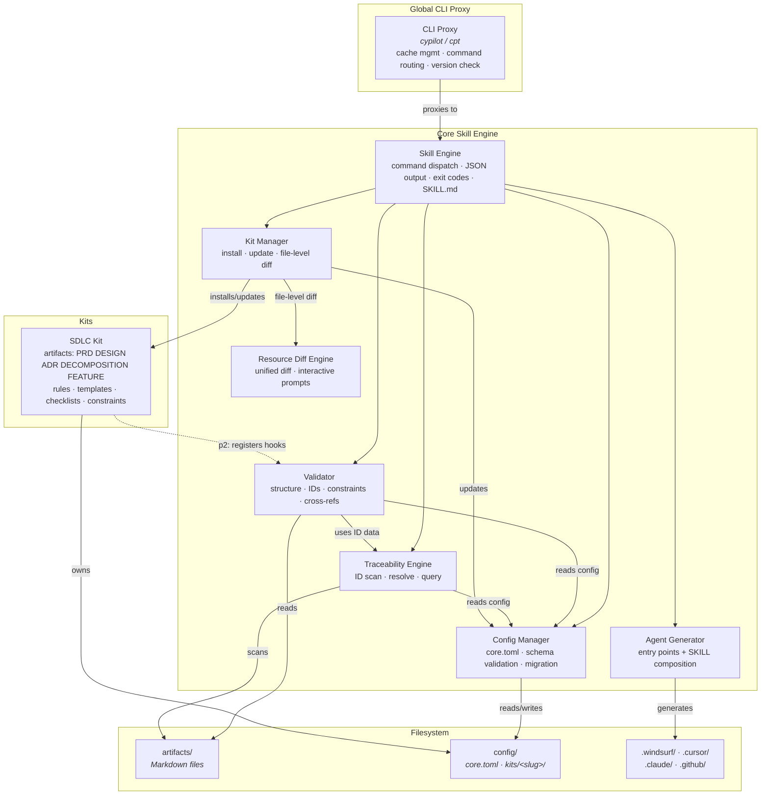
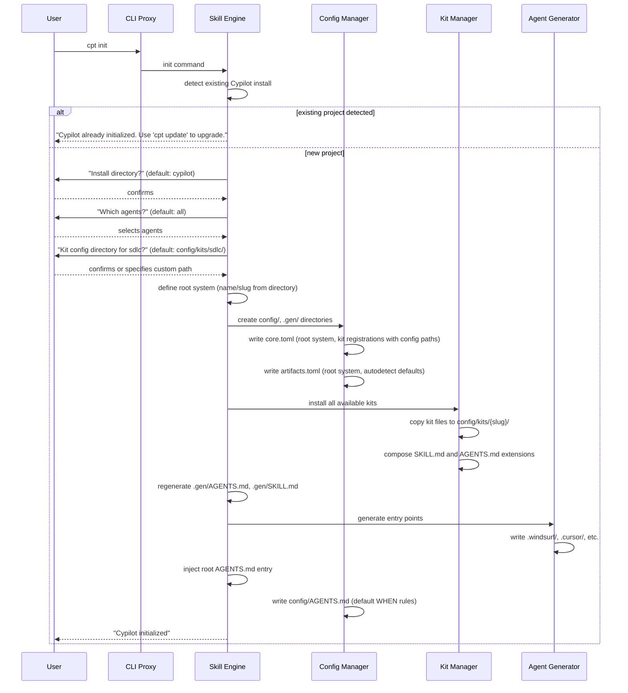
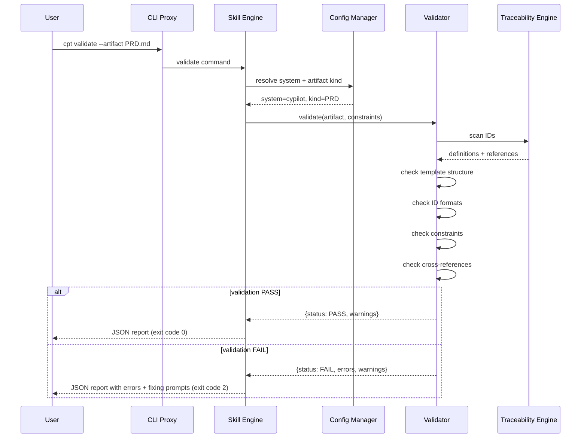
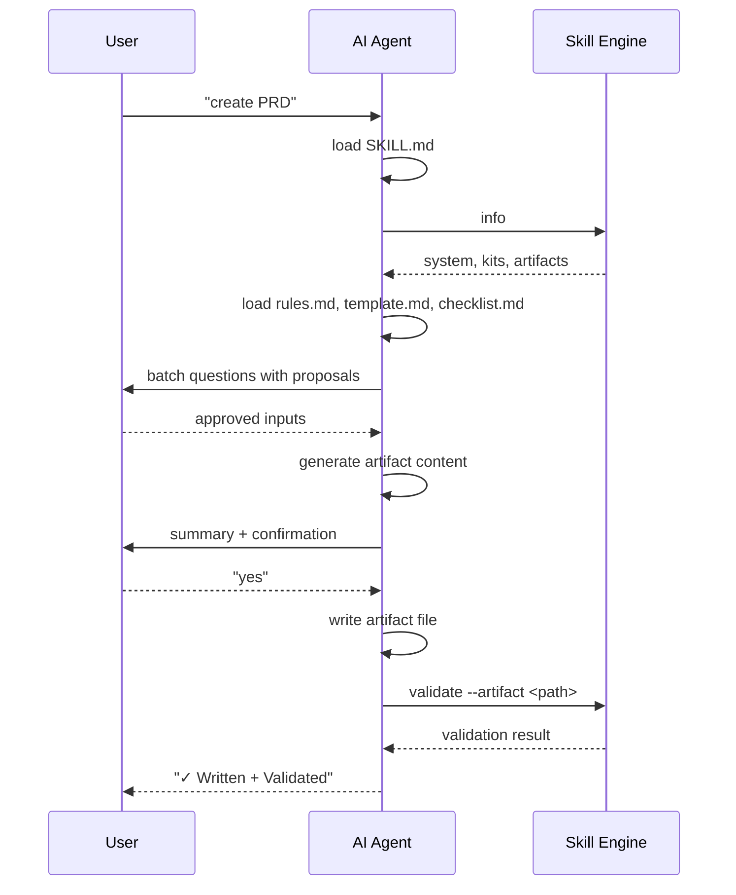
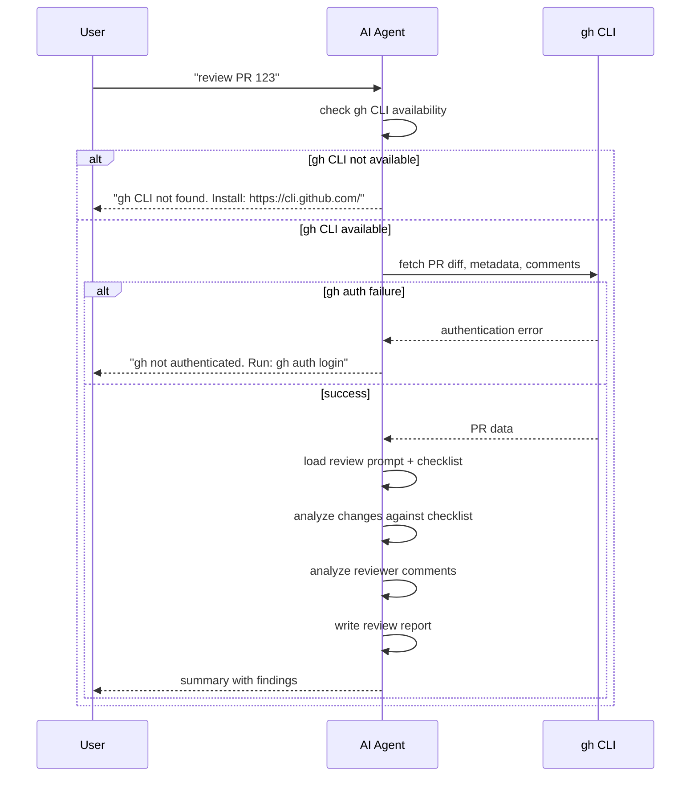
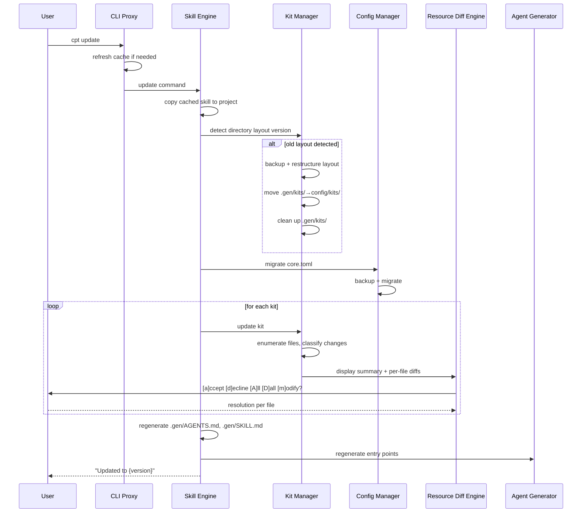
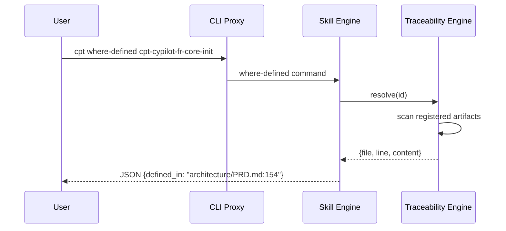

# Technical Design — Cyber Pilot (Cypilot)


<!-- toc -->

- [1. Architecture Overview](#1-architecture-overview)
  - [1.1 Architectural Vision](#11-architectural-vision)
  - [1.2 Architecture Drivers](#12-architecture-drivers)
  - [1.3 Architecture Layers](#13-architecture-layers)
- [2. Principles & Constraints](#2-principles-constraints)
  - [2.1 Design Principles](#21-design-principles)
  - [2.2 Constraints](#22-constraints)
- [3. Technical Architecture](#3-technical-architecture)
  - [3.1 Domain Model](#31-domain-model)
  - [3.2 Component Model](#32-component-model)
  - [3.3 API Contracts](#33-api-contracts)
  - [3.4 Internal Dependencies](#34-internal-dependencies)
  - [3.5 External Dependencies](#35-external-dependencies)
  - [3.6 Interactions & Sequences](#36-interactions-sequences)
  - [3.7 Database schemas & tables](#37-database-schemas-tables)
- [4. Additional context](#4-additional-context)
  - [Performance Considerations](#performance-considerations)
  - [Extensibility Model](#extensibility-model)
  - [Migration Strategy](#migration-strategy)
  - [Testing Approach](#testing-approach)
  - [Non-Applicable Design Domains](#non-applicable-design-domains)
- [5. Traceability](#5-traceability)
  - [Specifications](#specifications)

<!-- /toc -->

## 1. Architecture Overview

### 1.1 Architectural Vision

Cypilot uses a layered architecture with a thin global CLI proxy at the top, a deterministic skill engine at the core, and a kit system for domain-specific functionality. The architecture maximizes determinism: all validation, scanning, and transformation is handled by Python scripts with JSON output; LLMs are reserved only for reasoning tasks within agent workflows.

The system separates concerns into five layers: Global CLI Proxy (installation, caching, version management), Core Skill Engine (command routing, deterministic execution), Kit System (domain-specific file packages: rules, templates, checklists, constraints, workflows), Config Management (structured config directory, schema validation), and Agent Integration (multi-agent entry point generation). Each layer has clear boundaries and communicates through well-defined interfaces.

Each kit is a file package: a collection of artifact definitions (rules, checklists, templates, examples, constraints, workflows, scripts) that are copied into the kit's config directory (default: `{cypilot_path}/config/kits/<slug>/`) during installation. Kit updates use file-level diff: each file in the new kit version is compared against the user's installed copy, and changed files are presented as unified diffs with interactive accept/decline/modify prompts. All kit files are user-editable and preserved across updates via interactive diff. The core knows about kits through registration in `{cypilot_path}/config/core.toml`. A plugin system for custom hooks and CLI subcommands is planned for p2.

### 1.2 Architecture Drivers

#### Functional Drivers

##### Global CLI Installer

- [x] `p1` - `cpt-cypilot-fr-core-installer`

**Design Response**: Thin proxy shell with local cache at `~/.cypilot/cache/`. On every invocation the proxy ensures a cached skill bundle exists, routes commands to the project-installed or cached skill, and performs non-blocking background version checks. The proxy contains zero skill logic.

##### Project Initialization

- [x] `p1` - `cpt-cypilot-fr-core-init`

**Design Response**: Interactive bootstrapper that copies the skill from cache into the project, creates the `config/` and `.gen/` directory structure, and generates agent entry points. The dialog asks for install directory, agent selection, and per-kit config output directory. Installed kits copy all kit files (rules, templates, checklists, examples, constraints, workflows, scripts) into the kit's config directory.

##### Config Directory

- [x] `p1` - `cpt-cypilot-fr-core-config`

**Design Response**: `{cypilot_path}/config/core.toml` holds system definitions, kit registrations (with configurable config output paths), and ignore lists. `{cypilot_path}/config/kits/<slug>/` directories hold all kit files — artifacts, workflows, per-kit SKILL.md, constraints, and scripts (all user-editable). `{cypilot_path}/.gen/` holds only top-level auto-generated files (`AGENTS.md`, `SKILL.md`, `README.md`). All TOML config files use deterministic serialization. Kit files are user-editable and preserved across updates via interactive diff.

##### Deterministic Skill Engine

- [x] `p1` - `cpt-cypilot-fr-core-skill-engine`

**Design Response**: Python command router that dispatches to command handlers. All commands output JSON. Exit codes follow the convention: 0=PASS, 1=filesystem error, 2=FAIL. SKILL.md serves as the agent entry point with command reference and execution protocol.

##### Generic Workflows

- [x] `p1` - `cpt-cypilot-fr-core-workflows`

**Design Response**: Two universal Markdown workflows (generate and analyze) with a common execution protocol. Workflows are loaded and interpreted by AI agents, not by the tool itself. The tool provides deterministic commands that workflows invoke.

##### Multi-Agent Integration

- [x] `p1` - `cpt-cypilot-fr-core-agents`

**Design Response**: Agent Generator component produces entry points in each agent's native format: `.windsurf/workflows/`, `.cursor/rules/`, `.claude/commands/`, `.github/prompts/`. All entry points reference the core SKILL.md. The `agents` command fully overwrites entry points on each invocation.

##### Extensible Kit System

- [x] `p1` - `cpt-cypilot-fr-core-kits`

**Design Response**: Kit Manager handles kit lifecycle: installation (copying kit files into the kit's config directory, asking user for config output directory), registration in `core.toml` (with config path), and version tracking. Each kit is a collection of ready-to-use files (rules, templates, checklists, examples, constraints, workflows, scripts). Kit updates use file-level diff: each file in the new version is compared against the user's installed copy, and all changed files are presented as unified diffs with interactive accept/decline/accept-all/decline-all/modify prompts. `cpt kit move-config <slug>` relocates a kit's config output directory. A plugin system for custom CLI subcommands and hooks is planned for p2.

##### ID and Traceability System

- [x] `p1` - `cpt-cypilot-fr-core-traceability`

**Design Response**: Traceability Engine scans artifacts for `cpt-{system}-{kind}-{slug}` IDs, resolves cross-references, detects code tags (`@cpt-*`), and provides query commands (list-ids, where-defined, where-used, get-content). Validation enforces constraints from `constraints.toml`.

##### Cypilot DSL (CDSL)

- [x] `p1` - `cpt-cypilot-fr-core-cdsl`

**Design Response**: CDSL is a plain English specification language embedded in Markdown. The tool parses CDSL instruction markers (`- [ ] Inst-label:`) for implementation tracking. CDSL validation is part of the Validator component's template compliance checks.

##### SDLC Kit

- [x] `p2` - `cpt-cypilot-fr-sdlc-plugin`

**Design Response**: The SDLC kit is a file package providing artifact definitions for PRD, DESIGN, ADR, DECOMPOSITION, and FEATURE. All kit resources (templates, examples, rules, checklists, constraints, workflows) are maintained as ready-to-use files in `config/kits/sdlc/`. Kit-specific CLI subcommands for managing autodetect rules and artifact patterns are planned for p2.

##### Artifact Validation

- [x] `p1` - `cpt-cypilot-fr-sdlc-validation`

**Design Response**: Validator component performs single-pass scanning of artifact files: template structure compliance, ID format validation, priority marker presence, placeholder detection, and constraint enforcement. Cross-artifact validation checks covered_by references, checked consistency, and ID resolution across all registered artifacts.

##### PR Review Workflow

- [ ] `p1` - `cpt-cypilot-fr-sdlc-pr-review`

**Design Response**: PR review uses `gh` CLI to fetch PR data (diffs, metadata, comments), then delegates analysis to the AI agent with configurable prompts and checklists. The workflow is read-only (no local working tree modifications) and always re-fetches data on each invocation.

##### Version Detection and Updates

- [ ] `p2` - `cpt-cypilot-fr-core-version`

**Design Response**: The `update` command copies the cached skill into the project, detects directory layout and automatically restructures if the old layout is detected, migrates `{cypilot_path}/config/core.toml`, updates each kit using file-level diff (comparing each file in the new version against the user's installed copy and presenting unified diffs with accept/decline/modify prompts for all changed files), regenerates kit outputs with interactive diff for user-modified resources, and regenerates agent entry points. Config migration preserves all user settings. Version information is accessible via `--version`.

##### CLI Configuration Interface

- [ ] `p2` - `cpt-cypilot-fr-core-cli-config`

**Design Response**: Core CLI commands manage `core.toml` (system definitions, ignore lists, kit registrations). All config changes are validated against schemas before application. Dry-run mode is supported. Kit-specific CLI subcommands are planned for p2.

##### VS Code Plugin

- [ ] `p2` - `cpt-cypilot-fr-core-vscode-plugin`

**Design Response**: VS Code extension delegates all validation to the installed Cypilot skill (`cpt validate`). The plugin reads config from the project's install directory, provides ID syntax highlighting, go-to-definition, real-time validation, autocompletion, hover info, CodeLens, traceability tree view, and quick fixes.

##### Artifact Pipeline

- [x] `p1` - `cpt-cypilot-fr-sdlc-pipeline`

**Design Response**: The SDLC kit defines an artifact-first pipeline: PRD → DESIGN → ADR → DECOMPOSITION → FEATURE → CODE. Each artifact kind has dedicated resource files (template, checklist, rules, constraints) maintained in the kit. Artifacts are usable independently (no forced sequence). The generate and analyze workflows handle both greenfield and brownfield entry points.

##### Artifact Blueprint (DEPRECATED)

- [x] `p1` - `cpt-cypilot-fr-core-blueprint`

> **DEPRECATED per `cpt-cypilot-adr-remove-blueprint-system`**: The Blueprint Processor and blueprint files have been removed. Kits are now direct file packages — all kit resources (rules, templates, checklists, examples, constraints, workflows, scripts, SKILL.md) are maintained as ready-to-use files in `{cypilot_path}/config/kits/<slug>/`. There is no generation step. Kit updates use file-level diff (see `cpt-cypilot-fr-core-resource-diff`).

**Kit file structure**: Each kit is a directory containing per-artifact subdirectories (`artifacts/<KIND>/rules.md`, `artifacts/<KIND>/template.md`, `artifacts/<KIND>/checklist.md`, `artifacts/<KIND>/examples/example.md`), kit-wide files (`constraints.toml`, `conf.toml`, `SKILL.md`), and optional directories (`workflows/`, `scripts/`, `codebase/`). All files are user-editable and preserved across updates via interactive diff.

**SKILL extensions**: Kit `SKILL.md` files in `{cypilot_path}/config/kits/<slug>/SKILL.md` are aggregated into `{cypilot_path}/config/SKILL.md` during init/kit-install. The main SKILL.md navigates to `{cypilot_path}/config/SKILL.md`, ensuring AI agents discover kit capabilities.

**System prompt extensions**: Kit `AGENTS.md` content is appended to `{cypilot_path}/config/AGENTS.md` during init/kit-install. Loaded via Protocol Guard, directives are automatically active.

**Workflow registrations**: Kit workflow files in `{cypilot_path}/config/kits/<slug>/workflows/{name}.md` are registered with the Agent Generator, which creates entry points in each agent's native format (e.g., `.windsurf/workflows/cypilot-{name}.md`).

##### Generated Resource Editing & Interactive Diff

- [x] `p1` - `cpt-cypilot-fr-core-resource-diff`

**Design Response**: The Resource Diff Engine handles interactive conflict resolution for kit file updates and generated resource regeneration. The engine compares source files against the user's installed copies. If content differs, it presents a unified diff (similar to `git diff`) and an interactive CLI prompt with five modes: `[a]ccept` (overwrite with new), `[d]ecline` (keep current), `[A]ccept-all` (overwrite all remaining), `[D]ecline-all` (keep all remaining), `[m]odify` (open the file in the user's editor for manual resolution). Before iterating per-file, the engine displays a summary of all changes (added, removed, modified, unchanged counts). The same engine is used for both kit updates and generated resource regeneration.

##### Directory Layout Migration

- [ ] `p1` - `cpt-cypilot-fr-core-layout-migration`

**Design Response**: The Layout Migrator is a component in the Kit Manager that detects the old directory layout and performs automatic restructuring (generated outputs from `.gen/kits/` to `config/kits/`). This is an internal v3 restructuring, not a version bump. Detection: if `{cypilot_path}/.gen/kits/{slug}/` exists → old layout. Migration steps: (1) backup affected directories, (2) move `.gen/kits/{slug}/` → `config/kits/{slug}/` (generated outputs), (3) remove old `kits/{slug}/` reference copies if present, (4) remove `.gen/kits/` directory (preserve `.gen/AGENTS.md`, `.gen/SKILL.md`, `.gen/README.md`), (5) update `core.toml` kit registrations. Rollback: if any step fails, restore from backup and report error. Runs automatically during `cpt update`.

##### Cross-Artifact Validation

- [x] `p1` - `cpt-cypilot-fr-sdlc-cross-artifact`

**Design Response**: The Validator component performs cross-artifact checks by loading all registered artifacts for a system and comparing ID definitions against references. Checks include: covered_by reference completeness per constraints.toml rules, checked-ref-implies-checked-def consistency, and ID resolution across artifact boundaries. Cross-artifact validation runs as part of `cpt validate` (no separate command).

##### PR Status Workflow

- [ ] `p1` - `cpt-cypilot-fr-sdlc-pr-status`

**Design Response**: PR status reuses the same `gh` CLI integration as PR review. The workflow fetches comments, CI status, and merge conflict state, then classifies unreplied comments by severity. Output is a structured JSON report. Shares the SDLC kit's PR configuration (prompts, exclude lists).

##### Code Generation from Design

- [ ] `p2` - `cpt-cypilot-fr-sdlc-code-gen`

**Design Response**: Code generation is an agent-driven workflow (not a deterministic command). The generate workflow loads FEATURE artifacts, reads project system prompts (domain model, API contracts) when present, and instructs the agent to produce code with `@cpt-*` traceability tags. The tool validates tags after generation via the Traceability Engine.

##### Brownfield Support

- [ ] `p2` - `cpt-cypilot-fr-sdlc-brownfield`

**Design Response**: Brownfield entry uses `cpt init` with existing code detection. The SDLC kit's autodetect rules scan for existing documentation and code structure. The generate workflow supports reverse-engineering mode: agents analyze existing code and produce artifacts (PRD, DESIGN) that describe the current state. Incremental adoption is supported — start with config, add artifacts gradually.

##### Feature Lifecycle Management

- [ ] `p2` - `cpt-cypilot-fr-sdlc-lifecycle`

**Design Response**: Feature status (NOT_STARTED → IN_DESIGN → DESIGNED → READY → IN_PROGRESS → DONE) is tracked via checkbox state on FEATURE artifact ID definitions. The Validator enforces status transition rules and dependency blocking. Status queries use the Traceability Engine's ID scanning.

##### PR Review Configuration

- [ ] `p2` - `cpt-cypilot-fr-sdlc-pr-config`

**Design Response**: PR review configuration is stored in `{cypilot_path}/config/kits/sdlc/`. Configuration includes prompt selection, checklist mapping, domain-specific review criteria, template variables, and PR exclude lists. Config changes are validated against the schema before writing. Kit-specific CLI subcommands for PR config management are planned for p2.

##### Quickstart Guides

- [ ] `p2` - `cpt-cypilot-fr-sdlc-guides`

**Design Response**: Quickstart guides are SDLC kit resources generated alongside templates and examples. Guides use progressive disclosure: human-facing overview docs with copy-paste prompts, and AI-facing navigation rules embedded in SKILL.md and agent entry points.

##### Utility Commands

- [x] `p1` - `cpt-cypilot-fr-core-toc`
- [ ] `p2` - `cpt-cypilot-fr-core-template-qa`
- [ ] `p2` - `cpt-cypilot-fr-core-doctor`
- [ ] `p3` - `cpt-cypilot-fr-core-hooks`
- [ ] `p3` - `cpt-cypilot-fr-core-completions`

**Design Response**: Utility commands are implemented as standalone handlers in the Skill Engine with no architectural impact beyond the standard command routing pattern. `self-check` validates examples against templates. `doctor` checks environment health (Python version, git, gh, agents, config integrity). `hook install/uninstall` manages git pre-commit hooks for lightweight validation. `completions install` generates shell completion scripts for bash/zsh/fish.

##### Spec Coverage

- [x] `p1` - `cpt-cypilot-fr-core-traceability`

**Design Response**: The `spec-coverage` command reuses the Traceability Engine's code scanning infrastructure to measure two metrics: **coverage percentage** (ratio of lines within `@cpt-begin`/`@cpt-end` blocks to total effective lines) and **granularity score** (instruction density — ideally 1 block marker per 10 lines). Output mirrors `coverage.py` JSON format with per-file and summary statistics. Threshold enforcement via `--min-coverage` and `--min-granularity` flags enables CI gating. Implementation lives in `skills/.../utils/coverage.py` (scanner + metrics) and `skills/.../commands/spec_coverage.py` (CLI entry point).

#### NFR Allocation

| NFR ID | NFR Summary | Allocated To | Design Response | Verification Approach |
|--------|-------------|--------------|-----------------|----------------------|
| `cpt-cypilot-nfr-validation-performance` | Single artifact validation ≤ 3s | `cpt-cypilot-component-validator` | Single-pass scanning, no external calls, in-memory processing, no LLM dependency | Benchmark test with largest project artifact |
| `cpt-cypilot-nfr-security-integrity` | No untrusted code execution, deterministic results, no secrets in config | `cpt-cypilot-component-config-manager`, `cpt-cypilot-component-validator` | Validator reads files as text only — no eval/exec. Config Manager rejects files containing known secret patterns. All commands are pure functions of input state | Determinism test: same repo state → same validation output |
| `cpt-cypilot-nfr-reliability-recoverability` | Actionable failure guidance, no settings loss on migration | `cpt-cypilot-component-config-manager`, `cpt-cypilot-component-skill-engine` | Config migration creates backup before applying changes. All error messages include file path, line number, and remediation steps | Migration test: upgrade config across 3 versions, verify no settings lost |
| `cpt-cypilot-nfr-adoption-usability` | ≤ 5 decisions in init, ≤ 3 clarifying questions per workflow | `cpt-cypilot-component-cli-proxy`, `cpt-cypilot-component-skill-engine` | Init uses sensible defaults (all agents, all kits). CLI provides `--help` with usage examples for every command | Count decisions in init flow; count agent questions per workflow |

### 1.3 Architecture Layers

The architecture is organized into five layers stacked top-to-bottom, where each layer depends only on the layer directly below it.

At the top sits the **AI Agent layer** — external coding assistants (Windsurf, Cursor, Claude Code, GitHub Copilot, OpenAI Codex) that read SKILL.md as their entry point and invoke Cypilot commands. Immediately below is the **Agent Entry Points layer**: generated files in agent-native directories (`.windsurf/`, `.cursor/`, `.claude/`, `.github/`) that contain workflow proxies and skill shims translating agent-specific formats into Cypilot CLI calls.

The **Global CLI Proxy layer** (`cypilot` / `cpt`, installed via pipx) is a thin stateless shell. It resolves the target skill — either from the project's local install directory or from the global cache (`~/.cypilot/cache/`) — and forwards the invocation. The proxy contains zero skill logic.

Below the proxy is the **Core Skill Engine layer** — the heart of the system. It owns the command router, JSON output serialization, SKILL.md, workflows, and the execution protocol. Three core components live here: the **Validator** (deterministic structural and cross-artifact checks), the **Traceability Engine** (ID scanning, resolution, and coverage analysis), and the **Config Manager** (schema-validated JSON config read/write with migration support).

At the bottom is the **Kit layer**. The **Kit Manager** handles kit installation (copying kit files into the kit's config directory), registration, file-level diff updates, kit config relocation, and layout migration. Each kit is a file package — the **SDLC Kit** being the primary one, providing rules, templates, checklists, examples, constraints, and workflows for PRD, DESIGN, ADR, DECOMPOSITION, and FEATURE artifact kinds. A plugin system for custom hooks and CLI subcommands is planned for p2.

- [ ] `p3` - **ID**: `cpt-cypilot-tech-python-stdlib`

| Layer | Responsibility | Technology |
|-------|---------------|------------|
| Global CLI Proxy | Installation entry point, cache management, version checks, command routing | Python (pipx-installable package) |
| Core Skill Engine | Command dispatch, JSON output, deterministic execution, workflow loading | Python 3.11+ stdlib |
| Kit System | Domain-specific file packages (rules, templates, checklists, constraints, workflows) | Markdown + TOML files, Kit Manager |
| Config Management | Config directory operations, schema validation, deterministic serialization | TOML, Python stdlib (tomllib 3.11+) |
| Agent Integration | Entry point generation in native agent formats | Python, Markdown templates |

## 2. Principles & Constraints

### 2.1 Design Principles

#### Determinism First

- [x] `p1` - **ID**: `cpt-cypilot-principle-determinism-first`

Everything that can be validated, checked, or enforced without an LLM MUST be handled by deterministic scripts. The LLM is reserved only for tasks requiring reasoning, creativity, or natural language understanding. This ensures reproducible results: same input → same output, regardless of which AI agent runs the command.

#### Kit-Centric

- [x] `p1` - **ID**: `cpt-cypilot-principle-kit-centric`

All domain-specific value is delivered by kits. Kits are file packages containing rules, templates, checklists, examples, constraints, and workflows. Core provides infrastructure (ID system, workflows, config, agent integration, Kit Manager); kits provide the content and semantics. This separation ensures that new domains can be supported by adding a new kit as a directory of ready-to-use files.

#### Traceability by Design

- [x] `p1` - **ID**: `cpt-cypilot-principle-traceability-by-design`

All design elements use structured `cpt-*` IDs following the format `cpt-{system}-{kind}-{slug}`. Code tags (`@cpt-*`) link implementation to design. Cross-references between artifacts are validated deterministically. The ID system is the backbone of Cypilot's value proposition — it enables automated verification that code implements what was designed.

#### Plugin Extensibility

- [x] `p1` - **ID**: `cpt-cypilot-principle-plugin-extensibility`

Kits are file packages that provide artifact definitions (rules, templates, checklists, examples, constraints, workflows). Core does not interpret kit-specific semantics — it only knows that a kit is registered and where its files live. User customizations to kit files are preserved across updates through file-level diff — all changed files are presented as unified diffs with interactive accept/decline/modify prompts. Generated resources in the kit's config directory are also user-editable with interactive diff on regeneration. A plugin system for custom markers and hooks is planned for p2.

#### Machine-Readable Output

- [x] `p2` - **ID**: `cpt-cypilot-principle-machine-readable`

All CLI commands output JSON to stdout. Config files use TOML with deterministic serialization. Validation results include file paths and line numbers. This enables programmatic consumption by CI pipelines, IDE plugins, and agent workflows without parsing human-readable text.

#### Tool-Managed Config

- [x] `p2` - **ID**: `cpt-cypilot-principle-tool-managed-config`

Config files are edited exclusively by the tool, never manually. All changes go through CLI commands that validate against schemas before writing. This prevents configuration drift, ensures schema compliance, and enables reliable migration between versions.

#### Skill-Documented

- [x] `p2` - **ID**: `cpt-cypilot-principle-skill-documented`

All tool capabilities MUST be fully documented in the agent-facing SKILL.md. SKILL.md is the single entry point for AI agents — it enumerates all commands, workflows, and integration points so agents can discover and use the tool's full functionality without external documentation.

#### DRY (Don't Repeat Yourself)

- [x] `p1` - **ID**: `cpt-cypilot-principle-dry`

Every piece of knowledge — a template, a rule, a checklist criterion, a config schema — MUST have exactly one authoritative source. Kits generate resources from a single definition; agent entry points are generated from one template per agent; validation rules live in constraints.toml, not duplicated across code. If something needs to change, it changes in one place.

#### Occam's Razor

- [x] `p1` - **ID**: `cpt-cypilot-principle-occams-razor`

The simplest solution that satisfies the requirements is the correct one. No abstraction layers, extension points, or generalization beyond what is needed today. Prefer flat structures over nested, single-pass algorithms over multi-phase, plain functions over class hierarchies. Complexity must be justified by a concrete requirement, not by speculative future needs.

#### CI & Automation First, LLM Last Resort

- [x] `p1` - **ID**: `cpt-cypilot-principle-ci-automation-first`

Every check, validation, and enforcement MUST be implementable as a deterministic CI step. LLM-based analysis is used only when deterministic methods are provably insufficient (e.g., semantic quality review, natural language understanding). If a task can be expressed as a regex, a schema check, or a graph traversal — it MUST NOT require an LLM. This ensures that quality gates are reproducible, fast, and free of hallucination risk.

#### Zero Harm, Only Benefits

- [x] `p1` - **ID**: `cpt-cypilot-principle-zero-harm`

Adopting Cypilot MUST NOT impose costs on the development workflow. No mandatory file renames, no forced directory structures outside the Cypilot install directory and `config/`, no blocking CI gates by default, no slowdowns to existing processes. Every feature is opt-in and additive. If a team removes Cypilot, their project continues to work exactly as before — only the `{cypilot_path}/` directory and generated agent files are left behind.

#### No Manual Maintenance

- [x] `p2` - **ID**: `cpt-cypilot-principle-no-manual-maintenance`

Nothing that can be automated MUST require manual upkeep. Agent entry points are regenerated on `update`. Kit files are updated via file-level diff. Config migrations run automatically. Shell completions are generated from command definitions. If a human must remember to update something after a version change, that is a bug in the tool.

### 2.2 Constraints

#### Python Standard Library Only

- [x] `p1` - **ID**: `cpt-cypilot-constraint-python-stdlib`

Core skill engine uses Python 3.11+ standard library only (requires `tomllib` from stdlib). No third-party dependencies in core. This ensures the tool works in any Python 3.11+ environment without dependency conflicts. Kits may declare their own dependencies, managed separately.

#### Markdown as Contract

- [x] `p1` - **ID**: `cpt-cypilot-constraint-markdown-contract`

Artifacts are Markdown files with structured `cpt-*` IDs. Markdown is the contract format between humans, agents, and the tool. Workflows, templates, checklists, and rules are all Markdown. This leverages the universal readability of Markdown while enabling deterministic parsing of structured elements.

#### Git Project Heuristics

- [x] `p2` - **ID**: `cpt-cypilot-constraint-git-project-heuristics`

Git is the primary project detection mechanism (`.git` directory provides project root detection and version control integration). Non-Git projects are supported but without Git-based heuristics — the tool falls back to the current working directory as project root.

#### Cross-Platform Native Support

- [x] `p1` - **ID**: `cpt-cypilot-constraint-cross-platform`

CLI proxy and skill engine must work natively on Linux, Windows, and macOS without platform-specific workarounds or conditional dependencies. File paths use `pathlib`, subprocess calls avoid shell-specific syntax, and no OS-specific system calls are used. This constraint applies to all core components and kits.

#### No Weakening of Rules

- [x] `p1` - **ID**: `cpt-cypilot-constraint-no-weakening`

Validation rules cannot be bypassed or weakened in STRICT mode. The deterministic gate must pass before semantic review proceeds. This constraint ensures that the quality floor is maintained — agents cannot skip validation steps or downgrade severity of issues.

## 3. Technical Architecture

### 3.1 Domain Model

**Technology**: Python dataclasses, TOML

**Location**: In-memory models built from filesystem state (no persistent database)

**Machine-Readable Schemas**:
- **Config schema**: `{cypilot_path}/config/core.toml` structure defined by [core-config.schema.json]({cypilot_path}/.core/schemas/core-config.schema.json)
- **Kit constraints schema**: [kit-constraints.schema.json]({cypilot_path}/.core/schemas/kit-constraints.schema.json)
- **Artifact registry**: [artifacts.toml]({cypilot_path}/config/artifacts.toml) — system, autodetect, and codebase definitions
- **Python types**: `skills/cypilot/scripts/cypilot/` — dataclass definitions for in-memory models

**Specifications** (see [specs/](./specs/) for full documents):
- **CLI**: [cli.md](./specs/cli.md) — complete CLI interface specification
- **Kit specification**: [kit/](./specs/kit/) — kit structure, file package format, constraint semantics, validation
  - [kit.md](./specs/kit/kit.md) — kit overview, directory structure, taxonomy, extension protocol
  - [blueprint.md](./specs/kit/blueprint.md) — DEPRECATED: blueprint format documentation (kept for reference)
  - [rules.md](./specs/kit/rules.md) — generated rules.md format
  - [checklist.md](./specs/kit/checklist.md) — generated checklist.md format
  - [template.md](./specs/kit/template.md) — generated template.md format
  - [constraints.md](./specs/kit/constraints.md) — generated constraints.toml format, validation semantics
  - [example.md](./specs/kit/example.md) — generated example.md format
- **Identifiers & Traceability**: [traceability.md](./specs/traceability.md) — ID formats, naming conventions, task markers, code traceability markers, validation
- **CDSL**: [CDSL.md](./specs/CDSL.md) — behavioral specification language syntax
- **Artifacts registry**: [artifacts-registry.md](./specs/artifacts-registry.md) — artifacts.toml structure and agent operations
- **System prompts**: [sysprompts.md](./specs/sysprompts.md) — `{cypilot_path}/config/sysprompts/` and `config/AGENTS.md` format

**Core Entities**:

| Entity | Description | Source |
|--------|-------------|--------|
| System | A named project or subsystem with slug, kit assignment, and autodetect rules | `{cypilot_path}/config/core.toml` → systems[] |
| Artifact | A Markdown file of a specific kind (PRD, DESIGN, ADR, etc.) belonging to a system | Filesystem, registered via autodetect |
| Kit | A file package with artifact definitions (rules, templates, checklists, examples, constraints, workflows); all files in kit config directory | `{cypilot_path}/config/core.toml` → kits{}, `{cypilot_path}/config/kits/<slug>/` |
| Identifier | A `cpt-*` ID with kind, slug, definition location (file + line), and references | Scanned from artifact Markdown |
| Config | Structured TOML in `config/` directory — core.toml + per-kit configs | Filesystem |
| AgentEntryPoint | Generated file in an agent's native format (workflow proxy, skill shim, or rule file) | Generated into `.windsurf/`, `.cursor/`, etc. |
| Blueprint | DEPRECATED per `cpt-cypilot-adr-remove-blueprint-system` — removed from architecture. Kit resources are now maintained as direct files. | N/A |
| Constraint | Kit-wide rules for ID kinds, headings, and cross-artifact references | `{cypilot_path}/config/kits/<slug>/constraints.toml` |
| Workflow | A Markdown file with frontmatter, phases, and validation criteria | `{cypilot_path}/.core/workflows/` |

**Relationships**:
- System → Kit: each system is assigned to exactly one kit (by slug)
- System → Artifact[]: a system contains zero or more artifacts, discovered via autodetect rules
- System → Codebase[]: a system tracks zero or more codebase directories
- Kit → Files: each kit owns its files in its config directory (default: `{cypilot_path}/config/kits/<slug>/`, relocatable)
- Kit → Artifact Resources: each kit has per-artifact resource files (rules.md, template.md, checklist.md, examples/) for each artifact kind it defines
- Kit → Constraints: kit-wide `constraints.toml` defines allowed/required ID kinds per artifact kind
- Kit → SKILL extension: kit `SKILL.md` composes into the main SKILL.md
- Artifact → Identifier[]: each artifact contains zero or more ID definitions and references
- Identifier → Identifier: cross-references between definitions and references across artifacts
- Constraint → Identifier: constraints define which ID kinds are allowed/required per artifact kind

### 3.2 Component Model



#### CLI Proxy

- [x] `p1` - **ID**: `cpt-cypilot-component-cli-proxy`

##### Why this component exists

Provides a stable global entry point (`cypilot`/`cpt`) that works both inside and outside projects. Manages the skill bundle cache so users don't need to manually download or update the tool.

##### Responsibility scope

- Maintain local skill bundle cache (`~/.cypilot/cache/`)
- Route commands to project-installed skill (if inside a project) or cached skill (if outside)
- Perform non-blocking background version checks
- Display version update notices when cached version is newer than project version

##### Responsibility boundaries

Does NOT contain any skill logic, workflow logic, or command implementations. Does NOT interpret command arguments — passes them through to the resolved skill. Does NOT modify project files.

##### Related components (by ID)

- `cpt-cypilot-component-skill-engine` — proxies all commands to this component

#### Blueprint Processor (DEPRECATED)

- [x] `p1` - **ID**: `cpt-cypilot-component-blueprint-processor`

> **DEPRECATED per `cpt-cypilot-adr-remove-blueprint-system`**: This component has been removed. Kits are now direct file packages — no blueprint parsing, no marker extraction, no resource generation. Kit files are maintained directly in `{cypilot_path}/config/kits/<slug>/`. Kit updates are handled by the Kit Manager via file-level diff (see `cpt-cypilot-component-kit-manager`). SKILL and AGENTS.md composition is handled by the Kit Manager during install/update.

#### Skill Engine

- [x] `p1` - **ID**: `cpt-cypilot-component-skill-engine`

##### Why this component exists

Central command dispatcher that provides a uniform interface for all Cypilot functionality. Ensures all commands follow the same conventions (JSON output, exit codes, deterministic behavior).

##### Responsibility scope

- Parse and route CLI commands to appropriate handlers
- Enforce JSON output format for all commands
- Manage exit code conventions (0=PASS, 1=error, 2=FAIL)
- Load and expose SKILL.md as the agent entry point
- Register kit commands at runtime (p2: kit plugin CLI subcommands)

##### Responsibility boundaries

Does NOT execute workflows (workflows are interpreted by AI agents). Does NOT contain domain-specific validation logic (delegated to kits). Does NOT manage config schema — delegates to Config Manager.

##### Related components (by ID)

- `cpt-cypilot-component-cli-proxy` — receives commands from proxy
- `cpt-cypilot-component-validator` — delegates validation commands
- `cpt-cypilot-component-traceability-engine` — delegates ID query commands
- `cpt-cypilot-component-config-manager` — delegates config commands
- `cpt-cypilot-component-kit-manager` — manages kit lifecycle
- `cpt-cypilot-component-agent-generator` — delegates agent commands

#### Validator

- [x] `p1` - **ID**: `cpt-cypilot-component-validator`

##### Why this component exists

Provides the deterministic quality gate that ensures artifacts meet structural requirements without relying on an LLM. This is the core of Cypilot's value — catching issues that agents miss or hallucinate.

##### Responsibility scope

- Template structure compliance checking (heading patterns, required sections)
- ID format validation (`cpt-{system}-{kind}-{slug}` pattern)
- Priority marker validation
- Placeholder detection (TODO, TBD, FIXME)
- Cross-reference validation (covered_by, checked consistency)
- Constraint enforcement from `constraints.toml` (headings scoping, reference rules)
- TOC validation (`validate-toc`): verify anchors resolve, all headings covered, TOC not stale
- Stable error codes (`error_codes.py`): machine-readable codes for all validation issues, used by fixing prompts and downstream consumers
- Fixing prompt generation (`fixing.py`): enrich errors with actionable prompts for LLM agents
- Single-pass scanning for performance (≤ 3s per artifact)

##### Responsibility boundaries

Does NOT perform semantic validation (checklist review is done by AI agents). Does NOT modify artifacts — read-only analysis. Does NOT validate code files directly.

##### Related components (by ID)

- `cpt-cypilot-component-skill-engine` — receives validation commands
- `cpt-cypilot-component-traceability-engine` — uses ID scanning results
- `cpt-cypilot-component-config-manager` — reads config for system/artifact resolution
- `cpt-cypilot-component-sdlc-plugin` — p2: SDLC kit registers validation hooks

#### Traceability Engine

- [x] `p1` - **ID**: `cpt-cypilot-component-traceability-engine`

##### Why this component exists

Implements the ID system that links design elements to code. Without this component, there is no automated way to verify that code implements what was designed.

##### Responsibility scope

- Scan artifacts for ID definitions (`**ID**: \`cpt-...\``) and references (backticked `cpt-...`)
- Scan code for traceability tags (`@cpt-*`) with language-aware comment detection (`language_config.py`)
- Resolve cross-references between definitions and references
- Provide query commands: `list-ids`, `list-id-kinds`, `where-defined`, `where-used`, `get-content`
- Support ID versioning (`-vN` suffix)
- Markdown structure parsing (`parsing.py`): section extraction, heading analysis, content block identification
- Spec coverage analysis: measure CDSL marker coverage percentage and instruction granularity per code file

##### Responsibility boundaries

Does NOT define which ID kinds are valid — that comes from kit constraints. Does NOT enforce cross-artifact reference rules — that's the Validator's job (using data from this engine). Does NOT modify files.

##### Related components (by ID)

- `cpt-cypilot-component-validator` — provides ID scan data for validation
- `cpt-cypilot-component-skill-engine` — receives query commands
- `cpt-cypilot-component-config-manager` — reads config for system/artifact resolution

#### Config Manager

- [x] `p1` - **ID**: `cpt-cypilot-component-config-manager`

##### Why this component exists

Ensures config integrity by centralizing all config file operations behind schema validation. Prevents configuration drift and enables reliable migration between versions.

##### Responsibility scope

- CRUD operations on `{cypilot_path}/config/core.toml` (system definitions, kit registrations, ignore lists)
- Schema validation before any write operation
- Deterministic TOML serialization
- Config migration between versions (with backup before migration)
- JSON → TOML format migration (`migrate-config` command): detect legacy `.json` files, convert to `.toml`, validate, remove originals
- Backward-compatible config loading: read `.toml` first, fall back to `.json` with deprecation warning
- Provide CLI commands for config inspection (`config show`)

##### Responsibility boundaries

Does NOT manage kit file content. Does NOT interpret kit-specific semantics.

##### Related components (by ID)

- `cpt-cypilot-component-skill-engine` — receives config commands
- `cpt-cypilot-component-kit-manager` — coordinates kit config creation during installation
- `cpt-cypilot-component-validator` — provides config data for validation context

#### Kit Manager

- [x] `p1` - **ID**: `cpt-cypilot-component-kit-manager`

##### Why this component exists

Manages the kit lifecycle — installing, registering, and updating kits. Enables the extensible architecture where new domains can be added by providing a new kit as a directory of ready-to-use files.

##### Responsibility scope

- Kit installation: copy all kit files from source into `{cypilot_path}/config/kits/{slug}/`, register in `core.toml`, regenerate `.gen/AGENTS.md` and `.gen/SKILL.md` to include the new kit's navigation and skill routing. All files in the kit's config directory are user-editable and preserved across updates via interactive diff
- Kit registration: add kit entry to `{cypilot_path}/config/core.toml` with config output path
- Version tracking: store kit version in `{cypilot_path}/config/kits/{slug}/conf.toml`
- Update modes: force (`--force`) overwrites all kit files; interactive (default) uses file-level diff — compares each file in the new version against user's installed copy, shows unified diffs, prompts with accept/decline/accept-all/decline-all/modify via Resource Diff Engine
- Kit config relocation: `cpt kit move-config <slug>` moves the kit's config directory to a new location, updates `core.toml`
- Layout restructuring: detect old directory layout and automatically restructure (move generated outputs from `.gen/kits/` to `config/kits/`, clean up `.gen/kits/`)
- Kit structural validation (`validate-kits` command): verify kit directory exists with required files (`conf.toml`, `constraints.toml`, `artifacts/` directory)
- Plugin loading (p2): discover and load kit Python entry points at runtime

##### Responsibility boundaries

Does NOT own kit resource content — kit files are maintained directly. Does NOT perform kit-specific validation beyond structural checks.

##### Related components (by ID)

- `cpt-cypilot-component-skill-engine` — receives kit management commands
- `cpt-cypilot-component-config-manager` — updates core.toml during kit registration
- `cpt-cypilot-component-sdlc-plugin` — primary kit that is installed

#### Agent Generator

- [x] `p1` - **ID**: `cpt-cypilot-component-agent-generator`

##### Why this component exists

Bridges the gap between Cypilot's unified skill system and the diverse file format requirements of different AI coding assistants. Without this component, users would need to manually create and maintain agent-specific files.

##### Responsibility scope

- Generate workflow entry points in each agent's native format from kit workflow files (e.g., `.windsurf/workflows/cypilot-{name}.md` → `config/kits/<slug>/workflows/{name}.md`)
- Compose SKILL.md: collect kit SKILL.md extensions and assemble them into the main SKILL.md alongside core commands
- Generate skill shims that reference the composed SKILL.md
- Support 5 agents: Windsurf (`.windsurf/workflows/`), Cursor (`.cursor/rules/`), Claude (`.claude/commands/`), Copilot (`.github/prompts/`), OpenAI
- Full overwrite on each invocation (no merge with existing files)
- Support `--agent` flag for single-agent regeneration

##### Responsibility boundaries

Does NOT maintain agent-specific state. Does NOT define SKILL extension content — collects from kit files. Does NOT persist agent selection in config.

##### Related components (by ID)

- `cpt-cypilot-component-skill-engine` — receives `agents` command
- `cpt-cypilot-component-kit-manager` — provides kit SKILL.md extensions for composition
- `cpt-cypilot-component-config-manager` — reads config for project context

#### SDLC Kit

- [x] `p1` - **ID**: `cpt-cypilot-component-sdlc-plugin`

##### Why this component exists

Provides the artifact-first development methodology that is Cypilot's primary use case. Without this kit, Cypilot would be a generic ID system without domain-specific value.

##### Responsibility scope

- Kit file authoring: maintain per-artifact files in `config/kits/sdlc/artifacts/<KIND>/` — `rules.md`, `template.md`, `checklist.md`, `examples/example.md` for each artifact kind (PRD, DESIGN, ADR, DECOMPOSITION, FEATURE)
- Kit-wide files: `constraints.toml`, `conf.toml`, `SKILL.md`, `codebase/rules.md`, `codebase/checklist.md`, `workflows/*.md`
- PR review/status workflows: fetch PR data via `gh` CLI, analyze against configurable prompts

##### Responsibility boundaries

Does NOT own the ID system — uses core traceability engine. Does NOT manage `core.toml` — only its files in `{cypilot_path}/config/kits/sdlc/`. Does NOT manage update logic — the core Kit Manager handles file-level diff and interactive prompts for user modification preservation.

> Custom marker registration and CLI subcommands (`sdlc` namespace) are planned for p2.

##### Related components (by ID)

- `cpt-cypilot-component-kit-manager` — installs and manages kit lifecycle
- `cpt-cypilot-component-validator` — validates artifacts against kit constraints
- `cpt-cypilot-component-config-manager` — reads core config for system/artifact context

### 3.3 API Contracts

- [ ] `p1` - **ID**: `cpt-cypilot-interface-cli-json`

**Type**: CLI (command-line interface)
**Stability**: stable
**Format**: All commands output JSON to stdout

**Core Commands**:

| Command | Description | Exit Code |
|---------|-------------|-----------|
| `validate --artifact <path>` | Validate single artifact | 0=PASS, 2=FAIL |
| `validate` | Validate all registered artifacts | 0=PASS, 2=FAIL |
| `list-ids [--kind K] [--pattern P]` | List IDs matching criteria | 0 |
| `where-defined --id <id>` | Find where an ID is defined | 0=found, 2=not found |
| `where-used --id <id>` | Find where an ID is referenced | 0 |
| `get-content --id <id>` | Get content block for an ID | 0=found, 2=not found |
| `info` | Show adapter status and registry | 0 |
| `agents [--agent A]` | Generate agent entry points | 0 |
| `doctor` | Environment health check | 0=healthy, 2=issues |
| `config show` | Display current core config | 0 |
| `config system add/remove` | Manage system definitions | 0 |
| `init` | Initialize project | 0 |
| `update` | Update project skill to cached version | 0 |
| `hook install/uninstall` | Manage pre-commit hooks | 0 |
| `migrate-config` | Migrate legacy JSON configs to TOML | 0 |
| `self-check` | Validate examples against templates | 0=PASS, 2=FAIL |
| `toc` | Generate/update table of contents in artifact | 0 |
| `validate-toc` | Validate table of contents consistency | 0=PASS, 2=FAIL |
| `list-id-kinds` | List all known ID kind tokens | 0 |
| `validate-kits` | Validate kit structural correctness | 0=PASS, 2=FAIL |
| `kit install` | Install a kit (copy files, register in core.toml) | 0 |
| `kit update [--force]` | Update kit files (interactive: file-level diff; force: overwrite) | 0 |
| `kit move-config <slug>` | Relocate a kit's config output directory | 0 |

**Kit Commands (SDLC)**:

| Command | Description | Exit Code |
|---------|-------------|-----------|
| `sdlc autodetect show --system S` | Show autodetect rules for a system | 0 |
| `sdlc autodetect add-artifact` | Add artifact autodetect rule | 0 |
| `sdlc autodetect add-codebase` | Add codebase definition | 0 |
| `sdlc pr-review <number>` | Review a PR | 0 |
| `sdlc pr-status <number>` | Check PR status | 0 |

- [ ] `p2` - **ID**: `cpt-cypilot-interface-github-gh-cli`

**Direction**: required from client
**Protocol/Format**: GitHub REST/GraphQL API accessed through `gh` CLI v2.0+
**Used by**: SDLC Kit (PR review/status workflows)

### 3.4 Internal Dependencies

No internal module dependencies beyond the component relationships documented in Section 3.2. All components are part of a single Python package and communicate through direct function calls within the same process.

**Dependency Rules**:
- Components access each other through well-defined interfaces (not internal implementation details)
- Validator and Traceability Engine share scan results through a common data model (ID definitions, references)
- Kit plugins register hooks at startup — core components invoke hooks through a registry, not direct imports
- No circular dependencies: core components do not depend on kit plugins; plugins depend on core interfaces

### 3.5 External Dependencies

#### GitHub API (via `gh` CLI)

| Dependency | Interface Used | Purpose |
|------------|---------------|---------|
| `gh` CLI v2.0+ | CLI subprocess invocation | Fetch PR diffs, metadata, comments, and status for SDLC kit PR review/status workflows |

**Dependency Rules**:
- `gh` CLI is optional — only required for PR review/status workflows
- `cpt doctor` checks `gh` availability and authentication status
- PR workflows fail gracefully with actionable error message if `gh` is not available

#### Python Runtime

| Dependency | Interface Used | Purpose |
|------------|---------------|---------|
| Python 3.11+ | Runtime environment | Execute all Cypilot skill scripts and kit plugins (requires `tomllib` from stdlib) |

**Dependency Rules**:
- Core uses stdlib only — no pip dependencies
- `cpt doctor` checks Python version compatibility

#### pipx (recommended)

| Dependency | Interface Used | Purpose |
|------------|---------------|---------|
| pipx | Package installer | Global CLI proxy installation in isolated environment |

**Dependency Rules**:
- pipx is recommended but not required — manual installation is possible
- `cpt doctor` checks pipx availability

### 3.6 Interactions & Sequences

#### Project Initialization

**ID**: `cpt-cypilot-seq-init`

**Use cases**: `cpt-cypilot-usecase-init`

**Actors**: `cpt-cypilot-actor-user`, `cpt-cypilot-actor-cypilot-cli`



**Description**: User initializes Cypilot in a project. The skill engine asks for install directory, agent selection, and per-kit config output directory. It defines a **root system** (name and slug derived from the project directory name), creates full configs (`core.toml` with root system and kit registrations including config paths, `artifacts.toml` with default SDLC autodetect rules for standard artifact kinds), installs kits (copies ready files into kit config directory), generates agent entry points, and sets up `{cypilot_path}/config/AGENTS.md` with default WHEN rules.

**Root AGENTS.md injection**: During initialization (and verified on every CLI invocation), the engine ensures the project root `AGENTS.md` file contains a managed block that points agents to the Cypilot navigation entry:

```markdown
<!-- @cpt:root-agents -->
ALWAYS open and follow `{cypilot_path}/.gen/AGENTS.md` FIRST
ALWAYS open and follow `{cypilot_path}/config/AGENTS.md` WHEN it exists
<!-- @/cpt:root-agents -->
```

The block is inserted at the **beginning** of the file. If the file does not exist, it is created. The path inside the block reflects the actual install directory (e.g., `@/{cypilot_path}/config/AGENTS.md`). Content between the `<!-- @cpt:root-agents -->` and `<!-- @/cpt:root-agents -->` comment markers is fully managed by Cypilot — it is overwritten on every check, so manual edits inside the block are discarded.

**Integrity invariant**: every Cypilot CLI command (not just `init`) verifies the root `AGENTS.md` block exists and is correct before proceeding. If the block is missing or the path is stale (e.g., install directory changed), the engine silently re-injects it. This guarantees that any agent opening the project will be routed to Cypilot regardless of how the IDE session started.

#### Artifact Validation

**ID**: `cpt-cypilot-seq-validate`

**Use cases**: `cpt-cypilot-usecase-validate`

**Actors**: `cpt-cypilot-actor-user`, `cpt-cypilot-actor-ci-pipeline`



**Description**: Single artifact validation flow. The validator performs a single-pass scan, using the traceability engine for ID resolution, and returns a structured JSON report with PASS/FAIL status.

#### Agent Workflow Execution (Generate)

**ID**: `cpt-cypilot-seq-generate-workflow`

**Use cases**: `cpt-cypilot-usecase-create-artifact`

**Actors**: `cpt-cypilot-actor-user`, `cpt-cypilot-actor-ai-agent`



**Description**: Artifact generation is orchestrated by the AI agent, not the tool. The agent reads workflows and rules as instructions, collects information from the user, generates content, writes files, and invokes deterministic validation.

#### PR Review

**ID**: `cpt-cypilot-seq-pr-review`

**Use cases**: `cpt-cypilot-usecase-pr-review`

**Actors**: `cpt-cypilot-actor-user`, `cpt-cypilot-actor-ai-agent`



**Description**: PR review is driven by the AI agent using `gh` CLI for data fetching. The tool provides configurable prompts and checklists; the agent performs the analysis and writes a structured report.

#### Version Update

**ID**: `cpt-cypilot-seq-update`

**Use cases**: `cpt-cypilot-usecase-update`

**Actors**: `cpt-cypilot-actor-user`, `cpt-cypilot-actor-cypilot-cli`



**Description**: Update copies the cached skill into the project, detects directory layout (triggering automatic restructuring if old layout detected), migrates config files (with backup), updates each kit using file-level diff (comparing each file in the new version against the user's installed copy, showing unified diffs with accept/decline/modify prompts for all changed files), and regenerates agent entry points for compatibility.

#### ID Resolution Query

**ID**: `cpt-cypilot-seq-traceability-query`

**Use cases**: `cpt-cypilot-usecase-validate`

**Actors**: `cpt-cypilot-actor-user`, `cpt-cypilot-actor-ai-agent`



**Description**: ID resolution query scans all registered artifacts to find where an ID is defined. Used by agents for navigation and by the validator for cross-reference checking.

### 3.7 Database schemas & tables

Not applicable — Cypilot does not use a database. All persistent state is stored in the filesystem:

- **`{cypilot_path}/config/core.toml`** — core config (system definitions, kit registrations with config paths, ignore lists)
- **`{cypilot_path}/config/artifacts.toml`** — artifact registry (systems, artifacts, codebases)
- **`{cypilot_path}/config/kits/<slug>/`** — per-kit files (conf.toml, SKILL.md, constraints.toml, artifacts/, codebase/, workflows/, scripts/) — all user-editable, path configurable per kit, preserved via interactive diff on update
- **`{cypilot_path}/.gen/`** — top-level auto-generated files only (AGENTS.md, SKILL.md, README.md)
- **`~/.cypilot/cache/`** — global skill bundle cache
- **Markdown artifacts** — source of truth for design (PRD.md, DESIGN.md, etc.)

## 4. Additional context

### Performance Considerations

The validator uses single-pass scanning to meet the ≤ 3 second requirement. Artifacts are read once into memory, and all checks (template structure, ID format, constraints, cross-references) are performed in a single traversal. No external calls (network, database, LLM) are made during validation.

### Extensibility Model

The kit plugin system is designed for extension at three levels:

1. **Kit-level**: New kits can be created for entirely new domains (e.g., API design, infrastructure-as-code). Each kit is a self-contained package.
2. **Artifact-level**: Within a kit, new artifact kinds can be added via config. The SDLC kit supports adding custom artifact types through its plugin CLI.
3. **Resource-level**: Within an artifact kind, users can override templates, extend checklists, modify rules, and embed custom prompts. Overrides are preserved across updates.

### Migration Strategy

Config migration follows a forward-only strategy:
1. Each version of `core.toml` has a schema version field
2. Migration scripts transform config from version N to N+1
3. Kit plugins provide their own migration scripts
4. Before any migration, a backup is created
5. If migration fails, the backup is restored and the user is notified

#### Directory Layout Restructuring

The new layout consolidates all kit files into `config/kits/`, removes reference copies (replaced by file-level diff), and moves generated outputs from `.gen/kits/` to `config/kits/`. This is an internal v3 restructuring that runs automatically during `cpt update`. The Layout Migrator (part of Kit Manager) performs this:

| Source (old) | Destination (new) | Action |
|-------------|------------------|--------|
| `.gen/kits/{slug}/` | `config/kits/{slug}/` | Move (generated outputs) |
| `kits/{slug}/` (reference copies) | — | Remove (replaced by file-level diff) |
| `.gen/kits/` | — | Remove directory (top-level `.gen/` files preserved) |

**Detection**: Old layout is detected when `{cypilot_path}/.gen/kits/{slug}/` exists.

**Triggers**: Automatically during `cpt update` when old layout is detected.

#### JSON → TOML Format Migration

All configuration and constraint files are migrating from JSON to TOML:

| File (old) | File (new) | Owner |
|------------|------------|-------|
| `config/core.json` | `{cypilot_path}/config/core.toml` | Config Manager |
| `{cypilot_path}/config/kits/<slug>/*.json` | `{cypilot_path}/config/kits/<slug>/*.toml` | Kit plugins |
| `constraints.json` | `constraints.toml` | Kit Manager |
| `.cypilot-adapter/artifacts.toml` | `{cypilot_path}/config/artifacts.toml` | Config Manager |

**Rationale**: TOML is human-readable, supports comments, and is used consistently for all Cypilot configuration files. JSON remains the CLI output format (stdout).

**Migrator** (`cpt migrate-config`):
1. Detect existing `.json` config files in `config/` and `.cypilot-adapter/`
   - `.cypilot-adapter/artifacts.toml` migrates to `{cypilot_path}/config/artifacts.toml` (new location)
2. For each file: parse JSON → serialize as TOML → write `.toml` alongside `.json`
3. Validate the new `.toml` file against the schema
4. If validation passes: remove the `.json` file
5. If validation fails: keep `.json`, report error, skip that file
6. `constraints.toml` is a kit file — updated via file-level diff during kit update
7. The migrator runs automatically during `cpt update` when upgrading from a JSON-based version
8. Manual trigger: `cpt migrate-config` for explicit migration

**Backward compatibility**: the Config Manager reads `.toml` first; if not found, falls back to `.json` and emits a deprecation warning suggesting `cpt migrate-config`.

### Testing Approach

Component-level tests use fixture artifacts (synthetic Markdown files and TOML configs in `tests/fixtures/`). Mock boundaries:

- **Validator tests**: use fixture artifacts with known structural issues; no filesystem mocking needed (real temp files)
- **Traceability Engine tests**: use fixture artifacts with known ID patterns; verify scan results against expected definitions/references
- **Config Manager tests**: use temporary config directories; verify schema validation, serialization determinism, and migration correctness
- **CLI integration tests**: invoke the skill engine as a subprocess with fixture projects; verify JSON output and exit codes
- **Kit plugin tests**: use fixture kit directories; verify resource generation, CLI subcommand registration, and migration scripts
- **PR review tests**: mock `gh` CLI subprocess calls; verify prompt loading and report structure

Test data strategy: all test fixtures are self-contained in `tests/` — no dependency on the live `architecture/` or `config/` directories. Tests verify determinism by running the same input twice and asserting identical output.

### Non-Applicable Design Domains

The following design domains are not applicable to Cypilot and are explicitly excluded:

- **Security Architecture** (SEC): Cypilot is a local CLI tool with no authentication, authorization, or data protection requirements. It does not handle user credentials, PII, or network security. The only security consideration (no secrets in config, no untrusted code execution) is addressed in the NFR allocation.
- **Performance Architecture** (PERF): Cypilot processes single repositories locally with single-pass in-memory scanning. There is no caching strategy, database access optimization, or scalability architecture needed. The ≤ 3s validation target is met by design (single-pass, stdlib-only, no external calls).
- **Reliability Architecture** (REL): Cypilot runs as a local CLI tool, not a service. There are no fault tolerance, redundancy, or disaster recovery requirements. Config migration with backup addresses the only recoverability concern.
- **Data Architecture** (DATA): No database. All state is in the filesystem (Markdown + TOML). No data partitioning, replication, sharding, or archival needed.
- **Integration Architecture** (INT): The only external integration is `gh` CLI for PR review, which is a simple subprocess call with graceful failure handling. No integration middleware, event architecture, or API gateway needed.
- **Operations Architecture** (OPS): Installed locally via pipx. No deployment topology, container orchestration, observability infrastructure, or monitoring needed.
- **Compliance Architecture** (COMPL): No regulated data, no compliance certifications, no privacy architecture needed.
- **Usability Architecture** (UX): CLI tool with no frontend. No state management, responsive design, or progressive enhancement needed.

## 5. Traceability

- **PRD**: [PRD.md](./PRD.md)
- **ADRs**: [ADR/](./ADR/) — `cpt-cypilot-adr-remove-blueprint-system` (replace blueprint system with direct file package model)
- **Features**: [features/](./features/) — `core-infra.md`, `blueprint-system.md`, `traceability-validation.md`, `sdlc-kit.md`, `agent-integration.md`, `pr-workflows.md`, `version-config.md`, `developer-experience.md`, `spec-coverage.md`, `v2-v3-migration.md`

### Specifications

| Spec | File | Drives |
|------|------|--------|
| CLI Interface | [specs/cli.md](./specs/cli.md) | `cpt-cypilot-interface-cli-json`, `cpt-cypilot-fr-core-installer`, `cpt-cypilot-fr-core-init`, `cpt-cypilot-fr-core-cli-config` |
| Kit Specification | [specs/kit/](./specs/kit/) | `cpt-cypilot-fr-core-blueprint` (DEPRECATED), `cpt-cypilot-fr-core-kits`, `cpt-cypilot-component-kit-manager`, `cpt-cypilot-component-validator` |
| Identifiers & Traceability | [specs/traceability.md](./specs/traceability.md) | `cpt-cypilot-fr-core-traceability`, `cpt-cypilot-component-traceability-engine` |
| CDSL | [specs/CDSL.md](./specs/CDSL.md) | `cpt-cypilot-fr-core-cdsl` |
| Artifacts Registry | [specs/artifacts-registry.md](./specs/artifacts-registry.md) | `cpt-cypilot-fr-core-config`, `cpt-cypilot-component-config-manager` |
| System Prompts | [specs/sysprompts.md](./specs/sysprompts.md) | `cpt-cypilot-fr-core-config`, `cpt-cypilot-fr-core-workflows` |
