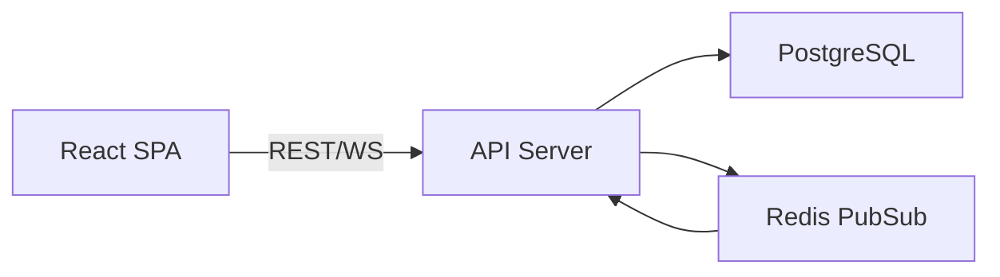
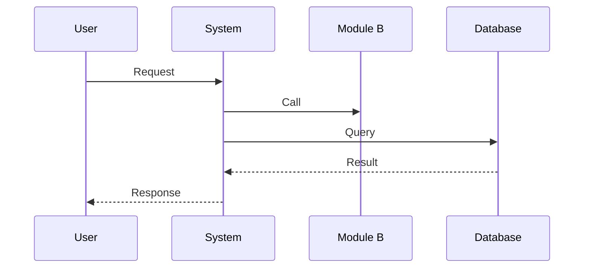
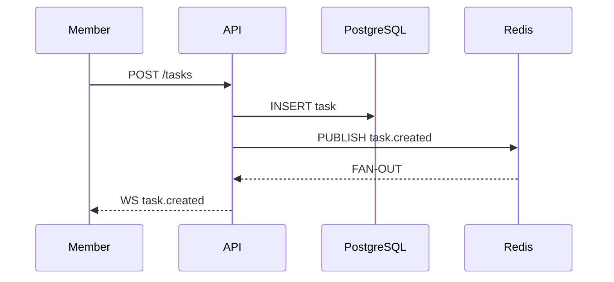

# DESIGN Blueprint
Blueprint for Technical Design Documents.

This file is the single source of truth for:
- template.md generation (from @cpt:heading + @cpt:prompt markers)
- example.md generation (from @cpt:heading examples + @cpt:example markers)
- rules.md generation (from @cpt:rules + @cpt:rule markers)
- checklist.md generation (from @cpt:checklist + @cpt:check markers)
- constraints.toml contributions (from @cpt:heading + @cpt:id markers)

All text between markers is ignored by the generator.

DESIGN is the system blueprint: architecture, components, boundaries,
interfaces, drivers, principles, and constraints.
Based on: ISO/IEC/IEEE 42010:2022, IEEE 1016-2009

## Metadata

> **`@cpt:blueprint`** — Blueprint metadata: artifact kind, kit slug, version. Internal; not output to any file.

`@cpt:blueprint`
```toml
# Artifact kind: PRD | ADR | DESIGN | DECOMPOSITION | FEATURE | CODE
artifact = "DESIGN"
codebase = false
```
`@/cpt:blueprint`

## Skill Integration

> **`@cpt:skill`** — Skill content. Agent-facing navigation and instructions. Output: `.gen/kits/{slug}/SKILL.md`.

`@cpt:skill`
```markdown
### DESIGN Commands
- `cypilot validate --artifact <DESIGN.md>` — validate DESIGN structure and IDs
- `cypilot list-ids --kind component` — list all components
- `cypilot list-ids --kind principle` — list all design principles
- `cypilot where-defined --id <id>` — find where a DESIGN ID is defined
- `cypilot where-used --id <id>` — find where a DESIGN ID is referenced downstream
### DESIGN Workflows
- **Generate DESIGN**: create a new DESIGN from template with guided prompts per section
- **Analyze DESIGN**: validate structure (deterministic) then semantic quality (checklist-based)
```
`@/cpt:skill`

---

## Rules Definition

### Rules Skeleton

> **`@cpt:rules`** — Rules skeleton. Defines section structure (prerequisites, requirements, tasks, validation, etc.) for `{cypilot_path}/.gen/kits/sdlc/artifacts/DESIGN/rules.md`.

`@cpt:rules`
```toml
# Prerequisite steps (load dependencies, read configs)
[prerequisites]
# Ordered list of section keys (each needs a matching @cpt:rule block)
sections = ["load_dependencies"]

# Requirement sections (structural, semantic, constraints, etc.)
[requirements]
# Ordered list of section keys (each needs a matching @cpt:rule block)
sections = ["structural", "versioning", "semantic", "scope", "traceability", "constraints", "deliberate_omissions", "technology_stack"]
# Display names for non-obvious requirement section keys
[requirements.names]
deliberate_omissions = "Deliberate Omissions (MUST NOT HAVE)"
technology_stack = "Technology Stack & Capacity"

# Task phases — step-by-step workflow for creating the artifact
[tasks]
# Ordered list of phase keys (each needs a matching @cpt:rule block)
phases = ["setup", "content_creation", "ids_and_references", "quality_check"]
# Display names for non-obvious task phase keys
[tasks.names]
ids_and_references = "IDs and References"

# Validation phases — ordered checks run after artifact is written
[validation]
# Ordered list of phase keys (each needs a matching @cpt:rule block)
phases = ["structural", "semantic", "validation_report", "applicability", "report_format", "reporting", "pr_review"]
# Display names for non-obvious validation phase keys
[validation.names]
structural = "Structural Validation (Deterministic)"
semantic = "Semantic Validation (Checklist-based)"
applicability = "Applicability Context"
report_format = "Report Format"
reporting = "Reporting Commitment"
pr_review = "PR Review Focus (Design)"

# Error handling sections — what to do when things go wrong
[error_handling]
# Ordered list of section keys (each needs a matching @cpt:rule block)
sections = ["missing_prd", "incomplete_prd", "escalation"]

# Next steps — recommended actions after completing the artifact
[next_steps]
# Ordered list of section keys (each needs a matching @cpt:rule block)
sections = ["options"]
```
`@/cpt:rules`

### Prerequisites

> **`@cpt:rule`** — Rule entry. TOML selects category+section; markdown block becomes the section body in `{cypilot_path}/.gen/kits/sdlc/artifacts/DESIGN/rules.md`.

`@cpt:rule:prerequisites-load_dependencies`
```toml
# Rule category: prerequisites | requirements | tasks | validation | error_handling | next_steps
kind = "prerequisites"
# Section name — must match a section defined in the @cpt:rules skeleton
section = "load_dependencies"
```
```markdown
- [ ] Load `{cypilot_path}/.gen/kits/sdlc/artifacts/DESIGN/template.md` for structure
- [ ] Load `{cypilot_path}/.gen/kits/sdlc/artifacts/DESIGN/checklist.md` for semantic guidance
- [ ] Load `{cypilot_path}/.gen/kits/sdlc/artifacts/DESIGN/examples/example.md` for reference style
- [ ] Read parent PRD for context
- [ ] Load `{cypilot_path}/.core/architecture/specs/traceability.md` for ID formats
- [ ] Load `{cypilot_path}/.gen/kits/sdlc/constraints.toml` for kit-level constraints
- [ ] Load `{cypilot_path}/.core/architecture/specs/kit/constraints.md` for constraints specification
- [ ] Load `{cypilot_path}/.core/schemas/kit-constraints.schema.json` for constraints JSON Schema
```
`@/cpt:rule:prerequisites-load_dependencies`

### Requirements

#### Structural

> **`@cpt:rule`** — Rule entry. TOML selects category+section; markdown block becomes the section body in `{cypilot_path}/.gen/kits/sdlc/artifacts/DESIGN/rules.md`.

`@cpt:rule:requirements-structural`
```toml
# Rule category: prerequisites | requirements | tasks | validation | error_handling | next_steps
kind = "requirements"
# Section name — must match a section defined in the @cpt:rules skeleton
section = "structural"
```
```markdown
- [ ] DESIGN follows `{cypilot_path}/.gen/kits/sdlc/artifacts/DESIGN/template.md` structure
- [ ] Artifact frontmatter (optional): use `cpt:` format for document metadata
- [ ] All required sections present and non-empty
- [ ] All IDs follow `cpt-{hierarchy-prefix}-{kind}-{slug}` convention (see artifacts.toml for hierarchy)
- [ ] References to PRD are valid
- [ ] No placeholder content (TODO, TBD, FIXME)
- [ ] No duplicate IDs within document
```
`@/cpt:rule:requirements-structural`

#### Versioning

> **`@cpt:rule`** — Rule entry. TOML selects category+section; markdown block becomes the section body in `{cypilot_path}/.gen/kits/sdlc/artifacts/DESIGN/rules.md`.

`@cpt:rule:requirements-versioning`
```toml
# Rule category: prerequisites | requirements | tasks | validation | error_handling | next_steps
kind = "requirements"
# Section name — must match a section defined in the @cpt:rules skeleton
section = "versioning"
```
```markdown
- [ ] When editing existing DESIGN: increment version in frontmatter
- [ ] When changing type/component definition: add `-v{N}` suffix to ID or increment existing version
- [ ] Format: `cpt-{hierarchy-prefix}-type-{slug}-v2`, `cpt-{hierarchy-prefix}-comp-{slug}-v3`, etc.
- [ ] Keep changelog of significant changes
```
`@/cpt:rule:requirements-versioning`

#### Semantic

> **`@cpt:rule`** — Rule entry. TOML selects category+section; markdown block becomes the section body in `{cypilot_path}/.gen/kits/sdlc/artifacts/DESIGN/rules.md`.

`@cpt:rule:requirements-semantic`
```toml
# Rule category: prerequisites | requirements | tasks | validation | error_handling | next_steps
kind = "requirements"
# Section name — must match a section defined in the @cpt:rules skeleton
section = "semantic"
```
```markdown
**Reference**: `{cypilot_path}/.gen/kits/sdlc/artifacts/DESIGN/checklist.md` for detailed semantic criteria

- [ ] Architecture overview is complete and clear
- [ ] Domain model defines all core types
- [ ] Components have clear responsibilities and boundaries
- [ ] Integration points documented
- [ ] ADR references provided for key decisions
- [ ] PRD capabilities traced to components
```
`@/cpt:rule:requirements-semantic`

#### Scope

> **`@cpt:rule`** — Rule entry. TOML selects category+section; markdown block becomes the section body in `{cypilot_path}/.gen/kits/sdlc/artifacts/DESIGN/rules.md`.

`@cpt:rule:requirements-scope`
```toml
# Rule category: prerequisites | requirements | tasks | validation | error_handling | next_steps
kind = "requirements"
# Section name — must match a section defined in the @cpt:rules skeleton
section = "scope"
```
```markdown
**One DESIGN per system/subsystem**. Match scope to architectural boundaries.

| Scope | Examples | Guideline |
|-------|----------|-----------|
| **Too broad** | "Entire platform design" for 50+ components | Split into subsystem DESIGNs |
| **Right size** | "Auth subsystem design" covering auth components | Clear boundary, manageable size |
| **Too narrow** | "Login button component design" | Implementation detail, use SPEC |

**DESIGN-worthy content**:
- System/subsystem architecture overview
- Domain model (core types, relationships)
- Component responsibilities and boundaries
- Integration points and contracts
- Key architectural decisions (reference ADRs)

**NOT DESIGN-worthy** (use SPEC instead):
- Individual spec implementation details
- UI flows and interactions
- Algorithm pseudo-code
- Test scenarios

**Relationship to other artifacts**:
- **PRD** → DESIGN: PRD defines WHAT, DESIGN defines HOW (high-level)
- **DESIGN** → DECOMPOSITION: DESIGN defines architecture, DECOMPOSITION lists implementations
- **DESIGN** → SPEC: DESIGN provides context, SPEC details implementation
```
`@/cpt:rule:requirements-scope`

#### Traceability

> **`@cpt:rule`** — Rule entry. TOML selects category+section; markdown block becomes the section body in `{cypilot_path}/.gen/kits/sdlc/artifacts/DESIGN/rules.md`.

`@cpt:rule:requirements-traceability`
```toml
# Rule category: prerequisites | requirements | tasks | validation | error_handling | next_steps
kind = "requirements"
# Section name — must match a section defined in the @cpt:rules skeleton
section = "traceability"
```
```markdown
- [ ] When component fully implemented → mark component `[x]` in DESIGN
- [ ] When all components for ADR implemented → update ADR status (PROPOSED → ACCEPTED)
- [ ] When all design elements for PRD capability implemented → mark capability `[x]` in PRD
```
`@/cpt:rule:requirements-traceability`

#### Constraints

> **`@cpt:rule`** — Rule entry. TOML selects category+section; markdown block becomes the section body in `{cypilot_path}/.gen/kits/sdlc/artifacts/DESIGN/rules.md`.

`@cpt:rule:requirements-constraints`
```toml
# Rule category: prerequisites | requirements | tasks | validation | error_handling | next_steps
kind = "requirements"
# Section name — must match a section defined in the @cpt:rules skeleton
section = "constraints"
```
```markdown
- [ ] ALWAYS open and follow `{cypilot_path}/.gen/kits/sdlc/constraints.toml` (kit root)
- [ ] Treat `constraints.toml` as primary validator for:
  - where IDs are defined
  - where IDs are referenced
  - which cross-artifact references are required / optional / prohibited

**References**:
- `{cypilot_path}/.core/requirements/kit-constraints.md`
- `{cypilot_path}/.core/schemas/kit-constraints.schema.json`

**Validation Checks**:
- `cypilot validate` enforces `identifiers[<kind>].references` rules (required / optional / prohibited)
- `cypilot validate` enforces headings scoping for ID definitions and references
- `cypilot validate` enforces "checked ref implies checked def" consistency
```
`@/cpt:rule:requirements-constraints`

#### Deliberate Omissions (MUST NOT HAVE)

> **`@cpt:rule`** — Rule entry. TOML selects category+section; markdown block becomes the section body in `{cypilot_path}/.gen/kits/sdlc/artifacts/DESIGN/rules.md`.

`@cpt:rule:requirements-deliberate_omissions`
```toml
# Rule category: prerequisites | requirements | tasks | validation | error_handling | next_steps
kind = "requirements"
# Section name — must match a section defined in the @cpt:rules skeleton
section = "deliberate_omissions"
```
```markdown
DESIGN documents must NOT contain the following — report as violation if found:

- **ARCH-DESIGN-NO-001**: No Spec-Level Details (CRITICAL) — DESIGN captures architecture, not feature specs
- **ARCH-DESIGN-NO-002**: No Decision Debates (HIGH) — debates belong in ADR
- **BIZ-DESIGN-NO-003**: No Product Requirements (HIGH) — requirements belong in PRD
- **BIZ-DESIGN-NO-004**: No Implementation Tasks (HIGH) — tasks belong in DECOMPOSITION
- **DATA-DESIGN-NO-001**: No Code-Level Schema Definitions (MEDIUM) — code schemas belong in implementation
- **INT-DESIGN-NO-001**: No Complete API Specifications (MEDIUM) — full API specs belong in FEATURE
- **OPS-DESIGN-NO-001**: No Infrastructure Code (MEDIUM) — infra code belongs in implementation
- **TEST-DESIGN-NO-001**: No Test Code (MEDIUM) — test code belongs in implementation
- **MAINT-DESIGN-NO-001**: No Code Snippets (HIGH) — code belongs in implementation
- **SEC-DESIGN-NO-001**: No Security Secrets (CRITICAL) — secrets must never appear in documentation
```
`@/cpt:rule:requirements-deliberate_omissions`

#### Technology Stack & Capacity

> **`@cpt:rule`** — Rule entry. TOML selects category+section; markdown block becomes the section body in `{cypilot_path}/.gen/kits/sdlc/artifacts/DESIGN/rules.md`.

`@cpt:rule:requirements-technology_stack`
```toml
# Rule category: prerequisites | requirements | tasks | validation | error_handling | next_steps
kind = "requirements"
# Section name — must match a section defined in the @cpt:rules skeleton
section = "technology_stack"
```
```markdown
**ARCH-DESIGN-009: Technology Stack Alignment** (MEDIUM):
- [ ] Technology choices documented (if applicable)
- [ ] Choices align with constraints
- [ ] Choices align with team capabilities
- [ ] Choices support NFRs
- [ ] Choices are maintainable long-term
- [ ] Technology risks identified

**ARCH-DESIGN-010: Capacity and Cost Budgets** (HIGH):
- [ ] Capacity planning approach documented
- [ ] Cost estimation approach documented
- [ ] Budget allocation strategy documented
- [ ] Cost optimization patterns documented
```
`@/cpt:rule:requirements-technology_stack`

### Task Phases

#### Setup

> **`@cpt:rule`** — Rule entry. TOML selects category+section; markdown block becomes the section body in `{cypilot_path}/.gen/kits/sdlc/artifacts/DESIGN/rules.md`.

`@cpt:rule:tasks-setup`
```toml
# Rule category: prerequisites | requirements | tasks | validation | error_handling | next_steps
kind = "tasks"
# Section name — must match a section defined in the @cpt:rules skeleton
section = "setup"
```
```markdown
- [ ] Load `{cypilot_path}/.gen/kits/sdlc/artifacts/DESIGN/template.md` for structure
- [ ] Load `{cypilot_path}/.gen/kits/sdlc/artifacts/DESIGN/checklist.md` for semantic guidance
- [ ] Load `{cypilot_path}/.gen/kits/sdlc/artifacts/DESIGN/examples/example.md` for reference style
- [ ] Read parent PRD for context
```
`@/cpt:rule:tasks-setup`

#### Content Creation

> **`@cpt:rule`** — Rule entry. TOML selects category+section; markdown block becomes the section body in `{cypilot_path}/.gen/kits/sdlc/artifacts/DESIGN/rules.md`.

`@cpt:rule:tasks-content_creation`
```toml
# Rule category: prerequisites | requirements | tasks | validation | error_handling | next_steps
kind = "tasks"
# Section name — must match a section defined in the @cpt:rules skeleton
section = "content_creation"
```
````markdown
**Apply checklist.md semantics during creation:**

| Checklist Section | Generation Task |
|-------------------|-----------------|
| ARCH-DESIGN-001: Architecture Overview | Document system purpose, high-level architecture, context diagram |
| ARCH-DESIGN-002: Principles Coherence | Define actionable, non-contradictory principles |
| DOMAIN-DESIGN-001: Domain Model | Define types, relationships, boundaries |
| COMP-DESIGN-001: Component Design | Define responsibilities, interfaces, dependencies |

**Partial Completion Handling**:

If DESIGN cannot be completed in a single session:
1. **Checkpoint progress**:
   - Note completed sections (Architecture, Domain, Components, etc.)
   - Note current section being worked on
   - List remaining sections
2. **Ensure valid intermediate state**:
   - All completed sections must be internally consistent
   - Add `status: DRAFT` to frontmatter
   - Mark incomplete sections with `INCOMPLETE: {reason}`
3. **Document resumption point**:
   ```
   DESIGN checkpoint:
   - Completed: Architecture Overview, Domain Model
   - In progress: Component Design (3/7 components)
   - Remaining: Sequences, Data Model
   - Resume: Continue with component cpt-{hierarchy-prefix}-comp-{slug}
   ```
4. **On resume**:
   - Verify PRD unchanged since last session
   - Continue from documented checkpoint
   - Remove incomplete markers as sections are finished
````
`@/cpt:rule:tasks-content_creation`

#### IDs & References

> **`@cpt:rule`** — Rule entry. TOML selects category+section; markdown block becomes the section body in `{cypilot_path}/.gen/kits/sdlc/artifacts/DESIGN/rules.md`.

`@cpt:rule:tasks-ids_and_references`
```toml
# Rule category: prerequisites | requirements | tasks | validation | error_handling | next_steps
kind = "tasks"
# Section name — must match a section defined in the @cpt:rules skeleton
section = "ids_and_references"
```
```markdown
- [ ] Generate type IDs: `cpt-{hierarchy-prefix}-type-{slug}` (e.g., `cpt-myapp-type-user-entity`)
- [ ] Generate component IDs (if needed)
- [ ] Link to PRD actors/capabilities
- [ ] Reference relevant ADRs
- [ ] Verify uniqueness with `cypilot list-ids`
```
`@/cpt:rule:tasks-ids_and_references`

#### Quality Check

> **`@cpt:rule`** — Rule entry. TOML selects category+section; markdown block becomes the section body in `{cypilot_path}/.gen/kits/sdlc/artifacts/DESIGN/rules.md`.

`@cpt:rule:tasks-quality_check`
```toml
# Rule category: prerequisites | requirements | tasks | validation | error_handling | next_steps
kind = "tasks"
# Section name — must match a section defined in the @cpt:rules skeleton
section = "quality_check"
```
```markdown
- [ ] Self-review against `{cypilot_path}/.gen/kits/sdlc/artifacts/DESIGN/checklist.md` MUST HAVE items
- [ ] Ensure no MUST NOT HAVE violations
- [ ] Verify PRD traceability
```
`@/cpt:rule:tasks-quality_check`

### Error Handling

#### Missing PRD

> **`@cpt:rule`** — Rule entry. TOML selects category+section; markdown block becomes the section body in `{cypilot_path}/.gen/kits/sdlc/artifacts/DESIGN/rules.md`.

`@cpt:rule:error_handling-missing_prd`
```toml
# Rule category: prerequisites | requirements | tasks | validation | error_handling | next_steps
kind = "error_handling"
# Section name — must match a section defined in the @cpt:rules skeleton
section = "missing_prd"
```
```markdown
- [ ] If parent PRD not found:
  - Option 1: Run `/cypilot-generate PRD` first (recommended)
  - Option 2: Continue without PRD (DESIGN will lack traceability)
  - If Option 2: document "PRD pending" in DESIGN frontmatter, skip PRD reference validation
```
`@/cpt:rule:error_handling-missing_prd`

#### Incomplete PRD

> **`@cpt:rule`** — Rule entry. TOML selects category+section; markdown block becomes the section body in `{cypilot_path}/.gen/kits/sdlc/artifacts/DESIGN/rules.md`.

`@cpt:rule:error_handling-incomplete_prd`
```toml
# Rule category: prerequisites | requirements | tasks | validation | error_handling | next_steps
kind = "error_handling"
# Section name — must match a section defined in the @cpt:rules skeleton
section = "incomplete_prd"
```
```markdown
- [ ] If PRD exists but is outdated: review PRD before proceeding
- [ ] If PRD needs updates: `/cypilot-generate PRD UPDATE`
- [ ] If PRD is current: proceed with DESIGN
```
`@/cpt:rule:error_handling-incomplete_prd`

#### Escalation

> **`@cpt:rule`** — Rule entry. TOML selects category+section; markdown block becomes the section body in `{cypilot_path}/.gen/kits/sdlc/artifacts/DESIGN/rules.md`.

`@cpt:rule:error_handling-escalation`
```toml
# Rule category: prerequisites | requirements | tasks | validation | error_handling | next_steps
kind = "error_handling"
# Section name — must match a section defined in the @cpt:rules skeleton
section = "escalation"
```
```markdown
- [ ] Ask user when uncertain about component boundaries
- [ ] Ask user when architecture decisions require ADR but none exists
- [ ] Ask user when PRD requirements are ambiguous or contradictory
```
`@/cpt:rule:error_handling-escalation`

### Validation

#### Structural

> **`@cpt:rule`** — Rule entry. TOML selects category+section; markdown block becomes the section body in `{cypilot_path}/.gen/kits/sdlc/artifacts/DESIGN/rules.md`.

`@cpt:rule:validation-structural`
```toml
# Rule category: prerequisites | requirements | tasks | validation | error_handling | next_steps
kind = "validation"
# Section name — must match a section defined in the @cpt:rules skeleton
section = "structural"
```
```markdown
- [ ] Run `cypilot validate --artifact <path>` for:
  - Template structure compliance
  - ID format validation
  - Cross-reference validity
  - No placeholders
```
`@/cpt:rule:validation-structural`

#### Semantic

> **`@cpt:rule`** — Rule entry. TOML selects category+section; markdown block becomes the section body in `{cypilot_path}/.gen/kits/sdlc/artifacts/DESIGN/rules.md`.

`@cpt:rule:validation-semantic`
```toml
# Rule category: prerequisites | requirements | tasks | validation | error_handling | next_steps
kind = "validation"
# Section name — must match a section defined in the @cpt:rules skeleton
section = "semantic"
```
```markdown
- [ ] Read `{cypilot_path}/.gen/kits/sdlc/artifacts/DESIGN/checklist.md` in full
- [ ] For each MUST HAVE item: check if requirement is met
  - If not met: report as violation with severity
  - If not applicable: verify explicit "N/A" with reasoning
- [ ] For each MUST NOT HAVE item: scan document for violations
```
`@/cpt:rule:validation-semantic`

#### Validation Report

> **`@cpt:rule`** — Rule entry. TOML selects category+section; markdown block becomes the section body in `{cypilot_path}/.gen/kits/sdlc/artifacts/DESIGN/rules.md`.

`@cpt:rule:validation-validation_report`
```toml
# Rule category: prerequisites | requirements | tasks | validation | error_handling | next_steps
kind = "validation"
# Section name — must match a section defined in the @cpt:rules skeleton
section = "validation_report"
```
````markdown
```
DESIGN Validation Report
══════════════════════════

Structural: PASS/FAIL
Semantic: PASS/FAIL (N issues)

Issues:
- [SEVERITY] CHECKLIST-ID: Description
```
````
`@/cpt:rule:validation-validation_report`

#### Applicability Context

> **`@cpt:rule`** — Rule entry. TOML selects category+section; markdown block becomes the section body in `{cypilot_path}/.gen/kits/sdlc/artifacts/DESIGN/rules.md`.

`@cpt:rule:validation-applicability`
```toml
# Rule category: prerequisites | requirements | tasks | validation | error_handling | next_steps
kind = "validation"
# Section name — must match a section defined in the @cpt:rules skeleton
section = "applicability"
```
```markdown
Before evaluating each checklist item, the expert MUST:

1. **Understand the artifact's domain** — What kind of system/project is this DESIGN for? (e.g., web service, CLI tool, data pipeline, methodology framework)

2. **Determine applicability for each requirement** — Not all checklist items apply to all designs:
   - A CLI tool design may not need Security Architecture analysis
   - A methodology framework design may not need Performance Architecture analysis
   - A local development tool design may not need Operations Architecture analysis

3. **Require explicit handling** — For each checklist item:
   - If applicable: The document MUST address it (present and complete)
   - If not applicable: The document MUST explicitly state "Not applicable because..." with reasoning
   - If missing without explanation: Report as violation

4. **Never skip silently** — Either:
   - The requirement is met (document addresses it), OR
   - The requirement is explicitly marked not applicable (document explains why), OR
   - The requirement is violated (report it with applicability justification)

**Key principle**: The reviewer must be able to distinguish "author considered and excluded" from "author forgot"
```
`@/cpt:rule:validation-applicability`

#### Report Format

> **`@cpt:rule`** — Rule entry. TOML selects category+section; markdown block becomes the section body in `{cypilot_path}/.gen/kits/sdlc/artifacts/DESIGN/rules.md`.

`@cpt:rule:validation-report_format`
```toml
# Rule category: prerequisites | requirements | tasks | validation | error_handling | next_steps
kind = "validation"
# Section name — must match a section defined in the @cpt:rules skeleton
section = "report_format"
```
````markdown
Report **only** problems (do not list what is OK).

For each issue include:

- **Why Applicable**: Explain why this requirement applies to this specific DESIGN's context
- **Checklist Item**: `{CHECKLIST-ID}` — {Checklist item title}
- **Severity**: CRITICAL|HIGH|MEDIUM|LOW
- **Issue**: What is wrong (requirement missing or incomplete)
- **Evidence**: Quote the exact text or "No mention found"
- **Why it matters**: Impact (risk, cost, user harm, compliance)
- **Proposal**: Concrete fix with clear acceptance criteria

### Compact Report Format (Quick Reviews)

For quick reviews, use this condensed table format:

```markdown
## DESIGN Review Summary

| ID | Severity | Issue | Proposal |
|----|----------|-------|----------|
| ARCH-DESIGN-001 | HIGH | Missing context diagram | Add system context diagram to Section A |
| ARCH-DESIGN-005 | MEDIUM | No schema location | Add path to domain types in Section C.1 |

**Applicability**: {System type} — checked {N} priority domains, {M} marked N/A
```
````
`@/cpt:rule:validation-report_format`

#### Reporting Commitment

> **`@cpt:rule`** — Rule entry. TOML selects category+section; markdown block becomes the section body in `{cypilot_path}/.gen/kits/sdlc/artifacts/DESIGN/rules.md`.

`@cpt:rule:validation-reporting`
```toml
# Rule category: prerequisites | requirements | tasks | validation | error_handling | next_steps
kind = "validation"
# Section name — must match a section defined in the @cpt:rules skeleton
section = "reporting"
```
```markdown
- [ ] I reported all issues I found
- [ ] I used the exact report format defined in this checklist (no deviations)
- [ ] I included Why Applicable justification for each issue
- [ ] I included evidence and impact for each issue
- [ ] I proposed concrete fixes for each issue
- [ ] I did not hide or omit known problems
- [ ] I verified explicit handling for all major checklist categories
- [ ] I am ready to iterate on the proposals and re-review after changes
```
`@/cpt:rule:validation-reporting`

#### PR Review Focus (Design)

> **`@cpt:rule`** — Rule entry. TOML selects category+section; markdown block becomes the section body in `{cypilot_path}/.gen/kits/sdlc/artifacts/DESIGN/rules.md`.

`@cpt:rule:validation-pr_review`
```toml
# Rule category: prerequisites | requirements | tasks | validation | error_handling | next_steps
kind = "validation"
# Section name — must match a section defined in the @cpt:rules skeleton
section = "pr_review"
```
```markdown
When reviewing PRs that add or change design documents, additionally focus on:

- [ ] Alignment with existing architecture (see project DESIGN artifacts)
- [ ] Trade-off analysis — are alternatives considered and justified?
- [ ] API contract consistency with existing endpoints and conventions
- [ ] Security considerations — authentication, authorization, data protection
- [ ] Compliance with `{cypilot_path}/.gen/kits/sdlc/artifacts/DESIGN/template.md` structure (generated from blueprint)
- [ ] Identify antipatterns — god objects, leaky abstractions, tight coupling
- [ ] Compare proposed design with existing industry patterns in SaaS platforms
- [ ] Compare proposed design with IEEE, ISO, and other industry standards where applicable
- [ ] Critical assessment of design decisions — challenge assumptions and gaps
- [ ] Split findings by checklist category and rate each 1-10
```
`@/cpt:rule:validation-pr_review`

### Next Steps

> **`@cpt:rule`** — Rule entry. TOML selects category+section; markdown block becomes the section body in `{cypilot_path}/.gen/kits/sdlc/artifacts/DESIGN/rules.md`.

`@cpt:rule:next_steps-options`
```toml
# Rule category: prerequisites | requirements | tasks | validation | error_handling | next_steps
kind = "next_steps"
# Section name — must match a section defined in the @cpt:rules skeleton
section = "options"
```
```markdown
- [ ] DESIGN complete → `/cypilot-generate DECOMPOSITION` — create specs manifest
- [ ] Need architecture decision → `/cypilot-generate ADR` — document key decision
- [ ] PRD missing/incomplete → `/cypilot-generate PRD` — create/update PRD first
- [ ] DESIGN needs revision → continue editing DESIGN
- [ ] Want checklist review only → `/cypilot-analyze semantic` — semantic validation
```
`@/cpt:rule:next_steps-options`

---

## Checklist Definition

Design quality checks organized by domain.

### Checklist Skeleton

> **`@cpt:checklist`** — Checklist preamble. Static markdown placed at the top of `{cypilot_path}/.gen/kits/sdlc/artifacts/DESIGN/checklist.md` (standards, prerequisites, severity dictionary).

`@cpt:checklist`
```toml
[severity]
levels = ["CRITICAL", "HIGH", "MEDIUM", "LOW"]

[review]
priority = ["ARCH", "SEM", "PERF", "SEC", "REL", "DATA", "INT", "OPS", "MAINT", "TEST", "COMPL", "UX", "BIZ", "DOC"]

[[domain]]
abbr = "ARCH"
name = "🏗️ ARCHITECTURE Expertise"
header = "🏗️ ARCHITECTURE Expertise (ARCH)"
standards_text = """> **Standards**:
> - [IEEE 1016-2009](https://standards.ieee.org/ieee/1016/4502/) — Context (§5.2), Composition (§5.3), Logical (§5.4), Dependency (§5.5) viewpoints
> - [ISO/IEC/IEEE 42010:2022](https://www.iso.org/standard/74393.html) — Stakeholders, concerns, architecture viewpoints (§5-6)"""

[[domain]]
abbr = "SEM"
name = "Semantic Alignment"
header = "Semantic Alignment (SEM)"
standards_text = """> **Standard**: [ISO/IEC/IEEE 29148:2018](https://www.iso.org/standard/72089.html) — Requirements Engineering
>
> "Bidirectional traceability between requirements and design" (§6.5)"""

[[domain]]
abbr = "PERF"
name = "⚡ PERFORMANCE Expertise"
header = "⚡ PERFORMANCE Expertise (PERF)"
standards_text = """> **Standard**: [ISO/IEC 25010:2011](https://www.iso.org/standard/35733.html) — Performance Efficiency
>
> Sub-characteristics: time behavior, resource utilization, capacity"""

[[domain]]
abbr = "SEC"
name = "🔒 SECURITY Expertise"
header = "🔒 SECURITY Expertise (SEC)"
standards_text = """> **Standards**:
> - [ISO/IEC 25010:2011](https://www.iso.org/standard/35733.html) — Security: confidentiality, integrity, non-repudiation, accountability, authenticity
> - [OWASP ASVS 5.0](https://owasp.org/www-project-application-security-verification-standard/) — Architecture requirements (V1)
> - [ISO/IEC 27001:2022](https://www.iso.org/standard/27001) — Information security controls"""

[[domain]]
abbr = "REL"
name = "🛡️ RELIABILITY Expertise"
header = "🛡️ RELIABILITY Expertise (REL)"
standards_text = """> **Standard**: [ISO/IEC 25010:2011](https://www.iso.org/standard/35733.html) — Reliability
>
> Sub-characteristics: maturity, availability, fault tolerance, recoverability"""

[[domain]]
abbr = "DATA"
name = "📊 DATA Expertise"
header = "📊 DATA Expertise (DATA)"
standards_text = """> **Standard**: [IEEE 1016-2009](https://standards.ieee.org/ieee/1016/4502/) — Information Viewpoint (§5.6)
>
> Data entities, persistent data stores, data flow"""

[[domain]]
abbr = "INT"
name = "🔌 INTEGRATION Expertise"
header = "🔌 INTEGRATION Expertise (INT)"
standards = []

[[domain]]
abbr = "OPS"
name = "🖥️ OPERATIONS Expertise"
header = "🖥️ OPERATIONS Expertise (OPS)"
standards = []

[[domain]]
abbr = "MAINT"
name = "🔧 MAINTAINABILITY Expertise"
header = "🔧 MAINTAINABILITY Expertise (MAINT)"
standards_text = """> **Standard**: [ISO/IEC 25010:2011](https://www.iso.org/standard/35733.html) — Maintainability
>
> Sub-characteristics: modularity, reusability, analysability, modifiability, testability"""

[[domain]]
abbr = "TEST"
name = "🧪 TESTING Expertise"
header = "🧪 TESTING Expertise (TEST)"
standards_text = """> **Standard**: [ISO/IEC 25010:2011](https://www.iso.org/standard/35733.html) §4.2.7.5 — Testability"""

[[domain]]
abbr = "COMPL"
name = "📜 COMPLIANCE Expertise"
header = "📜 COMPLIANCE Expertise (COMPL)"
standards = []

[[domain]]
abbr = "UX"
name = "👤 USABILITY Expertise"
header = "👤 USABILITY Expertise (UX)"
standards = []

[[domain]]
abbr = "BIZ"
name = "🏢 BUSINESS Expertise"
header = "🏢 BUSINESS Expertise (BIZ)"
standards_text = """> **Standard**: [ISO/IEC/IEEE 29148:2018](https://www.iso.org/standard/72089.html) — Requirements Engineering
>
> Requirements-to-design allocation and traceability (§6.5)"""

[[domain]]
abbr = "DOC"
name = "DOC"
header = "DOC (DOC)"
standards = []

```
````markdown
# DESIGN (Overall Design) Expert Checklist

**Artifact**: Overall System Design (DESIGN)
**Version**: 2.0
**Last Updated**: 2026-02-03
**Purpose**: Comprehensive quality checklist for Overall Design artifacts

---

## Referenced Standards

This checklist validates system design artifacts based on the following international standards:

| Standard | Domain | Description |
|----------|--------|-------------|
| [IEEE 1016-2009](https://standards.ieee.org/ieee/1016/4502/) | **Design Description** | Software Design Descriptions — context, composition, logical, dependency viewpoints |
| [ISO/IEC/IEEE 42010:2022](https://www.iso.org/standard/74393.html) | **Architecture Description** | Architecture viewpoints, stakeholders, concerns, model correspondences |
| [ISO/IEC 25010:2011](https://www.iso.org/standard/35733.html) | **Quality Model** | SQuaRE — 8 quality characteristics: performance, security, reliability, maintainability |
| [ISO/IEC/IEEE 29148:2018](https://www.iso.org/standard/72089.html) | **Requirements Traceability** | Bidirectional traceability, requirements-to-design mapping |
| [OWASP ASVS 5.0](https://owasp.org/www-project-application-security-verification-standard/) | **Security Architecture** | Authentication, authorization, cryptography, data protection |
| [ISO/IEC 27001:2022](https://www.iso.org/standard/27001) | **Information Security** | ISMS controls, security management framework |
---

## Review Scope Selection

**Choose review mode based on DESIGN scope and change type**:

| Review Mode | When to Use | Domains to Check |
|-------------|-------------|------------------|
| **Quick** | Minor updates, <3 sections changed | ARCH (core only) + changed domains |
| **Standard** | New DESIGN, moderate changes | All applicable domains |
| **Full** | Major architectural changes, compliance-critical | All 12 domains with evidence |

### Quick Review (ARCH Core Only)

**MUST CHECK** (blocking):
- [ ] ARCH-DESIGN-001: Architecture Overview Completeness
- [ ] ARCH-DESIGN-004: Component Model Quality
- [ ] ARCH-DESIGN-005: Domain Model Authority
- [ ] DOC-DESIGN-001: Explicit Non-Applicability

**Changed sections** — also check relevant domain items for any sections modified.

### Domain Prioritization by System Type

| System Type | Priority Domains (check first) | Secondary Domains | Often N/A |
|-------------|-------------------------------|-------------------|-----------|
| **Web Service** | ARCH, SEC, REL, DATA, INT | PERF, OPS, TEST | UX, COMPL |
| **CLI Tool** | ARCH, MAINT, TEST | DATA, INT | SEC, PERF, OPS, COMPL, UX |
| **Data Pipeline** | ARCH, DATA, REL, PERF | INT, OPS | SEC, UX, COMPL |
| **Methodology/Framework** | ARCH, MAINT | TEST | SEC, PERF, REL, DATA, INT, OPS, COMPL, UX |
| **Mobile App** | ARCH, UX, SEC, PERF | DATA, TEST | OPS, INT, COMPL |

**Applicability Rule**: Domains in "Often N/A" column still require explicit "Not applicable because..." statement in document if skipped.

---

## Prerequisites

Before starting the review, confirm:

- [ ] I understand this checklist validates DESIGN artifacts
- [ ] I will follow the Applicability Context rules below
- [ ] I will check ALL items in MUST HAVE sections
- [ ] I will verify ALL items in MUST NOT HAVE sections
- [ ] I will document any violations found
- [ ] I will provide specific feedback for each failed check
- [ ] I will complete the Final Checklist and provide a review report

---

## Evidence Requirements (STRICT mode)

**When Rules Mode = STRICT** (per `{cypilot_path}/.core/requirements/agent-compliance.md`):

### For Each Checklist Category

Agent MUST output evidence in this format:

| Category ID | Status | Evidence |
|-------------|--------|----------|
| ARCH-DESIGN-001 | PASS | Lines 45-67: "System purpose is to provide..." |
| ARCH-DESIGN-002 | PASS | Section B.1 contains 9 principles with unique IDs |
| PERF-DESIGN-001 | N/A | Line 698: "Performance architecture not applicable..." |

### Evidence Standards

**For PASS**:
- Quote 2-5 sentences from document proving requirement is met
- Include line numbers or section references
- Evidence must directly demonstrate compliance

**For N/A (Not Applicable)**:
- Quote the **explicit** "Not applicable because..." statement from document
- If no explicit statement exists → report as VIOLATION, not N/A
- Agent CANNOT decide N/A on author's behalf — document must state it

**For FAIL**:
- State what's missing or incorrect
- Provide location where it should be
- Quote surrounding context

### Why Evidence Matters

Without evidence requirements, agents exhibit anti-pattern AP-004 (BULK_PASS):
- Report "all checks pass" without actually verifying each item
- Skip tedious checklist review
- Produce invalid validation that misses real issues

**Real example of this failure**:
> Agent reported "DESIGN validation PASS" without reading the file, because deterministic gate passed and agent assumed semantic review was optional.

---

## Applicability Context

Before evaluating each checklist item, the expert MUST:

1. **Understand the artifact's domain** — What kind of system/project is this DESIGN for? (e.g., web service, CLI tool, data pipeline, methodology framework)

2. **Determine applicability for each requirement** — Not all checklist items apply to all designs:
   - A CLI tool design may not need Security Architecture analysis
   - A methodology framework design may not need Performance Architecture analysis
   - A local development tool design may not need Operations Architecture analysis

3. **Require explicit handling** — For each checklist item:
   - If applicable: The document MUST address it (present and complete)
   - If not applicable: The document MUST explicitly state "Not applicable because..." with reasoning
   - If missing without explanation: Report as violation

4. **Never skip silently** — The expert MUST NOT skip a requirement just because it's not mentioned. Either:
   - The requirement is met (document addresses it), OR
   - The requirement is explicitly marked not applicable (document explains why), OR
   - The requirement is violated (report it with applicability justification)

**Key principle**: The reviewer must be able to distinguish "author considered and excluded" from "author forgot"

---

## Severity Dictionary

- **CRITICAL**: Unsafe/misleading/unverifiable; blocks downstream work.
- **HIGH**: Major ambiguity/risk; should be fixed before approval.
- **MEDIUM**: Meaningful improvement; fix when feasible.
- **LOW**: Minor improvement; optional.
````
`@/cpt:checklist`

> **`@cpt:check`** — Checklist item. TOML defines id/domain/severity; markdown defines the check criteria. Output: `{cypilot_path}/.gen/kits/sdlc/artifacts/DESIGN/checklist.md`.

`@cpt:check:arch-design-001`
```toml
# Unique check ID (format: {DOMAIN}-{ARTIFACT}-{NNN})
id = "ARCH-DESIGN-001"
# Expertise domain: BIZ|ARCH|SEC|TEST|MAINT|OPS|DOC|UX|SAFE|COMPL|PERF|DATA|INT
domain = "ARCH"
# Human-readable check title
title = "Architecture Overview Completeness"
# Severity: CRITICAL | HIGH | MEDIUM | LOW
severity = "CRITICAL"
# Reference standard (ISO, IEEE, etc.) or empty string
ref = "ISO/IEC/IEEE 42010:2022 §5.3 (Stakeholders and concerns), IEEE 1016-2009 §5.2 (Context viewpoint)"
# Check kind: must_have | must_not_have
kind = "must_have"
```
```markdown
- [ ] System purpose clearly stated
- [ ] High-level architecture described
- [ ] Key architectural decisions summarized
- [ ] Architecture drivers documented (Section A)
- [ ] Key product/business requirements mapped to architectural drivers (links or references)
- [ ] System context diagram present or described
- [ ] External system boundaries identified
- [ ] ADR references provided for significant constraints
```
`@/cpt:check:arch-design-001`

> **`@cpt:check`** — Checklist item. TOML defines id/domain/severity; markdown defines the check criteria. Output: `{cypilot_path}/.gen/kits/sdlc/artifacts/DESIGN/checklist.md`.

`@cpt:check:arch-design-002`
```toml
# Unique check ID (format: {DOMAIN}-{ARTIFACT}-{NNN})
id = "ARCH-DESIGN-002"
# Expertise domain: BIZ|ARCH|SEC|TEST|MAINT|OPS|DOC|UX|SAFE|COMPL|PERF|DATA|INT
domain = "ARCH"
# Human-readable check title
title = "Principles Coherence"
# Severity: CRITICAL | HIGH | MEDIUM | LOW
severity = "CRITICAL"
# Check kind: must_have | must_not_have
kind = "must_have"
```
```markdown
- [ ] Each principle has a stable reference (name/identifier) and is unique
- [ ] Principles are actionable (can guide decisions)
- [ ] Principles don't contradict each other
- [ ] Principles are prioritized when they conflict
- [ ] Principles trace to business drivers
- [ ] ADR references provided for major principles (if ADRs exist)
```
`@/cpt:check:arch-design-002`

> **`@cpt:check`** — Checklist item. TOML defines id/domain/severity; markdown defines the check criteria. Output: `{cypilot_path}/.gen/kits/sdlc/artifacts/DESIGN/checklist.md`.

`@cpt:check:arch-design-003`
```toml
# Unique check ID (format: {DOMAIN}-{ARTIFACT}-{NNN})
id = "ARCH-DESIGN-003"
# Expertise domain: BIZ|ARCH|SEC|TEST|MAINT|OPS|DOC|UX|SAFE|COMPL|PERF|DATA|INT
domain = "ARCH"
# Human-readable check title
title = "Constraints Documentation"
# Severity: CRITICAL | HIGH | MEDIUM | LOW
severity = "CRITICAL"
# Check kind: must_have | must_not_have
kind = "must_have"
```
```markdown
- [ ] Each constraint has a stable reference (name/identifier) and is unique
- [ ] Regulatory constraints documented
- [ ] Platform/technology constraints documented
- [ ] Vendor/licensing constraints documented
- [ ] Legacy system integration constraints documented
- [ ] Data residency constraints documented
- [ ] Resource constraints documented (budget, team, time)
- [ ] ADR references provided for significant constraints
```
`@/cpt:check:arch-design-003`

> **`@cpt:check`** — Checklist item. TOML defines id/domain/severity; markdown defines the check criteria. Output: `{cypilot_path}/.gen/kits/sdlc/artifacts/DESIGN/checklist.md`.

`@cpt:check:arch-design-004`
```toml
# Unique check ID (format: {DOMAIN}-{ARTIFACT}-{NNN})
id = "ARCH-DESIGN-004"
# Expertise domain: BIZ|ARCH|SEC|TEST|MAINT|OPS|DOC|UX|SAFE|COMPL|PERF|DATA|INT
domain = "ARCH"
# Human-readable check title
title = "Component Model Quality"
# Severity: CRITICAL | HIGH | MEDIUM | LOW
severity = "CRITICAL"
# Reference standard (ISO, IEEE, etc.) or empty string
ref = "IEEE 1016-2009 §5.3 (Composition viewpoint), ISO/IEC/IEEE 42010:2022 §6 (Architecture views)"
# Check kind: must_have | must_not_have
kind = "must_have"
```
```markdown
- [ ] At least one architecture diagram present (image, Mermaid, or ASCII)
- [ ] All major components/services identified
- [ ] Component responsibilities clearly defined
- [ ] Component boundaries explicit
- [ ] Component interactions documented
- [ ] Data flow between components described
- [ ] Control flow between components described
- [ ] Component naming is consistent and meaningful
```
`@/cpt:check:arch-design-004`

> **`@cpt:check`** — Checklist item. TOML defines id/domain/severity; markdown defines the check criteria. Output: `{cypilot_path}/.gen/kits/sdlc/artifacts/DESIGN/checklist.md`.

`@cpt:check:arch-design-005`
```toml
# Unique check ID (format: {DOMAIN}-{ARTIFACT}-{NNN})
id = "ARCH-DESIGN-005"
# Expertise domain: BIZ|ARCH|SEC|TEST|MAINT|OPS|DOC|UX|SAFE|COMPL|PERF|DATA|INT
domain = "ARCH"
# Human-readable check title
title = "Domain Model Authority"
# Severity: CRITICAL | HIGH | MEDIUM | LOW
severity = "CRITICAL"
# Reference standard (ISO, IEEE, etc.) or empty string
ref = "IEEE 1016-2009 §5.4 (Logical viewpoint), §5.6 (Information viewpoint)"
# Check kind: must_have | must_not_have
kind = "must_have"
```
```markdown
- [ ] Domain model section exists
- [ ] Core entities/aggregates defined
- [ ] Value objects identified
- [ ] Entity relationships documented
- [ ] Core invariants stated
- [ ] Links to machine-readable schemas/types are provided (when available)
- [ ] Schema location in repo specified
- [ ] Schema/type format specified (JSON Schema, TypeScript, OpenAPI, etc.)
```
`@/cpt:check:arch-design-005`

> **`@cpt:check`** — Checklist item. TOML defines id/domain/severity; markdown defines the check criteria. Output: `{cypilot_path}/.gen/kits/sdlc/artifacts/DESIGN/checklist.md`.

`@cpt:check:arch-design-006`
```toml
# Unique check ID (format: {DOMAIN}-{ARTIFACT}-{NNN})
id = "ARCH-DESIGN-006"
# Expertise domain: BIZ|ARCH|SEC|TEST|MAINT|OPS|DOC|UX|SAFE|COMPL|PERF|DATA|INT
domain = "ARCH"
# Human-readable check title
title = "API Contracts Authority"
# Severity: CRITICAL | HIGH | MEDIUM | LOW
severity = "CRITICAL"
# Check kind: must_have | must_not_have
kind = "must_have"
```
```markdown
- [ ] API/Interface contracts section exists (if applicable)
- [ ] External APIs documented
- [ ] Internal APIs documented (if applicable)
- [ ] Links to machine-readable contracts are provided (when available)
- [ ] Contract format specified (OpenAPI, GraphQL, proto)
- [ ] Key endpoints/operations described
- [ ] Request/response shapes outlined
- [ ] Error handling expectations documented
- [ ] AuthN/AuthZ entry points documented
- [ ] Versioning strategy documented (if applicable)
```
`@/cpt:check:arch-design-006`

> **`@cpt:check`** — Checklist item. TOML defines id/domain/severity; markdown defines the check criteria. Output: `{cypilot_path}/.gen/kits/sdlc/artifacts/DESIGN/checklist.md`.

`@cpt:check:arch-design-007`
```toml
# Unique check ID (format: {DOMAIN}-{ARTIFACT}-{NNN})
id = "ARCH-DESIGN-007"
# Expertise domain: BIZ|ARCH|SEC|TEST|MAINT|OPS|DOC|UX|SAFE|COMPL|PERF|DATA|INT
domain = "ARCH"
# Human-readable check title
title = "Interaction Sequences"
# Severity: CRITICAL | HIGH | MEDIUM | LOW
severity = "HIGH"
# Check kind: must_have | must_not_have
kind = "must_have"
```
```markdown
- [ ] Key interaction flows documented
- [ ] Sequence diagrams for critical paths
- [ ] Actors/use cases referenced consistently with the requirements document
- [ ] Happy path sequences documented
- [ ] Error path sequences documented
- [ ] Async flows documented (if applicable)
- [ ] Long-running operations documented
```
`@/cpt:check:arch-design-007`

> **`@cpt:check`** — Checklist item. TOML defines id/domain/severity; markdown defines the check criteria. Output: `{cypilot_path}/.gen/kits/sdlc/artifacts/DESIGN/checklist.md`.

`@cpt:check:arch-design-008`
```toml
# Unique check ID (format: {DOMAIN}-{ARTIFACT}-{NNN})
id = "ARCH-DESIGN-008"
# Expertise domain: BIZ|ARCH|SEC|TEST|MAINT|OPS|DOC|UX|SAFE|COMPL|PERF|DATA|INT
domain = "ARCH"
# Human-readable check title
title = "Modularity & Extensibility"
# Severity: CRITICAL | HIGH | MEDIUM | LOW
severity = "HIGH"
# Check kind: must_have | must_not_have
kind = "must_have"
```
```markdown
- [ ] Extension points identified
- [ ] Plugin/module boundaries defined
- [ ] API stability zones identified
- [ ] Internal vs external interfaces distinguished
- [ ] Coupling between components minimized
- [ ] Cohesion within components maximized
```
`@/cpt:check:arch-design-008`

> **`@cpt:check`** — Checklist item. TOML defines id/domain/severity; markdown defines the check criteria. Output: `{cypilot_path}/.gen/kits/sdlc/artifacts/DESIGN/checklist.md`.

`@cpt:check:arch-design-009`
```toml
# Unique check ID (format: {DOMAIN}-{ARTIFACT}-{NNN})
id = "ARCH-DESIGN-009"
# Expertise domain: BIZ|ARCH|SEC|TEST|MAINT|OPS|DOC|UX|SAFE|COMPL|PERF|DATA|INT
domain = "ARCH"
# Human-readable check title
title = "Technology Stack Alignment"
# Severity: CRITICAL | HIGH | MEDIUM | LOW
severity = "MEDIUM"
# Check kind: must_have | must_not_have
kind = "must_have"
```
```markdown
- [ ] Technology choices documented (if applicable)
- [ ] Choices align with constraints
- [ ] Choices align with team capabilities
- [ ] Choices support NFRs
- [ ] Choices are maintainable long-term
- [ ] Technology risks identified
```
`@/cpt:check:arch-design-009`

> **`@cpt:check`** — Checklist item. TOML defines id/domain/severity; markdown defines the check criteria. Output: `{cypilot_path}/.gen/kits/sdlc/artifacts/DESIGN/checklist.md`.

`@cpt:check:arch-design-010`
```toml
# Unique check ID (format: {DOMAIN}-{ARTIFACT}-{NNN})
id = "ARCH-DESIGN-010"
# Expertise domain: BIZ|ARCH|SEC|TEST|MAINT|OPS|DOC|UX|SAFE|COMPL|PERF|DATA|INT
domain = "ARCH"
# Human-readable check title
title = "Capacity and Cost Budgets"
# Severity: CRITICAL | HIGH | MEDIUM | LOW
severity = "HIGH"
# Check kind: must_have | must_not_have
kind = "must_have"
```
```markdown
- [ ] Capacity planning approach documented
- [ ] Cost estimation approach documented
- [ ] Budget allocation strategy documented
- [ ] Cost optimization patterns documented
```
`@/cpt:check:arch-design-010`

> **`@cpt:check`** — Checklist item. TOML defines id/domain/severity; markdown defines the check criteria. Output: `{cypilot_path}/.gen/kits/sdlc/artifacts/DESIGN/checklist.md`.

`@cpt:check:sem-design-001`
```toml
# Unique check ID (format: {DOMAIN}-{ARTIFACT}-{NNN})
id = "SEM-DESIGN-001"
# Expertise domain: BIZ|ARCH|SEC|TEST|MAINT|OPS|DOC|UX|SAFE|COMPL|PERF|DATA|INT
domain = "SEM"
# Human-readable check title
title = "PRD Intent Preservation"
# Severity: CRITICAL | HIGH | MEDIUM | LOW
severity = "CRITICAL"
# Reference standard (ISO, IEEE, etc.) or empty string
ref = "ISO/IEC/IEEE 29148:2018 §6.5 (Traceability)"
# Check kind: must_have | must_not_have
kind = "must_have"
```
```markdown
- [ ] Design addresses all PRD FR and NFR IDs referenced in the design
- [ ] Architecture drivers align with PRD problems, capabilities, and success criteria
- [ ] Actors and use cases referenced in design match the PRD actor definitions
- [ ] Non-goals and risks in PRD are respected and not contradicted
```
`@/cpt:check:sem-design-001`

> **`@cpt:check`** — Checklist item. TOML defines id/domain/severity; markdown defines the check criteria. Output: `{cypilot_path}/.gen/kits/sdlc/artifacts/DESIGN/checklist.md`.

`@cpt:check:sem-design-002`
```toml
# Unique check ID (format: {DOMAIN}-{ARTIFACT}-{NNN})
id = "SEM-DESIGN-002"
# Expertise domain: BIZ|ARCH|SEC|TEST|MAINT|OPS|DOC|UX|SAFE|COMPL|PERF|DATA|INT
domain = "SEM"
# Human-readable check title
title = "PRD Scope Consistency"
# Severity: CRITICAL | HIGH | MEDIUM | LOW
severity = "HIGH"
# Check kind: must_have | must_not_have
kind = "must_have"
```
```markdown
- [ ] No design scope extends beyond PRD boundaries without explicit approval
- [ ] Assumptions and open questions are consistent with PRD assumptions
- [ ] Any PRD trade-offs are explicitly documented in design context
```
`@/cpt:check:sem-design-002`

> **`@cpt:check`** — Checklist item. TOML defines id/domain/severity; markdown defines the check criteria. Output: `{cypilot_path}/.gen/kits/sdlc/artifacts/DESIGN/checklist.md`.

`@cpt:check:sem-design-003`
```toml
# Unique check ID (format: {DOMAIN}-{ARTIFACT}-{NNN})
id = "SEM-DESIGN-003"
# Expertise domain: BIZ|ARCH|SEC|TEST|MAINT|OPS|DOC|UX|SAFE|COMPL|PERF|DATA|INT
domain = "SEM"
# Human-readable check title
title = "ADR Consistency and Coverage"
# Severity: CRITICAL | HIGH | MEDIUM | LOW
severity = "CRITICAL"
# Check kind: must_have | must_not_have
kind = "must_have"
```
```markdown
- [ ] Each referenced ADR decision is reflected in architecture choices and rationale
- [ ] ADR status is respected (Rejected/Deprecated decisions are not implemented)
- [ ] ADR decision drivers are reflected in design principles and constraints
- [ ] ADR consequences are incorporated into design risks or constraints
```
`@/cpt:check:sem-design-003`

> **`@cpt:check`** — Checklist item. TOML defines id/domain/severity; markdown defines the check criteria. Output: `{cypilot_path}/.gen/kits/sdlc/artifacts/DESIGN/checklist.md`.

`@cpt:check:sem-design-004`
```toml
# Unique check ID (format: {DOMAIN}-{ARTIFACT}-{NNN})
id = "SEM-DESIGN-004"
# Expertise domain: BIZ|ARCH|SEC|TEST|MAINT|OPS|DOC|UX|SAFE|COMPL|PERF|DATA|INT
domain = "SEM"
# Human-readable check title
title = "ADR/PRD Link Integrity"
# Severity: CRITICAL | HIGH | MEDIUM | LOW
severity = "HIGH"
# Check kind: must_have | must_not_have
kind = "must_have"
```
```markdown
- [ ] ADR links include a clear trace to PRD context or requirement IDs
- [ ] Design references to ADRs are complete and do not omit critical decisions
- [ ] Any deviation from ADR decisions is explicitly justified and approved
```
`@/cpt:check:sem-design-004`

> **`@cpt:check`** — Checklist item. TOML defines id/domain/severity; markdown defines the check criteria. Output: `{cypilot_path}/.gen/kits/sdlc/artifacts/DESIGN/checklist.md`.

`@cpt:check:perf-design-001`
```toml
# Unique check ID (format: {DOMAIN}-{ARTIFACT}-{NNN})
id = "PERF-DESIGN-001"
# Expertise domain: BIZ|ARCH|SEC|TEST|MAINT|OPS|DOC|UX|SAFE|COMPL|PERF|DATA|INT
domain = "PERF"
# Human-readable check title
title = "Performance Architecture"
# Severity: CRITICAL | HIGH | MEDIUM | LOW
severity = "HIGH"
# Reference standard (ISO, IEEE, etc.) or empty string
ref = "ISO/IEC 25010:2011 §4.2.2 (Performance efficiency)"
# Check kind: must_have | must_not_have
kind = "must_have"
```
```markdown
- [ ] Caching strategy documented
- [ ] Database access patterns optimized
- [ ] N+1 query prevention addressed
- [ ] Batch processing patterns documented
- [ ] Async processing patterns documented
- [ ] Resource pooling strategies documented
- [ ] Memory management considerations documented
```
`@/cpt:check:perf-design-001`

> **`@cpt:check`** — Checklist item. TOML defines id/domain/severity; markdown defines the check criteria. Output: `{cypilot_path}/.gen/kits/sdlc/artifacts/DESIGN/checklist.md`.

`@cpt:check:perf-design-002`
```toml
# Unique check ID (format: {DOMAIN}-{ARTIFACT}-{NNN})
id = "PERF-DESIGN-002"
# Expertise domain: BIZ|ARCH|SEC|TEST|MAINT|OPS|DOC|UX|SAFE|COMPL|PERF|DATA|INT
domain = "PERF"
# Human-readable check title
title = "Scalability Architecture"
# Severity: CRITICAL | HIGH | MEDIUM | LOW
severity = "HIGH"
# Check kind: must_have | must_not_have
kind = "must_have"
```
```markdown
- [ ] Horizontal scaling approach documented
- [ ] Vertical scaling limits identified
- [ ] Stateless design patterns used where possible
- [ ] Session management strategy documented
- [ ] Load balancing approach documented
- [ ] Database scaling strategy documented
- [ ] Queue/message broker strategy documented
```
`@/cpt:check:perf-design-002`

> **`@cpt:check`** — Checklist item. TOML defines id/domain/severity; markdown defines the check criteria. Output: `{cypilot_path}/.gen/kits/sdlc/artifacts/DESIGN/checklist.md`.

`@cpt:check:perf-design-003`
```toml
# Unique check ID (format: {DOMAIN}-{ARTIFACT}-{NNN})
id = "PERF-DESIGN-003"
# Expertise domain: BIZ|ARCH|SEC|TEST|MAINT|OPS|DOC|UX|SAFE|COMPL|PERF|DATA|INT
domain = "PERF"
# Human-readable check title
title = "Latency Optimization"
# Severity: CRITICAL | HIGH | MEDIUM | LOW
severity = "MEDIUM"
# Check kind: must_have | must_not_have
kind = "must_have"
```
```markdown
- [ ] Critical path latency identified
- [ ] Latency budget allocated to components
- [ ] Network hop minimization addressed
- [ ] Data locality considerations documented
- [ ] CDN strategy documented (if applicable)
- [ ] Edge computing considerations (if applicable)
```
`@/cpt:check:perf-design-003`

> **`@cpt:check`** — Checklist item. TOML defines id/domain/severity; markdown defines the check criteria. Output: `{cypilot_path}/.gen/kits/sdlc/artifacts/DESIGN/checklist.md`.

`@cpt:check:perf-design-004`
```toml
# Unique check ID (format: {DOMAIN}-{ARTIFACT}-{NNN})
id = "PERF-DESIGN-004"
# Expertise domain: BIZ|ARCH|SEC|TEST|MAINT|OPS|DOC|UX|SAFE|COMPL|PERF|DATA|INT
domain = "PERF"
# Human-readable check title
title = "Resource Efficiency"
# Severity: CRITICAL | HIGH | MEDIUM | LOW
severity = "MEDIUM"
# Check kind: must_have | must_not_have
kind = "must_have"
```
```markdown
- [ ] CPU efficiency considerations documented
- [ ] Memory efficiency considerations documented
- [ ] Storage efficiency considerations documented
- [ ] Network bandwidth considerations documented
- [ ] Cost optimization patterns documented
```
`@/cpt:check:perf-design-004`

> **`@cpt:check`** — Checklist item. TOML defines id/domain/severity; markdown defines the check criteria. Output: `{cypilot_path}/.gen/kits/sdlc/artifacts/DESIGN/checklist.md`.

`@cpt:check:sec-design-001`
```toml
# Unique check ID (format: {DOMAIN}-{ARTIFACT}-{NNN})
id = "SEC-DESIGN-001"
# Expertise domain: BIZ|ARCH|SEC|TEST|MAINT|OPS|DOC|UX|SAFE|COMPL|PERF|DATA|INT
domain = "SEC"
# Human-readable check title
title = "Authentication Architecture"
# Severity: CRITICAL | HIGH | MEDIUM | LOW
severity = "CRITICAL"
# Reference standard (ISO, IEEE, etc.) or empty string
ref = "OWASP ASVS V1.2 (Authentication Architecture), ISO 25010 §4.2.6"
# Check kind: must_have | must_not_have
kind = "must_have"
```
```markdown
- [ ] Authentication mechanism documented
- [ ] Token/session management described
- [ ] Multi-factor authentication support documented
- [ ] SSO/federation integration documented
- [ ] Service-to-service authentication documented
- [ ] Credential storage approach documented
- [ ] Session timeout/renewal strategy documented
```
`@/cpt:check:sec-design-001`

> **`@cpt:check`** — Checklist item. TOML defines id/domain/severity; markdown defines the check criteria. Output: `{cypilot_path}/.gen/kits/sdlc/artifacts/DESIGN/checklist.md`.

`@cpt:check:sec-design-002`
```toml
# Unique check ID (format: {DOMAIN}-{ARTIFACT}-{NNN})
id = "SEC-DESIGN-002"
# Expertise domain: BIZ|ARCH|SEC|TEST|MAINT|OPS|DOC|UX|SAFE|COMPL|PERF|DATA|INT
domain = "SEC"
# Human-readable check title
title = "Authorization Architecture"
# Severity: CRITICAL | HIGH | MEDIUM | LOW
severity = "CRITICAL"
# Check kind: must_have | must_not_have
kind = "must_have"
```
```markdown
- [ ] Authorization model documented (RBAC, ABAC, etc.)
- [ ] Role definitions documented
- [ ] Permission matrix documented
- [ ] Resource-level access control documented
- [ ] API endpoint authorization documented
- [ ] Least privilege principle applied
- [ ] Privilege escalation prevention documented
```
`@/cpt:check:sec-design-002`

> **`@cpt:check`** — Checklist item. TOML defines id/domain/severity; markdown defines the check criteria. Output: `{cypilot_path}/.gen/kits/sdlc/artifacts/DESIGN/checklist.md`.

`@cpt:check:sec-design-003`
```toml
# Unique check ID (format: {DOMAIN}-{ARTIFACT}-{NNN})
id = "SEC-DESIGN-003"
# Expertise domain: BIZ|ARCH|SEC|TEST|MAINT|OPS|DOC|UX|SAFE|COMPL|PERF|DATA|INT
domain = "SEC"
# Human-readable check title
title = "Data Protection"
# Severity: CRITICAL | HIGH | MEDIUM | LOW
severity = "CRITICAL"
# Check kind: must_have | must_not_have
kind = "must_have"
```
```markdown
- [ ] Data encryption at rest documented
- [ ] Data encryption in transit documented
- [ ] Encryption key management documented
- [ ] Sensitive data classification documented
- [ ] PII handling procedures documented
- [ ] Data masking/anonymization documented
- [ ] Secure data disposal documented
```
`@/cpt:check:sec-design-003`

> **`@cpt:check`** — Checklist item. TOML defines id/domain/severity; markdown defines the check criteria. Output: `{cypilot_path}/.gen/kits/sdlc/artifacts/DESIGN/checklist.md`.

`@cpt:check:sec-design-004`
```toml
# Unique check ID (format: {DOMAIN}-{ARTIFACT}-{NNN})
id = "SEC-DESIGN-004"
# Expertise domain: BIZ|ARCH|SEC|TEST|MAINT|OPS|DOC|UX|SAFE|COMPL|PERF|DATA|INT
domain = "SEC"
# Human-readable check title
title = "Security Boundaries"
# Severity: CRITICAL | HIGH | MEDIUM | LOW
severity = "HIGH"
# Check kind: must_have | must_not_have
kind = "must_have"
```
```markdown
- [ ] Trust boundaries identified
- [ ] Network segmentation documented
- [ ] DMZ architecture documented (if applicable)
- [ ] Firewall rules documented
- [ ] Input validation strategy documented
- [ ] Output encoding strategy documented
- [ ] CORS policy documented (if applicable)
```
`@/cpt:check:sec-design-004`

> **`@cpt:check`** — Checklist item. TOML defines id/domain/severity; markdown defines the check criteria. Output: `{cypilot_path}/.gen/kits/sdlc/artifacts/DESIGN/checklist.md`.

`@cpt:check:sec-design-005`
```toml
# Unique check ID (format: {DOMAIN}-{ARTIFACT}-{NNN})
id = "SEC-DESIGN-005"
# Expertise domain: BIZ|ARCH|SEC|TEST|MAINT|OPS|DOC|UX|SAFE|COMPL|PERF|DATA|INT
domain = "SEC"
# Human-readable check title
title = "Threat Modeling"
# Severity: CRITICAL | HIGH | MEDIUM | LOW
severity = "HIGH"
# Check kind: must_have | must_not_have
kind = "must_have"
```
```markdown
- [ ] Major threats identified
- [ ] Attack vectors documented
- [ ] Mitigation strategies documented
- [ ] Security assumptions stated
- [ ] Third-party security risks documented
- [ ] Supply chain security considerations documented
```
`@/cpt:check:sec-design-005`

> **`@cpt:check`** — Checklist item. TOML defines id/domain/severity; markdown defines the check criteria. Output: `{cypilot_path}/.gen/kits/sdlc/artifacts/DESIGN/checklist.md`.

`@cpt:check:sec-design-006`
```toml
# Unique check ID (format: {DOMAIN}-{ARTIFACT}-{NNN})
id = "SEC-DESIGN-006"
# Expertise domain: BIZ|ARCH|SEC|TEST|MAINT|OPS|DOC|UX|SAFE|COMPL|PERF|DATA|INT
domain = "SEC"
# Human-readable check title
title = "Audit & Compliance"
# Severity: CRITICAL | HIGH | MEDIUM | LOW
severity = "HIGH"
# Check kind: must_have | must_not_have
kind = "must_have"
```
```markdown
- [ ] Audit logging architecture documented
- [ ] Log retention policy documented
- [ ] Tamper-proof logging documented
- [ ] Compliance controls documented
- [ ] Security monitoring integration documented
- [ ] Incident response hooks documented
```
`@/cpt:check:sec-design-006`

> **`@cpt:check`** — Checklist item. TOML defines id/domain/severity; markdown defines the check criteria. Output: `{cypilot_path}/.gen/kits/sdlc/artifacts/DESIGN/checklist.md`.

`@cpt:check:rel-design-001`
```toml
# Unique check ID (format: {DOMAIN}-{ARTIFACT}-{NNN})
id = "REL-DESIGN-001"
# Expertise domain: BIZ|ARCH|SEC|TEST|MAINT|OPS|DOC|UX|SAFE|COMPL|PERF|DATA|INT
domain = "REL"
# Human-readable check title
title = "Fault Tolerance"
# Severity: CRITICAL | HIGH | MEDIUM | LOW
severity = "HIGH"
# Reference standard (ISO, IEEE, etc.) or empty string
ref = "ISO/IEC 25010:2011 §4.2.5 (Fault tolerance)"
# Check kind: must_have | must_not_have
kind = "must_have"
```
```markdown
- [ ] Single points of failure identified and mitigated
- [ ] Redundancy strategies documented
- [ ] Failover mechanisms documented
- [ ] Circuit breaker patterns documented
- [ ] Retry policies documented
- [ ] Timeout policies documented
- [ ] Bulkhead patterns documented
```
`@/cpt:check:rel-design-001`

> **`@cpt:check`** — Checklist item. TOML defines id/domain/severity; markdown defines the check criteria. Output: `{cypilot_path}/.gen/kits/sdlc/artifacts/DESIGN/checklist.md`.

`@cpt:check:rel-design-002`
```toml
# Unique check ID (format: {DOMAIN}-{ARTIFACT}-{NNN})
id = "REL-DESIGN-002"
# Expertise domain: BIZ|ARCH|SEC|TEST|MAINT|OPS|DOC|UX|SAFE|COMPL|PERF|DATA|INT
domain = "REL"
# Human-readable check title
title = "Error Handling Architecture"
# Severity: CRITICAL | HIGH | MEDIUM | LOW
severity = "HIGH"
# Check kind: must_have | must_not_have
kind = "must_have"
```
```markdown
- [ ] Error classification documented
- [ ] Error propagation strategy documented
- [ ] Error recovery procedures documented
- [ ] Dead letter queue strategy documented
- [ ] Poison message handling documented
- [ ] Compensating transaction patterns documented
```
`@/cpt:check:rel-design-002`

> **`@cpt:check`** — Checklist item. TOML defines id/domain/severity; markdown defines the check criteria. Output: `{cypilot_path}/.gen/kits/sdlc/artifacts/DESIGN/checklist.md`.

`@cpt:check:rel-design-003`
```toml
# Unique check ID (format: {DOMAIN}-{ARTIFACT}-{NNN})
id = "REL-DESIGN-003"
# Expertise domain: BIZ|ARCH|SEC|TEST|MAINT|OPS|DOC|UX|SAFE|COMPL|PERF|DATA|INT
domain = "REL"
# Human-readable check title
title = "Data Consistency"
# Severity: CRITICAL | HIGH | MEDIUM | LOW
severity = "CRITICAL"
# Check kind: must_have | must_not_have
kind = "must_have"
```
```markdown
- [ ] Consistency model documented (strong, eventual, etc.)
- [ ] Transaction boundaries documented
- [ ] Distributed transaction strategy documented
- [ ] Saga patterns documented (if applicable)
- [ ] Conflict resolution strategies documented
- [ ] Idempotency patterns documented
```
`@/cpt:check:rel-design-003`

> **`@cpt:check`** — Checklist item. TOML defines id/domain/severity; markdown defines the check criteria. Output: `{cypilot_path}/.gen/kits/sdlc/artifacts/DESIGN/checklist.md`.

`@cpt:check:rel-design-004`
```toml
# Unique check ID (format: {DOMAIN}-{ARTIFACT}-{NNN})
id = "REL-DESIGN-004"
# Expertise domain: BIZ|ARCH|SEC|TEST|MAINT|OPS|DOC|UX|SAFE|COMPL|PERF|DATA|INT
domain = "REL"
# Human-readable check title
title = "Recovery Architecture"
# Severity: CRITICAL | HIGH | MEDIUM | LOW
severity = "HIGH"
# Check kind: must_have | must_not_have
kind = "must_have"
```
```markdown
- [ ] Backup strategy documented
- [ ] Recovery procedures documented
- [ ] Point-in-time recovery capability documented
- [ ] Disaster recovery architecture documented
- [ ] Business continuity procedures documented
- [ ] Data replication strategy documented
```
`@/cpt:check:rel-design-004`

> **`@cpt:check`** — Checklist item. TOML defines id/domain/severity; markdown defines the check criteria. Output: `{cypilot_path}/.gen/kits/sdlc/artifacts/DESIGN/checklist.md`.

`@cpt:check:rel-design-005`
```toml
# Unique check ID (format: {DOMAIN}-{ARTIFACT}-{NNN})
id = "REL-DESIGN-005"
# Expertise domain: BIZ|ARCH|SEC|TEST|MAINT|OPS|DOC|UX|SAFE|COMPL|PERF|DATA|INT
domain = "REL"
# Human-readable check title
title = "Resilience Patterns"
# Severity: CRITICAL | HIGH | MEDIUM | LOW
severity = "MEDIUM"
# Check kind: must_have | must_not_have
kind = "must_have"
```
```markdown
- [ ] Graceful degradation patterns documented
- [ ] Spec flags architecture documented
- [ ] Canary deployment support documented
- [ ] Blue/green deployment support documented
- [ ] Rollback procedures documented
- [ ] Health check mechanisms documented
```
`@/cpt:check:rel-design-005`

> **`@cpt:check`** — Checklist item. TOML defines id/domain/severity; markdown defines the check criteria. Output: `{cypilot_path}/.gen/kits/sdlc/artifacts/DESIGN/checklist.md`.

`@cpt:check:data-design-001`
```toml
# Unique check ID (format: {DOMAIN}-{ARTIFACT}-{NNN})
id = "DATA-DESIGN-001"
# Expertise domain: BIZ|ARCH|SEC|TEST|MAINT|OPS|DOC|UX|SAFE|COMPL|PERF|DATA|INT
domain = "DATA"
# Human-readable check title
title = "Data Architecture"
# Severity: CRITICAL | HIGH | MEDIUM | LOW
severity = "CRITICAL"
# Reference standard (ISO, IEEE, etc.) or empty string
ref = "IEEE 1016-2009 §5.6 (Information viewpoint)"
# Check kind: must_have | must_not_have
kind = "must_have"
```
```markdown
- [ ] Data stores identified
- [ ] Data partitioning strategy documented
- [ ] Data replication strategy documented
- [ ] Data sharding strategy documented (if applicable)
- [ ] Hot/warm/cold data strategy documented
- [ ] Data archival strategy documented
```
`@/cpt:check:data-design-001`

> **`@cpt:check`** — Checklist item. TOML defines id/domain/severity; markdown defines the check criteria. Output: `{cypilot_path}/.gen/kits/sdlc/artifacts/DESIGN/checklist.md`.

`@cpt:check:data-design-002`
```toml
# Unique check ID (format: {DOMAIN}-{ARTIFACT}-{NNN})
id = "DATA-DESIGN-002"
# Expertise domain: BIZ|ARCH|SEC|TEST|MAINT|OPS|DOC|UX|SAFE|COMPL|PERF|DATA|INT
domain = "DATA"
# Human-readable check title
title = "Data Integrity"
# Severity: CRITICAL | HIGH | MEDIUM | LOW
severity = "CRITICAL"
# Check kind: must_have | must_not_have
kind = "must_have"
```
```markdown
- [ ] Referential integrity approach documented
- [ ] Constraint enforcement documented
- [ ] Validation rules documented
- [ ] Data versioning strategy documented
- [ ] Concurrent modification handling documented
- [ ] Orphan data prevention documented
```
`@/cpt:check:data-design-002`

> **`@cpt:check`** — Checklist item. TOML defines id/domain/severity; markdown defines the check criteria. Output: `{cypilot_path}/.gen/kits/sdlc/artifacts/DESIGN/checklist.md`.

`@cpt:check:data-design-003`
```toml
# Unique check ID (format: {DOMAIN}-{ARTIFACT}-{NNN})
id = "DATA-DESIGN-003"
# Expertise domain: BIZ|ARCH|SEC|TEST|MAINT|OPS|DOC|UX|SAFE|COMPL|PERF|DATA|INT
domain = "DATA"
# Human-readable check title
title = "Data Governance"
# Severity: CRITICAL | HIGH | MEDIUM | LOW
severity = "HIGH"
# Check kind: must_have | must_not_have
kind = "must_have"
```
```markdown
- [ ] Data ownership documented
- [ ] Data lineage documented
- [ ] Data catalog integration documented
- [ ] Master data management documented
- [ ] Data quality monitoring documented
- [ ] Data dictionary/glossary linked
```
`@/cpt:check:data-design-003`

> **`@cpt:check`** — Checklist item. TOML defines id/domain/severity; markdown defines the check criteria. Output: `{cypilot_path}/.gen/kits/sdlc/artifacts/DESIGN/checklist.md`.

`@cpt:check:data-design-004`
```toml
# Unique check ID (format: {DOMAIN}-{ARTIFACT}-{NNN})
id = "DATA-DESIGN-004"
# Expertise domain: BIZ|ARCH|SEC|TEST|MAINT|OPS|DOC|UX|SAFE|COMPL|PERF|DATA|INT
domain = "DATA"
# Human-readable check title
title = "Database Design Quality"
# Severity: CRITICAL | HIGH | MEDIUM | LOW
severity = "HIGH (if database schemas are documented)"
# Check kind: must_have | must_not_have
kind = "must_have"
```
```markdown
- [ ] Tables/collections have stable identifiers (names/IDs) and are uniquely defined
- [ ] Normalization level appropriate
- [ ] Indexes documented
- [ ] Query patterns documented
- [ ] Migration strategy documented
- [ ] Schema versioning documented
```
`@/cpt:check:data-design-004`

> **`@cpt:check`** — Checklist item. TOML defines id/domain/severity; markdown defines the check criteria. Output: `{cypilot_path}/.gen/kits/sdlc/artifacts/DESIGN/checklist.md`.

`@cpt:check:int-design-001`
```toml
# Unique check ID (format: {DOMAIN}-{ARTIFACT}-{NNN})
id = "INT-DESIGN-001"
# Expertise domain: BIZ|ARCH|SEC|TEST|MAINT|OPS|DOC|UX|SAFE|COMPL|PERF|DATA|INT
domain = "INT"
# Human-readable check title
title = "Integration Architecture"
# Severity: CRITICAL | HIGH | MEDIUM | LOW
severity = "HIGH"
# Check kind: must_have | must_not_have
kind = "must_have"
```
```markdown
- [ ] Integration patterns documented (sync, async, event-driven)
- [ ] Message formats documented
- [ ] Protocol choices documented
- [ ] Integration middleware documented (if applicable)
- [ ] API gateway strategy documented (if applicable)
- [ ] Service mesh strategy documented (if applicable)
```
`@/cpt:check:int-design-001`

> **`@cpt:check`** — Checklist item. TOML defines id/domain/severity; markdown defines the check criteria. Output: `{cypilot_path}/.gen/kits/sdlc/artifacts/DESIGN/checklist.md`.

`@cpt:check:int-design-002`
```toml
# Unique check ID (format: {DOMAIN}-{ARTIFACT}-{NNN})
id = "INT-DESIGN-002"
# Expertise domain: BIZ|ARCH|SEC|TEST|MAINT|OPS|DOC|UX|SAFE|COMPL|PERF|DATA|INT
domain = "INT"
# Human-readable check title
title = "External System Integration"
# Severity: CRITICAL | HIGH | MEDIUM | LOW
severity = "HIGH"
# Check kind: must_have | must_not_have
kind = "must_have"
```
```markdown
- [ ] External system dependencies documented
- [ ] Integration contracts documented
- [ ] SLA expectations documented
- [ ] Fallback strategies documented
- [ ] Circuit breaker implementations documented
- [ ] Rate limiting handling documented
```
`@/cpt:check:int-design-002`

> **`@cpt:check`** — Checklist item. TOML defines id/domain/severity; markdown defines the check criteria. Output: `{cypilot_path}/.gen/kits/sdlc/artifacts/DESIGN/checklist.md`.

`@cpt:check:int-design-003`
```toml
# Unique check ID (format: {DOMAIN}-{ARTIFACT}-{NNN})
id = "INT-DESIGN-003"
# Expertise domain: BIZ|ARCH|SEC|TEST|MAINT|OPS|DOC|UX|SAFE|COMPL|PERF|DATA|INT
domain = "INT"
# Human-readable check title
title = "Event Architecture"
# Severity: CRITICAL | HIGH | MEDIUM | LOW
severity = "MEDIUM (if applicable)"
# Check kind: must_have | must_not_have
kind = "must_have"
```
```markdown
- [ ] Event catalog documented
- [ ] Event schemas documented
- [ ] Event sourcing patterns documented (if applicable)
- [ ] Event replay capability documented
- [ ] Event ordering guarantees documented
- [ ] Dead letter queue handling documented
```
`@/cpt:check:int-design-003`

> **`@cpt:check`** — Checklist item. TOML defines id/domain/severity; markdown defines the check criteria. Output: `{cypilot_path}/.gen/kits/sdlc/artifacts/DESIGN/checklist.md`.

`@cpt:check:int-design-004`
```toml
# Unique check ID (format: {DOMAIN}-{ARTIFACT}-{NNN})
id = "INT-DESIGN-004"
# Expertise domain: BIZ|ARCH|SEC|TEST|MAINT|OPS|DOC|UX|SAFE|COMPL|PERF|DATA|INT
domain = "INT"
# Human-readable check title
title = "API Versioning & Evolution"
# Severity: CRITICAL | HIGH | MEDIUM | LOW
severity = "MEDIUM"
# Check kind: must_have | must_not_have
kind = "must_have"
```
```markdown
- [ ] API versioning strategy documented
- [ ] Breaking change policy documented
- [ ] Deprecation policy documented
- [ ] Backward compatibility approach documented
- [ ] API lifecycle management documented
```
`@/cpt:check:int-design-004`

> **`@cpt:check`** — Checklist item. TOML defines id/domain/severity; markdown defines the check criteria. Output: `{cypilot_path}/.gen/kits/sdlc/artifacts/DESIGN/checklist.md`.

`@cpt:check:ops-design-001`
```toml
# Unique check ID (format: {DOMAIN}-{ARTIFACT}-{NNN})
id = "OPS-DESIGN-001"
# Expertise domain: BIZ|ARCH|SEC|TEST|MAINT|OPS|DOC|UX|SAFE|COMPL|PERF|DATA|INT
domain = "OPS"
# Human-readable check title
title = "Deployment Architecture"
# Severity: CRITICAL | HIGH | MEDIUM | LOW
severity = "HIGH"
# Check kind: must_have | must_not_have
kind = "must_have"
```
```markdown
- [ ] Deployment topology documented (if applicable)
- [ ] Container/VM strategy documented
- [ ] Orchestration approach documented
- [ ] Environment promotion strategy documented
- [ ] Configuration management documented
- [ ] Secret management documented
```
`@/cpt:check:ops-design-001`

> **`@cpt:check`** — Checklist item. TOML defines id/domain/severity; markdown defines the check criteria. Output: `{cypilot_path}/.gen/kits/sdlc/artifacts/DESIGN/checklist.md`.

`@cpt:check:ops-design-002`
```toml
# Unique check ID (format: {DOMAIN}-{ARTIFACT}-{NNN})
id = "OPS-DESIGN-002"
# Expertise domain: BIZ|ARCH|SEC|TEST|MAINT|OPS|DOC|UX|SAFE|COMPL|PERF|DATA|INT
domain = "OPS"
# Human-readable check title
title = "Observability Architecture"
# Severity: CRITICAL | HIGH | MEDIUM | LOW
severity = "HIGH"
# Check kind: must_have | must_not_have
kind = "must_have"
```
```markdown
- [ ] Logging architecture documented
- [ ] Log aggregation documented
- [ ] Metrics collection documented
- [ ] Distributed tracing documented
- [ ] Health check endpoints documented
- [ ] Alerting strategy documented
- [ ] Dashboard strategy documented
```
`@/cpt:check:ops-design-002`

> **`@cpt:check`** — Checklist item. TOML defines id/domain/severity; markdown defines the check criteria. Output: `{cypilot_path}/.gen/kits/sdlc/artifacts/DESIGN/checklist.md`.

`@cpt:check:ops-design-003`
```toml
# Unique check ID (format: {DOMAIN}-{ARTIFACT}-{NNN})
id = "OPS-DESIGN-003"
# Expertise domain: BIZ|ARCH|SEC|TEST|MAINT|OPS|DOC|UX|SAFE|COMPL|PERF|DATA|INT
domain = "OPS"
# Human-readable check title
title = "Infrastructure as Code"
# Severity: CRITICAL | HIGH | MEDIUM | LOW
severity = "MEDIUM"
# Check kind: must_have | must_not_have
kind = "must_have"
```
```markdown
- [ ] IaC approach documented
- [ ] Environment parity documented
- [ ] Immutable infrastructure approach documented
- [ ] Auto-scaling configuration documented
- [ ] Resource tagging strategy documented
```
`@/cpt:check:ops-design-003`

> **`@cpt:check`** — Checklist item. TOML defines id/domain/severity; markdown defines the check criteria. Output: `{cypilot_path}/.gen/kits/sdlc/artifacts/DESIGN/checklist.md`.

`@cpt:check:ops-design-004`
```toml
# Unique check ID (format: {DOMAIN}-{ARTIFACT}-{NNN})
id = "OPS-DESIGN-004"
# Expertise domain: BIZ|ARCH|SEC|TEST|MAINT|OPS|DOC|UX|SAFE|COMPL|PERF|DATA|INT
domain = "OPS"
# Human-readable check title
title = "SLO / Observability Targets"
# Severity: CRITICAL | HIGH | MEDIUM | LOW
severity = "HIGH"
# Check kind: must_have | must_not_have
kind = "must_have"
```
```markdown
- [ ] Key user-facing reliability targets are defined (SLO/SLI or equivalent)
- [ ] Alerting thresholds are aligned with those targets
- [ ] Error budgets (or an equivalent decision mechanism) are defined when applicable
```
`@/cpt:check:ops-design-004`

> **`@cpt:check`** — Checklist item. TOML defines id/domain/severity; markdown defines the check criteria. Output: `{cypilot_path}/.gen/kits/sdlc/artifacts/DESIGN/checklist.md`.

`@cpt:check:maint-design-001`
```toml
# Unique check ID (format: {DOMAIN}-{ARTIFACT}-{NNN})
id = "MAINT-DESIGN-001"
# Expertise domain: BIZ|ARCH|SEC|TEST|MAINT|OPS|DOC|UX|SAFE|COMPL|PERF|DATA|INT
domain = "MAINT"
# Human-readable check title
title = "Code Organization"
# Severity: CRITICAL | HIGH | MEDIUM | LOW
severity = "HIGH"
# Reference standard (ISO, IEEE, etc.) or empty string
ref = "ISO/IEC 25010:2011 §4.2.7 (Modularity)"
# Check kind: must_have | must_not_have
kind = "must_have"
```
```markdown
- [ ] Module structure documented
- [ ] Package/namespace conventions documented
- [ ] Layering strategy documented
- [ ] Dependency injection approach documented
- [ ] Interface definitions documented
```
`@/cpt:check:maint-design-001`

> **`@cpt:check`** — Checklist item. TOML defines id/domain/severity; markdown defines the check criteria. Output: `{cypilot_path}/.gen/kits/sdlc/artifacts/DESIGN/checklist.md`.

`@cpt:check:maint-design-002`
```toml
# Unique check ID (format: {DOMAIN}-{ARTIFACT}-{NNN})
id = "MAINT-DESIGN-002"
# Expertise domain: BIZ|ARCH|SEC|TEST|MAINT|OPS|DOC|UX|SAFE|COMPL|PERF|DATA|INT
domain = "MAINT"
# Human-readable check title
title = "Technical Debt Management"
# Severity: CRITICAL | HIGH | MEDIUM | LOW
severity = "MEDIUM"
# Check kind: must_have | must_not_have
kind = "must_have"
```
```markdown
- [ ] Known technical debt documented
- [ ] Debt remediation roadmap documented
- [ ] Deprecation timeline documented
- [ ] Migration paths documented
```
`@/cpt:check:maint-design-002`

> **`@cpt:check`** — Checklist item. TOML defines id/domain/severity; markdown defines the check criteria. Output: `{cypilot_path}/.gen/kits/sdlc/artifacts/DESIGN/checklist.md`.

`@cpt:check:maint-design-003`
```toml
# Unique check ID (format: {DOMAIN}-{ARTIFACT}-{NNN})
id = "MAINT-DESIGN-003"
# Expertise domain: BIZ|ARCH|SEC|TEST|MAINT|OPS|DOC|UX|SAFE|COMPL|PERF|DATA|INT
domain = "MAINT"
# Human-readable check title
title = "Documentation Strategy"
# Severity: CRITICAL | HIGH | MEDIUM | LOW
severity = "MEDIUM"
# Check kind: must_have | must_not_have
kind = "must_have"
```
```markdown
- [ ] Documentation structure documented
- [ ] API documentation approach documented
- [ ] Architecture documentation approach documented
- [ ] Runbook approach documented
- [ ] Knowledge base approach documented
```
`@/cpt:check:maint-design-003`

> **`@cpt:check`** — Checklist item. TOML defines id/domain/severity; markdown defines the check criteria. Output: `{cypilot_path}/.gen/kits/sdlc/artifacts/DESIGN/checklist.md`.

`@cpt:check:test-design-001`
```toml
# Unique check ID (format: {DOMAIN}-{ARTIFACT}-{NNN})
id = "TEST-DESIGN-001"
# Expertise domain: BIZ|ARCH|SEC|TEST|MAINT|OPS|DOC|UX|SAFE|COMPL|PERF|DATA|INT
domain = "TEST"
# Human-readable check title
title = "Testability Architecture"
# Severity: CRITICAL | HIGH | MEDIUM | LOW
severity = "HIGH"
# Reference standard (ISO, IEEE, etc.) or empty string
ref = "ISO/IEC 25010:2011 §4.2.7.5 (Testability)"
# Check kind: must_have | must_not_have
kind = "must_have"
```
```markdown
- [ ] Dependency injection for testability documented
- [ ] Mock/stub boundaries documented
- [ ] Test data management documented
- [ ] Test environment strategy documented
- [ ] Test isolation approach documented
```
`@/cpt:check:test-design-001`

> **`@cpt:check`** — Checklist item. TOML defines id/domain/severity; markdown defines the check criteria. Output: `{cypilot_path}/.gen/kits/sdlc/artifacts/DESIGN/checklist.md`.

`@cpt:check:test-design-002`
```toml
# Unique check ID (format: {DOMAIN}-{ARTIFACT}-{NNN})
id = "TEST-DESIGN-002"
# Expertise domain: BIZ|ARCH|SEC|TEST|MAINT|OPS|DOC|UX|SAFE|COMPL|PERF|DATA|INT
domain = "TEST"
# Human-readable check title
title = "Testing Strategy"
# Severity: CRITICAL | HIGH | MEDIUM | LOW
severity = "MEDIUM"
# Check kind: must_have | must_not_have
kind = "must_have"
```
```markdown
- [ ] Unit test approach documented
- [ ] Integration test approach documented
- [ ] E2E test approach documented
- [ ] Performance test approach documented
- [ ] Security test approach documented
- [ ] Contract test approach documented
```
`@/cpt:check:test-design-002`

> **`@cpt:check`** — Checklist item. TOML defines id/domain/severity; markdown defines the check criteria. Output: `{cypilot_path}/.gen/kits/sdlc/artifacts/DESIGN/checklist.md`.

`@cpt:check:compl-design-001`
```toml
# Unique check ID (format: {DOMAIN}-{ARTIFACT}-{NNN})
id = "COMPL-DESIGN-001"
# Expertise domain: BIZ|ARCH|SEC|TEST|MAINT|OPS|DOC|UX|SAFE|COMPL|PERF|DATA|INT
domain = "COMPL"
# Human-readable check title
title = "Compliance Architecture"
# Severity: CRITICAL | HIGH | MEDIUM | LOW
severity = "HIGH (if applicable)"
# Check kind: must_have | must_not_have
kind = "must_have"
```
```markdown
- [ ] Compliance requirements mapped to architecture
- [ ] Control implementations documented
- [ ] Audit trail architecture documented
- [ ] Evidence collection approach documented
- [ ] Compliance monitoring documented
```
`@/cpt:check:compl-design-001`

> **`@cpt:check`** — Checklist item. TOML defines id/domain/severity; markdown defines the check criteria. Output: `{cypilot_path}/.gen/kits/sdlc/artifacts/DESIGN/checklist.md`.

`@cpt:check:compl-design-002`
```toml
# Unique check ID (format: {DOMAIN}-{ARTIFACT}-{NNN})
id = "COMPL-DESIGN-002"
# Expertise domain: BIZ|ARCH|SEC|TEST|MAINT|OPS|DOC|UX|SAFE|COMPL|PERF|DATA|INT
domain = "COMPL"
# Human-readable check title
title = "Privacy Architecture"
# Severity: CRITICAL | HIGH | MEDIUM | LOW
severity = "HIGH (if applicable)"
# Check kind: must_have | must_not_have
kind = "must_have"
```
```markdown
- [ ] Privacy by design documented
- [ ] Consent management architecture documented
- [ ] Data subject rights implementation documented
- [ ] Privacy impact assessment documented
- [ ] Cross-border transfer controls documented
```
`@/cpt:check:compl-design-002`

> **`@cpt:check`** — Checklist item. TOML defines id/domain/severity; markdown defines the check criteria. Output: `{cypilot_path}/.gen/kits/sdlc/artifacts/DESIGN/checklist.md`.

`@cpt:check:ux-design-001`
```toml
# Unique check ID (format: {DOMAIN}-{ARTIFACT}-{NNN})
id = "UX-DESIGN-001"
# Expertise domain: BIZ|ARCH|SEC|TEST|MAINT|OPS|DOC|UX|SAFE|COMPL|PERF|DATA|INT
domain = "UX"
# Human-readable check title
title = "User-Facing Architecture"
# Severity: CRITICAL | HIGH | MEDIUM | LOW
severity = "MEDIUM"
# Check kind: must_have | must_not_have
kind = "must_have"
```
```markdown
- [ ] Frontend architecture documented
- [ ] State management approach documented
- [ ] Responsive design approach documented
- [ ] Progressive enhancement approach documented
- [ ] Offline support architecture documented (if applicable)
```
`@/cpt:check:ux-design-001`

> **`@cpt:check`** — Checklist item. TOML defines id/domain/severity; markdown defines the check criteria. Output: `{cypilot_path}/.gen/kits/sdlc/artifacts/DESIGN/checklist.md`.

`@cpt:check:biz-design-001`
```toml
# Unique check ID (format: {DOMAIN}-{ARTIFACT}-{NNN})
id = "BIZ-DESIGN-001"
# Expertise domain: BIZ|ARCH|SEC|TEST|MAINT|OPS|DOC|UX|SAFE|COMPL|PERF|DATA|INT
domain = "BIZ"
# Human-readable check title
title = "Business Alignment"
# Severity: CRITICAL | HIGH | MEDIUM | LOW
severity = "HIGH"
# Reference standard (ISO, IEEE, etc.) or empty string
ref = "ISO/IEC/IEEE 29148:2018 §6.5 (Requirements-design traceability)"
# Check kind: must_have | must_not_have
kind = "must_have"
```
```markdown
- [ ] All functional requirements are addressed
- [ ] All non-functional requirements are addressed
- [ ] Business capability mapping documented
- [ ] Time-to-market considerations documented
- [ ] Cost implications documented
```
`@/cpt:check:biz-design-001`

> **`@cpt:check`** — Checklist item. TOML defines id/domain/severity; markdown defines the check criteria. Output: `{cypilot_path}/.gen/kits/sdlc/artifacts/DESIGN/checklist.md`.

`@cpt:check:doc-design-001`
```toml
# Unique check ID (format: {DOMAIN}-{ARTIFACT}-{NNN})
id = "DOC-DESIGN-001"
# Expertise domain: BIZ|ARCH|SEC|TEST|MAINT|OPS|DOC|UX|SAFE|COMPL|PERF|DATA|INT
domain = "DOC"
# Human-readable check title
title = "Explicit Non-Applicability"
# Severity: CRITICAL | HIGH | MEDIUM | LOW
severity = "CRITICAL"
# Check kind: must_have | must_not_have
kind = "must_have"
```
```markdown
- [ ] If a section or requirement is intentionally omitted, it is explicitly stated in the document (e.g., "Not applicable because...")
- [ ] No silent omissions — every major checklist area is either present or has a documented reason for absence
- [ ] Reviewer can distinguish "author considered and excluded" from "author forgot"
```
`@/cpt:check:doc-design-001`

> **`@cpt:check`** — Checklist item. TOML defines id/domain/severity; markdown defines the check criteria. Output: `{cypilot_path}/.gen/kits/sdlc/artifacts/DESIGN/checklist.md`.

`@cpt:check:arch-design-no-001`
```toml
# Unique check ID (format: {DOMAIN}-{ARTIFACT}-{NNN})
id = "ARCH-DESIGN-NO-001"
# Expertise domain: BIZ|ARCH|SEC|TEST|MAINT|OPS|DOC|UX|SAFE|COMPL|PERF|DATA|INT
domain = "ARCH"
# Human-readable check title
title = "No Spec-Level Details"
# Severity: CRITICAL | HIGH | MEDIUM | LOW
severity = "CRITICAL"
# Check kind: must_have | must_not_have
kind = "must_not_have"
```
```markdown
**What to check**:
- [ ] No spec-specific user flows
- [ ] No spec-specific algorithms
- [ ] No spec-specific state machines
- [ ] No spec-specific error handling details
- [ ] No feature implementation steps

**Where it belongs**: `Spec DESIGN`
```
`@/cpt:check:arch-design-no-001`

> **`@cpt:check`** — Checklist item. TOML defines id/domain/severity; markdown defines the check criteria. Output: `{cypilot_path}/.gen/kits/sdlc/artifacts/DESIGN/checklist.md`.

`@cpt:check:arch-design-no-002`
```toml
# Unique check ID (format: {DOMAIN}-{ARTIFACT}-{NNN})
id = "ARCH-DESIGN-NO-002"
# Expertise domain: BIZ|ARCH|SEC|TEST|MAINT|OPS|DOC|UX|SAFE|COMPL|PERF|DATA|INT
domain = "ARCH"
# Human-readable check title
title = "No Decision Debates"
# Severity: CRITICAL | HIGH | MEDIUM | LOW
severity = "HIGH"
# Check kind: must_have | must_not_have
kind = "must_not_have"
```
```markdown
**What to check**:
- [ ] No "we considered X vs Y" discussions
- [ ] No pros/cons analysis of alternatives
- [ ] No decision justification narratives
- [ ] No "why we didn't choose X" explanations
- [ ] No historical context of decisions

**Where it belongs**: `ADR` (Architecture Decision Records)
```
`@/cpt:check:arch-design-no-002`

> **`@cpt:check`** — Checklist item. TOML defines id/domain/severity; markdown defines the check criteria. Output: `{cypilot_path}/.gen/kits/sdlc/artifacts/DESIGN/checklist.md`.

`@cpt:check:biz-design-no-003`
```toml
# Unique check ID (format: {DOMAIN}-{ARTIFACT}-{NNN})
id = "BIZ-DESIGN-NO-003"
# Expertise domain: BIZ|ARCH|SEC|TEST|MAINT|OPS|DOC|UX|SAFE|COMPL|PERF|DATA|INT
domain = "BIZ"
# Human-readable check title
title = "No Product Requirements"
# Severity: CRITICAL | HIGH | MEDIUM | LOW
severity = "HIGH"
# Check kind: must_have | must_not_have
kind = "must_not_have"
```
```markdown
**What to check**:
- [ ] No business vision statements
- [ ] No actor definitions (reference PRD instead)
- [ ] No use case definitions (reference PRD instead)
- [ ] No functional requirement definitions (reference PRD instead)
- [ ] No success criteria definitions

**Where it belongs**: `PRD`
```
`@/cpt:check:biz-design-no-003`

> **`@cpt:check`** — Checklist item. TOML defines id/domain/severity; markdown defines the check criteria. Output: `{cypilot_path}/.gen/kits/sdlc/artifacts/DESIGN/checklist.md`.

`@cpt:check:biz-design-no-004`
```toml
# Unique check ID (format: {DOMAIN}-{ARTIFACT}-{NNN})
id = "BIZ-DESIGN-NO-004"
# Expertise domain: BIZ|ARCH|SEC|TEST|MAINT|OPS|DOC|UX|SAFE|COMPL|PERF|DATA|INT
domain = "BIZ"
# Human-readable check title
title = "No Implementation Tasks"
# Severity: CRITICAL | HIGH | MEDIUM | LOW
severity = "HIGH"
# Check kind: must_have | must_not_have
kind = "must_not_have"
```
```markdown
**What to check**:
- [ ] No sprint/iteration plans
- [ ] No task breakdowns
- [ ] No effort estimates
- [ ] No developer assignments
- [ ] No implementation timelines
- [ ] No TODO lists

**Where it belongs**: Project management tools or Spec DESIGN
```
`@/cpt:check:biz-design-no-004`

> **`@cpt:check`** — Checklist item. TOML defines id/domain/severity; markdown defines the check criteria. Output: `{cypilot_path}/.gen/kits/sdlc/artifacts/DESIGN/checklist.md`.

`@cpt:check:data-design-no-001`
```toml
# Unique check ID (format: {DOMAIN}-{ARTIFACT}-{NNN})
id = "DATA-DESIGN-NO-001"
# Expertise domain: BIZ|ARCH|SEC|TEST|MAINT|OPS|DOC|UX|SAFE|COMPL|PERF|DATA|INT
domain = "DATA"
# Human-readable check title
title = "No Code-Level Schema Definitions"
# Severity: CRITICAL | HIGH | MEDIUM | LOW
severity = "MEDIUM"
# Check kind: must_have | must_not_have
kind = "must_not_have"
```
```markdown
**What to check**:
- [ ] No inline SQL CREATE TABLE statements
- [ ] No complete JSON Schema definitions (link to files instead)
- [ ] No TypeScript interface definitions (link to files instead)
- [ ] No migration scripts

**Where it belongs**: Source code repository and/or schema repository, referenced from the design documentation
```
`@/cpt:check:data-design-no-001`

> **`@cpt:check`** — Checklist item. TOML defines id/domain/severity; markdown defines the check criteria. Output: `{cypilot_path}/.gen/kits/sdlc/artifacts/DESIGN/checklist.md`.

`@cpt:check:int-design-no-001`
```toml
# Unique check ID (format: {DOMAIN}-{ARTIFACT}-{NNN})
id = "INT-DESIGN-NO-001"
# Expertise domain: BIZ|ARCH|SEC|TEST|MAINT|OPS|DOC|UX|SAFE|COMPL|PERF|DATA|INT
domain = "INT"
# Human-readable check title
title = "No Complete API Specifications"
# Severity: CRITICAL | HIGH | MEDIUM | LOW
severity = "MEDIUM"
# Check kind: must_have | must_not_have
kind = "must_not_have"
```
```markdown
**What to check**:
- [ ] No complete OpenAPI specifications (link to files instead)
- [ ] No complete GraphQL schemas (link to files instead)
- [ ] No request/response JSON examples (keep in API spec files)
- [ ] No curl examples

**Where it belongs**: API contract files (e.g., OpenAPI/GraphQL/proto), referenced from the design documentation
```
`@/cpt:check:int-design-no-001`

> **`@cpt:check`** — Checklist item. TOML defines id/domain/severity; markdown defines the check criteria. Output: `{cypilot_path}/.gen/kits/sdlc/artifacts/DESIGN/checklist.md`.

`@cpt:check:ops-design-no-001`
```toml
# Unique check ID (format: {DOMAIN}-{ARTIFACT}-{NNN})
id = "OPS-DESIGN-NO-001"
# Expertise domain: BIZ|ARCH|SEC|TEST|MAINT|OPS|DOC|UX|SAFE|COMPL|PERF|DATA|INT
domain = "OPS"
# Human-readable check title
title = "No Infrastructure Code"
# Severity: CRITICAL | HIGH | MEDIUM | LOW
severity = "MEDIUM"
# Check kind: must_have | must_not_have
kind = "must_not_have"
```
```markdown
**What to check**:
- [ ] No Terraform/CloudFormation templates
- [ ] No Kubernetes manifests
- [ ] No Docker Compose files
- [ ] No CI/CD pipeline YAML
- [ ] No shell scripts

**Where it belongs**: Infrastructure code repository or `infra/` directory
```
`@/cpt:check:ops-design-no-001`

> **`@cpt:check`** — Checklist item. TOML defines id/domain/severity; markdown defines the check criteria. Output: `{cypilot_path}/.gen/kits/sdlc/artifacts/DESIGN/checklist.md`.

`@cpt:check:test-design-no-001`
```toml
# Unique check ID (format: {DOMAIN}-{ARTIFACT}-{NNN})
id = "TEST-DESIGN-NO-001"
# Expertise domain: BIZ|ARCH|SEC|TEST|MAINT|OPS|DOC|UX|SAFE|COMPL|PERF|DATA|INT
domain = "TEST"
# Human-readable check title
title = "No Test Code"
# Severity: CRITICAL | HIGH | MEDIUM | LOW
severity = "MEDIUM"
# Check kind: must_have | must_not_have
kind = "must_not_have"
```
```markdown
**What to check**:
- [ ] No test case implementations
- [ ] No test data files
- [ ] No assertion logic
- [ ] No mock implementations

**Where it belongs**: Test directories in source code
```
`@/cpt:check:test-design-no-001`

> **`@cpt:check`** — Checklist item. TOML defines id/domain/severity; markdown defines the check criteria. Output: `{cypilot_path}/.gen/kits/sdlc/artifacts/DESIGN/checklist.md`.

`@cpt:check:maint-design-no-001`
```toml
# Unique check ID (format: {DOMAIN}-{ARTIFACT}-{NNN})
id = "MAINT-DESIGN-NO-001"
# Expertise domain: BIZ|ARCH|SEC|TEST|MAINT|OPS|DOC|UX|SAFE|COMPL|PERF|DATA|INT
domain = "MAINT"
# Human-readable check title
title = "No Code Snippets"
# Severity: CRITICAL | HIGH | MEDIUM | LOW
severity = "HIGH"
# Check kind: must_have | must_not_have
kind = "must_not_have"
```
```markdown
**What to check**:
- [ ] No production code examples
- [ ] No implementation snippets
- [ ] No debugging code
- [ ] No configuration file contents (link instead)

**Where it belongs**: Source code, with links from documentation
```
`@/cpt:check:maint-design-no-001`

> **`@cpt:check`** — Checklist item. TOML defines id/domain/severity; markdown defines the check criteria. Output: `{cypilot_path}/.gen/kits/sdlc/artifacts/DESIGN/checklist.md`.

`@cpt:check:sec-design-no-001`
```toml
# Unique check ID (format: {DOMAIN}-{ARTIFACT}-{NNN})
id = "SEC-DESIGN-NO-001"
# Expertise domain: BIZ|ARCH|SEC|TEST|MAINT|OPS|DOC|UX|SAFE|COMPL|PERF|DATA|INT
domain = "SEC"
# Human-readable check title
title = "No Security Secrets"
# Severity: CRITICAL | HIGH | MEDIUM | LOW
severity = "CRITICAL"
# Check kind: must_have | must_not_have
kind = "must_not_have"
```
```markdown
**What to check**:
- [ ] No API keys
- [ ] No passwords
- [ ] No certificates
- [ ] No private keys
- [ ] No connection strings with credentials
- [ ] No encryption keys

**Where it belongs**: Secret management system (Vault, AWS Secrets Manager, etc.)
```
`@/cpt:check:sec-design-no-001`


---

## Template Structure

Headings, prompts, IDs, and examples that define the generated `{cypilot_path}/.gen/kits/sdlc/artifacts/DESIGN/template.md`
and `{cypilot_path}/.gen/kits/sdlc/artifacts/DESIGN/examples/example.md` files. The DESIGN template covers: architecture overview,
domain model, components, design drivers, principles, constraints,
dependencies, sequences, database design, and traceability.

### Title (H1)

> **`@cpt:heading`** — Heading constraint. Defines required/optional heading in the artifact structure. Output: `constraints.toml` + `{cypilot_path}/.gen/kits/sdlc/artifacts/DESIGN/template.md`.

`@cpt:heading:design-h1-title`
```toml
# Unique heading constraint ID — referenced by identifier.headings to bind IDs to sections
id = "design-h1-title"
# Markdown heading level (1=H1 … 6=H6)
level = 1
# true = heading MUST appear in artifact | false = optional
required = true
# numbered: true = required | false = prohibited | omit = allowed
numbered = false
# multiple: true = required (2+) | false = prohibited (exactly one) | omit = allowed
multiple = false
# Suggested heading text template for authors
template = "Technical Design — {Module Name}"
# Brief writing instruction for content under this heading
prompt = "Module or system name"
# Human description of this heading's purpose
description = "DESIGN document title (H1)."
# Example heading texts showing correct usage
examples = ["# Technical Design: TaskFlow"]
```
`@/cpt:heading:design-h1-title`

### Architecture Overview

> **`@cpt:heading`** — Heading constraint. Defines required/optional heading in the artifact structure. Output: `constraints.toml` + `{cypilot_path}/.gen/kits/sdlc/artifacts/DESIGN/template.md`.

`@cpt:heading:design-arch-overview`
```toml
# Unique heading constraint ID — referenced by identifier.headings to bind IDs to sections
id = "design-arch-overview"
# Markdown heading level (1=H1 … 6=H6)
level = 2
# true = heading MUST appear in artifact | false = optional
required = true
# numbered: true = required | false = prohibited | omit = allowed
numbered = true
# multiple: true = required (2+) | false = prohibited (exactly one) | omit = allowed
multiple = false
# Regex the heading text must match (omit or null = any text)
pattern = "Architecture Overview"
# Human description of this heading's purpose
description = "Architecture overview section."
# Example heading texts showing correct usage
examples = ["## 1. Architecture Overview"]
```
`@/cpt:heading:design-arch-overview`

> **`@cpt:heading`** — Heading constraint. Defines required/optional heading in the artifact structure. Output: `constraints.toml` + `{cypilot_path}/.gen/kits/sdlc/artifacts/DESIGN/template.md`.

`@cpt:heading:design-arch-overview-vision`
```toml
# Unique heading constraint ID — referenced by identifier.headings to bind IDs to sections
id = "design-arch-overview-vision"
# Markdown heading level (1=H1 … 6=H6)
level = 3
# true = heading MUST appear in artifact | false = optional
required = true
# numbered: true = required | false = prohibited | omit = allowed
numbered = true
# multiple: true = required (2+) | false = prohibited (exactly one) | omit = allowed
multiple = false
# Regex the heading text must match (omit or null = any text)
pattern = "Architectural Vision"
# Human description of this heading's purpose
description = "High-level architectural vision."
# Example heading texts showing correct usage
examples = ["### Architectural Vision"]
```
`@/cpt:heading:design-arch-overview-vision`

> **`@cpt:prompt`** — Writing instruction. Markdown tells authors what to write under the preceding heading. Output: `{cypilot_path}/.gen/kits/sdlc/artifacts/DESIGN/template.md`.

`@cpt:prompt:design-arch-overview-vision`
```markdown
{2-3 paragraphs: Technical approach, key decisions, design philosophy. How does this architecture satisfy the requirements?}
```
`@/cpt:prompt:design-arch-overview-vision`

> **`@cpt:example`** — Example content. Filled-in sample of the preceding section. Output: `{cypilot_path}/.gen/kits/sdlc/artifacts/DESIGN/examples/example.md`.

`@cpt:example:design-arch-overview-vision`
```markdown
TaskFlow uses a layered architecture with clear separation of concerns: React SPA frontend, Node.js REST API, and PostgreSQL database. WebSocket connections enable real-time updates for collaborative task management.

The architecture prioritizes simplicity and developer productivity while supporting real-time collaboration. System boundaries are clearly defined between presentation, business logic, and data persistence layers.
```
`@/cpt:example:design-arch-overview-vision`

> **`@cpt:heading`** — Heading constraint. Defines required/optional heading in the artifact structure. Output: `constraints.toml` + `{cypilot_path}/.gen/kits/sdlc/artifacts/DESIGN/template.md`.

`@cpt:heading:design-arch-overview-drivers`
```toml
# Unique heading constraint ID — referenced by identifier.headings to bind IDs to sections
id = "design-arch-overview-drivers"
# Markdown heading level (1=H1 … 6=H6)
level = 3
# true = heading MUST appear in artifact | false = optional
required = true
# numbered: true = required | false = prohibited | omit = allowed
numbered = true
# multiple: true = required (2+) | false = prohibited (exactly one) | omit = allowed
multiple = false
# Regex the heading text must match (omit or null = any text)
pattern = "Architecture Drivers"
# Human description of this heading's purpose
description = "Architecture drivers: requirements, constraints, and ADR links."
# Example heading texts showing correct usage
examples = []
```
`@/cpt:heading:design-arch-overview-drivers`

> **`@cpt:prompt`** — Writing instruction. Markdown tells authors what to write under the preceding heading. Output: `{cypilot_path}/.gen/kits/sdlc/artifacts/DESIGN/template.md`.

`@cpt:prompt:design-arch-overview-drivers`
```markdown
Requirements that significantly influence architecture decisions.

**ADRs**: `cpt-{system}-adr-{slug}`
```
`@/cpt:prompt:design-arch-overview-drivers`

> **`@cpt:heading`** — Heading constraint. Defines required/optional heading in the artifact structure. Output: `constraints.toml` + `{cypilot_path}/.gen/kits/sdlc/artifacts/DESIGN/template.md`.

`@cpt:heading:design-arch-overview-drivers-functional`
```toml
# Unique heading constraint ID — referenced by identifier.headings to bind IDs to sections
id = "design-arch-overview-drivers-functional"
# Markdown heading level (1=H1 … 6=H6)
level = 4
# true = heading MUST appear in artifact | false = optional
required = true
# numbered: true = required | false = prohibited | omit = allowed
numbered = false
# multiple: true = required (2+) | false = prohibited (exactly one) | omit = allowed
multiple = false
# Regex the heading text must match (omit or null = any text)
pattern = "Functional Drivers"
# Human description of this heading's purpose
description = "Functional drivers table mapping PRD requirements to design responses."
# Example heading texts showing correct usage
examples = []
```
`@/cpt:heading:design-arch-overview-drivers-functional`

> **`@cpt:prompt`** — Writing instruction. Markdown tells authors what to write under the preceding heading. Output: `{cypilot_path}/.gen/kits/sdlc/artifacts/DESIGN/template.md`.

`@cpt:prompt:design-arch-overview-drivers-functional`
```markdown
| Requirement | Design Response |
|-------------|------------------|
| `cpt-{system}-fr-{slug}` | {How architecture addresses this requirement} |
```
`@/cpt:prompt:design-arch-overview-drivers-functional`

> **`@cpt:heading`** — Heading constraint. Defines required/optional heading in the artifact structure. Output: `constraints.toml` + `{cypilot_path}/.gen/kits/sdlc/artifacts/DESIGN/template.md`.

`@cpt:heading:design-arch-overview-drivers-nfr`
```toml
# Unique heading constraint ID — referenced by identifier.headings to bind IDs to sections
id = "design-arch-overview-drivers-nfr"
# Markdown heading level (1=H1 … 6=H6)
level = 4
# true = heading MUST appear in artifact | false = optional
required = true
# numbered: true = required | false = prohibited | omit = allowed
numbered = false
# multiple: true = required (2+) | false = prohibited (exactly one) | omit = allowed
multiple = false
# Regex the heading text must match (omit or null = any text)
pattern = "NFR Allocation"
# Human description of this heading's purpose
description = "NFR allocation table mapping non-functional requirements to design elements."
# Example heading texts showing correct usage
examples = []
```
`@/cpt:heading:design-arch-overview-drivers-nfr`

> **`@cpt:prompt`** — Writing instruction. Markdown tells authors what to write under the preceding heading. Output: `{cypilot_path}/.gen/kits/sdlc/artifacts/DESIGN/template.md`.

`@cpt:prompt:design-arch-overview-drivers-nfr`
```markdown
This table maps non-functional requirements from PRD to specific design/architecture responses, demonstrating how quality attributes are realized.

| NFR ID | NFR Summary | Allocated To | Design Response | Verification Approach |
|--------|-------------|--------------|-----------------|----------------------|
| `cpt-{system}-nfr-{slug}` | {Brief NFR description} | {Component/layer/mechanism} | {How this design element realizes the NFR} | {How compliance is verified} |
```
`@/cpt:prompt:design-arch-overview-drivers-nfr`

> **`@cpt:example`** — Example content. Filled-in sample of the preceding section. Output: `{cypilot_path}/.gen/kits/sdlc/artifacts/DESIGN/examples/example.md`.

`@cpt:example:design-arch-overview-drivers-nfr`
```markdown
### Architecture drivers

#### Product requirements

##### Task Management

- [ ] `p1` - `cpt-ex-task-flow-fr-task-management`

**Solution**: REST API with idempotent endpoints and PostgreSQL persistence for task CRUD.

##### Notifications

- [ ] `p1` - `cpt-ex-task-flow-fr-notifications`

**Solution**: WebSocket push with Redis PubSub for real-time notification delivery.

##### Security

- [ ] `p1` - `cpt-ex-task-flow-nfr-security`

**Solution**: JWT authentication with role-based authorization middleware.

##### Performance

- [ ] `p2` - `cpt-ex-task-flow-nfr-performance`

**Solution**: Connection pooling and query optimization for sub-500ms responses.

#### Architecture Decisions Records

##### PostgreSQL for Storage

- [ ] `p1` - `cpt-ex-task-flow-adr-postgres-storage`

Use PostgreSQL for durable task storage. Chosen for strong ACID guarantees, relational query support, and team expertise. Trade-off: requires separate DB server vs embedded SQLite.
```
`@/cpt:example:design-arch-overview-drivers-nfr`

> **`@cpt:heading`** — Heading constraint. Defines required/optional heading in the artifact structure. Output: `constraints.toml` + `{cypilot_path}/.gen/kits/sdlc/artifacts/DESIGN/template.md`.

`@cpt:heading:design-arch-overview-layers`
```toml
# Unique heading constraint ID — referenced by identifier.headings to bind IDs to sections
id = "design-arch-overview-layers"
# Markdown heading level (1=H1 … 6=H6)
level = 3
# true = heading MUST appear in artifact | false = optional
required = true
# numbered: true = required | false = prohibited | omit = allowed
numbered = true
# multiple: true = required (2+) | false = prohibited (exactly one) | omit = allowed
multiple = false
# Regex the heading text must match (omit or null = any text)
pattern = "Architecture Layers"
# Human description of this heading's purpose
description = "Architecture layering and responsibilities."
# Example heading texts showing correct usage
examples = ["### Architecture Layers"]
```
`@/cpt:heading:design-arch-overview-layers`

> **`@cpt:id`** — Identifier constraint. Defines an ID kind (template, references, task/priority rules). Output: `constraints.toml`.

`@cpt:id:tech`
```toml
kind = "tech"
name = "Tech Stack"
description = "A technology choice used in the architecture (language, framework, tool, storage, protocol)."
required = false          # true = at least one ID of this kind must exist in artifact
# task: omitted (optional) # true = must carry task attr | false = prohibited | omit = optional
# priority: omitted (optional) # true = must carry priority | false = prohibited | omit = optional
template = "cpt-{system}-tech-{slug}"
examples = ["cpt-cypilot-tech-python-stdlib", "cpt-cypilot-tech-markdown", "cpt-cypilot-tech-json"]
to_code = false              # true = ID is expected to appear in code via @cpt-* markers
headings = ["design-arch-overview-layers"]  # heading constraint IDs where this identifier must be placed

[references.PRD]  # how this ID is referenced in PRD artifacts
coverage = false           # true = must reference | false = referencing prohibited | omit = optional
```
`@/cpt:id:tech`

> **`@cpt:prompt`** — Writing instruction. Markdown tells authors what to write under the preceding heading. Output: `{cypilot_path}/.gen/kits/sdlc/artifacts/DESIGN/template.md`.

`@cpt:prompt:design-arch-overview-layers`
```markdown
{Add architecture diagram here: Mermaid or ASCII}

- [ ] `p3` - **ID**: `cpt-{system}-tech-{slug}`

| Layer | Responsibility | Technology |
|-------|---------------|------------|
| Presentation | {description} | {tech} |
| Application | {description} | {tech} |
| Domain | {description} | {tech} |
| Infrastructure | {description} | {tech} |
```
`@/cpt:prompt:design-arch-overview-layers`

> **`@cpt:example`** — Example content. Filled-in sample of the preceding section. Output: `{cypilot_path}/.gen/kits/sdlc/artifacts/DESIGN/examples/example.md`.

`@cpt:example:design-arch-overview-layers`
```markdown
| Layer | Responsibility | Technology |
|-------|---------------|------------|
| Presentation | User interface, state management | React, TypeScript |
| API | REST endpoints, WebSocket handling | Node.js, Express |
| Business Logic | Task operations, authorization | TypeScript |
| Data Access | Database queries, caching | PostgreSQL, Redis |
```
`@/cpt:example:design-arch-overview-layers`

### Principles & Constraints

> **`@cpt:heading`** — Heading constraint. Defines required/optional heading in the artifact structure. Output: `constraints.toml` + `{cypilot_path}/.gen/kits/sdlc/artifacts/DESIGN/template.md`.

`@cpt:heading:design-principles-constraints`
```toml
# Unique heading constraint ID — referenced by identifier.headings to bind IDs to sections
id = "design-principles-constraints"
# Markdown heading level (1=H1 … 6=H6)
level = 2
# true = heading MUST appear in artifact | false = optional
required = true
# numbered: true = required | false = prohibited | omit = allowed
numbered = true
# multiple: true = required (2+) | false = prohibited (exactly one) | omit = allowed
multiple = false
# Regex the heading text must match (omit or null = any text)
pattern = "Principles & Constraints"
# Human description of this heading's purpose
description = "Principles and constraints section."
# Example heading texts showing correct usage
examples = ["## 2. Principles & Constraints"]
```
`@/cpt:heading:design-principles-constraints`

> **`@cpt:heading`** — Heading constraint. Defines required/optional heading in the artifact structure. Output: `constraints.toml` + `{cypilot_path}/.gen/kits/sdlc/artifacts/DESIGN/template.md`.

`@cpt:heading:design-principles`
```toml
# Unique heading constraint ID — referenced by identifier.headings to bind IDs to sections
id = "design-principles"
# Markdown heading level (1=H1 … 6=H6)
level = 3
# true = heading MUST appear in artifact | false = optional
required = true
# numbered: true = required | false = prohibited | omit = allowed
numbered = true
# multiple: true = required (2+) | false = prohibited (exactly one) | omit = allowed
multiple = false
# Regex the heading text must match (omit or null = any text)
pattern = "Design Principles"
# Human description of this heading's purpose
description = "Design principles list."
# Example heading texts showing correct usage
examples = ["### 2.1 Design Principles"]
```
`@/cpt:heading:design-principles`

> **`@cpt:id`** — Identifier constraint. Defines an ID kind (template, references, task/priority rules). Output: `constraints.toml`.

`@cpt:id:principle`
```toml
kind = "principle"
name = "Design Principle"
description = "A guiding design rule (why/what to prefer) that shapes architecture and implementation decisions."
required = true          # true = at least one ID of this kind must exist in artifact
# task: omitted (optional) # true = must carry task attr | false = prohibited | omit = optional
# priority: omitted (optional) # true = must carry priority | false = prohibited | omit = optional
template = "cpt-{system}-principle-{slug}"
examples = ["cpt-cypilot-principle-deterministic-gate", "cpt-cypilot-principle-traceability", "cpt-cypilot-principle-machine-readable"]
to_code = false              # true = ID is expected to appear in code via @cpt-* markers
headings = ["design-principles"]  # heading constraint IDs where this identifier must be placed

[references.DECOMPOSITION]  # how this ID is referenced in DECOMPOSITION artifacts
coverage = true            # true = must reference | false = referencing prohibited | omit = optional
# task: omitted (optional) # true = ref must carry task | false = prohibited | omit = optional
# priority: omitted (optional) # true = ref must carry priority | false = prohibited | omit = optional
headings = ["decomposition-entry"]  # target heading constraint in DECOMPOSITION
[references.FEATURE]  # how this ID is referenced in FEATURE artifacts
# coverage: omitted (optional) # true = must reference | false = prohibited | omit = optional
# task: omitted (optional) # true = ref must carry task | false = prohibited | omit = optional
# priority: omitted (optional) # true = ref must carry priority | false = prohibited | omit = optional
headings = ["feature-context-purpose"]  # target heading constraint in FEATURE
[references.PRD]  # how this ID is referenced in PRD artifacts
coverage = false           # true = must reference | false = referencing prohibited | omit = optional
```
`@/cpt:id:principle`

> **`@cpt:heading`** — Heading constraint. Defines required/optional heading in the artifact structure. Output: `constraints.toml` + `{cypilot_path}/.gen/kits/sdlc/artifacts/DESIGN/template.md`.

`@cpt:heading:design-principle-entry`
```toml
id = "design-principle-entry"
level = 4
required = true
numbered = false
# multiple: omitted = allowed (can repeat)
template = "{Principle Name}"
description = "Individual design principle entry."
examples = []
```
`@/cpt:heading:design-principle-entry`

> **`@cpt:prompt`** — Writing instruction. Markdown tells authors what to write under the preceding heading. Output: `{cypilot_path}/.gen/kits/sdlc/artifacts/DESIGN/template.md`.

`@cpt:prompt:design-principle-entry`
```markdown
- [ ] `p2` - **ID**: `cpt-{system}-principle-{slug}`

{Description of the principle and why it matters for this system.}

**ADRs**: `cpt-{system}-adr-{slug}`
```
`@/cpt:prompt:design-principle-entry`

> **`@cpt:example`** — Example content. Filled-in sample of the preceding section. Output: `{cypilot_path}/.gen/kits/sdlc/artifacts/DESIGN/examples/example.md`.

`@cpt:example:design-principle-entry`
```markdown
#### Real-time First

- [ ] `p1` - **ID**: `cpt-ex-task-flow-principle-realtime-first`

Prefer architectures that keep task state and notifications consistent and observable for all users. Changes should propagate to all connected clients within 2 seconds.

#### Simplicity over Specs

- [ ] `p2` - **ID**: `cpt-ex-task-flow-principle-simplicity`

Choose simpler solutions over spec-rich ones. Avoid premature optimization and unnecessary abstractions. Code should be readable by junior developers.
```
`@/cpt:example:design-principle-entry`

> **`@cpt:heading`** — Heading constraint. Defines required/optional heading in the artifact structure. Output: `constraints.toml` + `{cypilot_path}/.gen/kits/sdlc/artifacts/DESIGN/template.md`.

`@cpt:heading:design-constraints`
```toml
# Unique heading constraint ID — referenced by identifier.headings to bind IDs to sections
id = "design-constraints"
# Markdown heading level (1=H1 … 6=H6)
level = 3
# true = heading MUST appear in artifact | false = optional
required = true
# numbered: true = required | false = prohibited | omit = allowed
numbered = true
# multiple: true = required (2+) | false = prohibited (exactly one) | omit = allowed
multiple = false
# Regex the heading text must match (omit or null = any text)
pattern = "Constraints"
# Human description of this heading's purpose
description = "Design constraints list."
# Example heading texts showing correct usage
examples = ["### 2.2 Constraints"]
```
`@/cpt:heading:design-constraints`

> **`@cpt:id`** — Identifier constraint. Defines an ID kind (template, references, task/priority rules). Output: `constraints.toml`.

`@cpt:id:constraint`
```toml
kind = "constraint"
name = "Design Constraint"
description = "A hard boundary (technical/organizational/regulatory) that the design must satisfy."
required = true          # true = at least one ID of this kind must exist in artifact
# task: omitted (optional) # true = must carry task attr | false = prohibited | omit = optional
# priority: omitted (optional) # true = must carry priority | false = prohibited | omit = optional
template = "cpt-{system}-constraint-{slug}"
examples = ["cpt-cypilot-constraint-markdown", "cpt-cypilot-constraint-stdlib-only", "cpt-cypilot-constraint-no-weakening-rules"]
to_code = false              # true = ID is expected to appear in code via @cpt-* markers
headings = ["design-constraints"]  # heading constraint IDs where this identifier must be placed

[references.DECOMPOSITION]  # how this ID is referenced in DECOMPOSITION artifacts
coverage = true            # true = must reference | false = referencing prohibited | omit = optional
# task: omitted (optional) # true = ref must carry task | false = prohibited | omit = optional
# priority: omitted (optional) # true = ref must carry priority | false = prohibited | omit = optional
headings = ["decomposition-entry"]  # target heading constraint in DECOMPOSITION
[references.FEATURE]  # how this ID is referenced in FEATURE artifacts
# coverage: omitted (optional) # true = must reference | false = prohibited | omit = optional
# task: omitted (optional) # true = ref must carry task | false = prohibited | omit = optional
# priority: omitted (optional) # true = ref must carry priority | false = prohibited | omit = optional
headings = ["feature-dod-entry"]  # target heading constraint in FEATURE
[references.PRD]  # how this ID is referenced in PRD artifacts
coverage = false           # true = must reference | false = referencing prohibited | omit = optional
```
`@/cpt:id:constraint`

> **`@cpt:heading`** — Heading constraint. Defines required/optional heading in the artifact structure. Output: `constraints.toml` + `{cypilot_path}/.gen/kits/sdlc/artifacts/DESIGN/template.md`.

`@cpt:heading:design-constraint-entry`
```toml
id = "design-constraint-entry"
level = 4
required = true
numbered = false
# multiple: omitted = allowed (can repeat)
template = "{Constraint Name}"
description = "Individual design constraint entry."
examples = []
```
`@/cpt:heading:design-constraint-entry`

> **`@cpt:prompt`** — Writing instruction. Markdown tells authors what to write under the preceding heading. Output: `{cypilot_path}/.gen/kits/sdlc/artifacts/DESIGN/template.md`.

`@cpt:prompt:design-constraint-entry`
```markdown
- [ ] `p2` - **ID**: `cpt-{system}-constraint-{slug}`

{Description of the constraint (technical, regulatory, organizational) and its impact on design.}

**ADRs**: `cpt-{system}-adr-{slug}`
```
`@/cpt:prompt:design-constraint-entry`

> **`@cpt:example`** — Example content. Filled-in sample of the preceding section. Output: `{cypilot_path}/.gen/kits/sdlc/artifacts/DESIGN/examples/example.md`.

`@cpt:example:design-constraint-entry`
```markdown
#### Supported Platforms

- [ ] `p1` - **ID**: `cpt-ex-task-flow-constraint-platforms`

Must run on Node.js 18+. PostgreSQL 14+ required for JSONB support. Browser support: last 2 versions of Chrome, Firefox, Safari, Edge.
```
`@/cpt:example:design-constraint-entry`

### Technical Architecture

Domain model, components, API contracts, dependencies, sequences, and database.

> **`@cpt:heading`** — Heading constraint. Defines required/optional heading in the artifact structure. Output: `constraints.toml` + `{cypilot_path}/.gen/kits/sdlc/artifacts/DESIGN/template.md`.

`@cpt:heading:design-tech-arch`
```toml
# Unique heading constraint ID — referenced by identifier.headings to bind IDs to sections
id = "design-tech-arch"
# Markdown heading level (1=H1 … 6=H6)
level = 2
# true = heading MUST appear in artifact | false = optional
required = true
# numbered: true = required | false = prohibited | omit = allowed
numbered = true
# multiple: true = required (2+) | false = prohibited (exactly one) | omit = allowed
multiple = false
# Regex the heading text must match (omit or null = any text)
pattern = "Technical Architecture"
# Human description of this heading's purpose
description = "Technical architecture section."
# Example heading texts showing correct usage
examples = ["## 3. Technical Architecture"]
```
`@/cpt:heading:design-tech-arch`

> **`@cpt:id`** — Identifier constraint. Defines an ID kind (template, references, task/priority rules). Output: `constraints.toml`.

`@cpt:id:topology`
```toml
kind = "topology"
name = "Topology"
description = "Deployment/runtime topology descriptor (processes/nodes/tiers) for the system or module."
required = false          # true = at least one ID of this kind must exist in artifact
# task: omitted (optional) # true = must carry task attr | false = prohibited | omit = optional
# priority: omitted (optional) # true = must carry priority | false = prohibited | omit = optional
template = "cpt-{system}-topology-{slug}"
examples = ["cpt-cypilot-topology-single-process", "cpt-cypilot-topology-cli-daemon", "cpt-ex-ovwa-topology-launchagent"]
to_code = false              # true = ID is expected to appear in code via @cpt-* markers
headings = ["design-tech-arch"]  # heading constraint IDs where this identifier must be placed

[references.PRD]  # how this ID is referenced in PRD artifacts
coverage = false           # true = must reference | false = referencing prohibited | omit = optional
```
`@/cpt:id:topology`

> **`@cpt:heading`** — Heading constraint. Defines required/optional heading in the artifact structure. Output: `constraints.toml` + `{cypilot_path}/.gen/kits/sdlc/artifacts/DESIGN/template.md`.

`@cpt:heading:design-tech-arch-domain`
```toml
# Unique heading constraint ID — referenced by identifier.headings to bind IDs to sections
id = "design-tech-arch-domain"
# Markdown heading level (1=H1 … 6=H6)
level = 3
# true = heading MUST appear in artifact | false = optional
required = true
# numbered: true = required | false = prohibited | omit = allowed
numbered = true
# multiple: true = required (2+) | false = prohibited (exactly one) | omit = allowed
multiple = false
# Regex the heading text must match (omit or null = any text)
pattern = "Domain Model"
# Human description of this heading's purpose
description = "Domain model."
# Example heading texts showing correct usage
examples = ["### 3.1 Domain Model"]
```
`@/cpt:heading:design-tech-arch-domain`

> **`@cpt:prompt`** — Writing instruction. Markdown tells authors what to write under the preceding heading. Output: `{cypilot_path}/.gen/kits/sdlc/artifacts/DESIGN/template.md`.

`@cpt:prompt:design-tech-arch-domain`
```markdown
**Technology**: {GTS, Rust structs},

**Location**: [{domain-model-file}]({path/to/domain-model})

**Core Entities**:

| Entity | Description | Schema |
|--------|-------------|--------|
| {EntityName} | {Purpose} | [{file}]({path}) |

**Relationships**:
- {Entity1} → {Entity2}: {Relationship description}
```
`@/cpt:prompt:design-tech-arch-domain`

> **`@cpt:example`** — Example content. Filled-in sample of the preceding section. Output: `{cypilot_path}/.gen/kits/sdlc/artifacts/DESIGN/examples/example.md`.

`@cpt:example:design-tech-arch-domain`
```markdown
Core entities: **Task** (id, title, description, status, priority, dueDate, assigneeId, createdBy, createdAt, updatedAt) and **User** (id, email, name, role). Task status follows state machine: TODO -> IN_PROGRESS -> DONE. Invariants: assignee must be team member, due date must be future.
```
`@/cpt:example:design-tech-arch-domain`

> **`@cpt:heading`** — Heading constraint. Defines required/optional heading in the artifact structure. Output: `constraints.toml` + `{cypilot_path}/.gen/kits/sdlc/artifacts/DESIGN/template.md`.

`@cpt:heading:design-tech-arch-component-model`
```toml
# Unique heading constraint ID — referenced by identifier.headings to bind IDs to sections
id = "design-tech-arch-component-model"
# Markdown heading level (1=H1 … 6=H6)
level = 3
# true = heading MUST appear in artifact | false = optional
required = true
# numbered: true = required | false = prohibited | omit = allowed
numbered = true
# multiple: true = required (2+) | false = prohibited (exactly one) | omit = allowed
multiple = false
# Regex the heading text must match (omit or null = any text)
pattern = "Component Model"
# Human description of this heading's purpose
description = "Component model and responsibilities."
# Example heading texts showing correct usage
examples = ["### 3.2 Component Model"]
```
`@/cpt:heading:design-tech-arch-component-model`

> **`@cpt:id`** — Identifier constraint. Defines an ID kind (template, references, task/priority rules). Output: `constraints.toml`.

`@cpt:id:component`
```toml
kind = "component"
name = "Component"
description = "A logical architecture component/module with clear responsibilities and interfaces."
required = true          # true = at least one ID of this kind must exist in artifact
# task: omitted (optional) # true = must carry task attr | false = prohibited | omit = optional
# priority: omitted (optional) # true = must carry priority | false = prohibited | omit = optional
template = "cpt-{system}-component-{slug}"
examples = ["cpt-cypilot-component-cypilot-skill", "cpt-cypilot-component-validator", "cpt-ex-ovwa-component-daemon"]
to_code = false              # true = ID is expected to appear in code via @cpt-* markers
headings = ["design-tech-arch-component-model"]  # heading constraint IDs where this identifier must be placed

[references.DECOMPOSITION]  # how this ID is referenced in DECOMPOSITION artifacts
coverage = true            # true = must reference | false = referencing prohibited | omit = optional
# task: omitted (optional) # true = ref must carry task | false = prohibited | omit = optional
# priority: omitted (optional) # true = ref must carry priority | false = prohibited | omit = optional
headings = ["decomposition-entry"]  # target heading constraint in DECOMPOSITION
[references.PRD]  # how this ID is referenced in PRD artifacts
coverage = false           # true = must reference | false = referencing prohibited | omit = optional
```
`@/cpt:id:component`

> **`@cpt:prompt`** — Writing instruction. Markdown tells authors what to write under the preceding heading. Output: `{cypilot_path}/.gen/kits/sdlc/artifacts/DESIGN/template.md`.

`@cpt:prompt:design-tech-arch-component-model`
```markdown
{Describe all components covered by this design. For single-component designs, document that component. For multi-component designs, list all components with their responsibilities and interfaces. Include a component diagram (Mermaid or ASCII) showing structure and relationships.}
```
`@/cpt:prompt:design-tech-arch-component-model`

> **`@cpt:example`** — Example content. Filled-in sample of the preceding section. Output: `{cypilot_path}/.gen/kits/sdlc/artifacts/DESIGN/examples/example.md`.

`@cpt:example:design-tech-arch-component-model`
````markdown

````
`@/cpt:example:design-tech-arch-component-model`

> **`@cpt:heading`** — Heading constraint. Defines required/optional heading in the artifact structure. Output: `constraints.toml` + `{cypilot_path}/.gen/kits/sdlc/artifacts/DESIGN/template.md`.

`@cpt:heading:design-component-entry`
```toml
id = "design-component-entry"
level = 4
required = true
numbered = false
# multiple: omitted = allowed (can repeat)
template = "{Component Name}"
description = "Individual component entry."
examples = []
```
`@/cpt:heading:design-component-entry`

> **`@cpt:prompt`** — Writing instruction. Markdown tells authors what to write under the preceding heading. Output: `{cypilot_path}/.gen/kits/sdlc/artifacts/DESIGN/template.md`.

`@cpt:prompt:design-component-entry`
```markdown
- [ ] `p2` - **ID**: `cpt-{system}-component-{slug}`
```
`@/cpt:prompt:design-component-entry`

> **`@cpt:heading`** — Heading constraint. Defines required/optional heading in the artifact structure. Output: `constraints.toml` + `{cypilot_path}/.gen/kits/sdlc/artifacts/DESIGN/template.md`.

`@cpt:heading:design-component-why`
```toml
# Unique heading constraint ID — referenced by identifier.headings to bind IDs to sections
id = "design-component-why"
# Markdown heading level (1=H1 … 6=H6)
level = 5
# true = heading MUST appear in artifact | false = optional
required = true
# numbered: true = required | false = prohibited | omit = allowed
numbered = false
# multiple: true = required (2+) | false = prohibited (exactly one) | omit = allowed
multiple = false
# Regex the heading text must match (omit or null = any text)
pattern = "Why this component exists"
# Human description of this heading's purpose
description = "Rationale for this component's existence."
# Example heading texts showing correct usage
examples = []
```
`@/cpt:heading:design-component-why`

> **`@cpt:prompt`** — Writing instruction. Markdown tells authors what to write under the preceding heading. Output: `{cypilot_path}/.gen/kits/sdlc/artifacts/DESIGN/template.md`.

`@cpt:prompt:design-component-why`
```markdown
{What problem it solves / why it is needed in the architecture.}
```
`@/cpt:prompt:design-component-why`

> **`@cpt:heading`** — Heading constraint. Defines required/optional heading in the artifact structure. Output: `constraints.toml` + `{cypilot_path}/.gen/kits/sdlc/artifacts/DESIGN/template.md`.

`@cpt:heading:design-component-scope`
```toml
# Unique heading constraint ID — referenced by identifier.headings to bind IDs to sections
id = "design-component-scope"
# Markdown heading level (1=H1 … 6=H6)
level = 5
# true = heading MUST appear in artifact | false = optional
required = true
# numbered: true = required | false = prohibited | omit = allowed
numbered = false
# multiple: true = required (2+) | false = prohibited (exactly one) | omit = allowed
multiple = false
# Regex the heading text must match (omit or null = any text)
pattern = "Responsibility scope"
# Human description of this heading's purpose
description = "Core responsibilities and invariants."
# Example heading texts showing correct usage
examples = []
```
`@/cpt:heading:design-component-scope`

> **`@cpt:prompt`** — Writing instruction. Markdown tells authors what to write under the preceding heading. Output: `{cypilot_path}/.gen/kits/sdlc/artifacts/DESIGN/template.md`.

`@cpt:prompt:design-component-scope`
```markdown
{What this component owns: core responsibilities, invariants, main operations.}
```
`@/cpt:prompt:design-component-scope`

> **`@cpt:heading`** — Heading constraint. Defines required/optional heading in the artifact structure. Output: `constraints.toml` + `{cypilot_path}/.gen/kits/sdlc/artifacts/DESIGN/template.md`.

`@cpt:heading:design-component-boundaries`
```toml
# Unique heading constraint ID — referenced by identifier.headings to bind IDs to sections
id = "design-component-boundaries"
# Markdown heading level (1=H1 … 6=H6)
level = 5
# true = heading MUST appear in artifact | false = optional
required = true
# numbered: true = required | false = prohibited | omit = allowed
numbered = false
# multiple: true = required (2+) | false = prohibited (exactly one) | omit = allowed
multiple = false
# Regex the heading text must match (omit or null = any text)
pattern = "Responsibility boundaries"
# Human description of this heading's purpose
description = "Explicit non-responsibilities and delegation boundaries."
# Example heading texts showing correct usage
examples = []
```
`@/cpt:heading:design-component-boundaries`

> **`@cpt:prompt`** — Writing instruction. Markdown tells authors what to write under the preceding heading. Output: `{cypilot_path}/.gen/kits/sdlc/artifacts/DESIGN/template.md`.

`@cpt:prompt:design-component-boundaries`
```markdown
{What it explicitly does NOT do; what is delegated to other components; constraints on responsibilities.}
```
`@/cpt:prompt:design-component-boundaries`

> **`@cpt:heading`** — Heading constraint. Defines required/optional heading in the artifact structure. Output: `constraints.toml` + `{cypilot_path}/.gen/kits/sdlc/artifacts/DESIGN/template.md`.

`@cpt:heading:design-component-related`
```toml
# Unique heading constraint ID — referenced by identifier.headings to bind IDs to sections
id = "design-component-related"
# Markdown heading level (1=H1 … 6=H6)
level = 5
# true = heading MUST appear in artifact | false = optional
required = true
# numbered: true = required | false = prohibited | omit = allowed
numbered = false
# multiple: true = required (2+) | false = prohibited (exactly one) | omit = allowed
multiple = false
# Regex the heading text must match (omit or null = any text)
pattern = "Related components (by ID)"
# Human description of this heading's purpose
description = "Component-to-component relationships using IDs."
# Example heading texts showing correct usage
examples = []
```
`@/cpt:heading:design-component-related`

> **`@cpt:prompt`** — Writing instruction. Markdown tells authors what to write under the preceding heading. Output: `{cypilot_path}/.gen/kits/sdlc/artifacts/DESIGN/template.md`.

`@cpt:prompt:design-component-related`
```markdown
{List component-to-component relationships using component IDs.}

- `cpt-{system}-component-{slug}` — {relationship type: depends on | calls | publishes to | subscribes to | shares model with | owns data for | etc.}
```
`@/cpt:prompt:design-component-related`

> **`@cpt:example`** — Example content. Filled-in sample of the preceding section. Output: `{cypilot_path}/.gen/kits/sdlc/artifacts/DESIGN/examples/example.md`.

`@cpt:example:design-component-related`
```markdown
#### API Server

- [ ] `p1` - **ID**: `cpt-ex-task-flow-component-api-server`

- Responsibilities: Handle HTTP requests, enforce authorization, coordinate business logic
- Boundaries: Exposes REST API and WebSocket endpoint, no direct database access from handlers
- Dependencies: Express, pg-pool, ioredis
- Key interfaces: TaskController, AuthMiddleware, WebSocketManager
```
`@/cpt:example:design-component-related`

> **`@cpt:heading`** — Heading constraint. Defines required/optional heading in the artifact structure. Output: `constraints.toml` + `{cypilot_path}/.gen/kits/sdlc/artifacts/DESIGN/template.md`.

`@cpt:heading:design-tech-arch-api-contracts`
```toml
# Unique heading constraint ID — referenced by identifier.headings to bind IDs to sections
id = "design-tech-arch-api-contracts"
# Markdown heading level (1=H1 … 6=H6)
level = 3
# true = heading MUST appear in artifact | false = optional
required = true
# numbered: true = required | false = prohibited | omit = allowed
numbered = true
# multiple: true = required (2+) | false = prohibited (exactly one) | omit = allowed
multiple = false
# Regex the heading text must match (omit or null = any text)
pattern = "API Contracts"
# Human description of this heading's purpose
description = "API contracts and external interfaces."
# Example heading texts showing correct usage
examples = ["### 3.3 API Contracts"]
```
`@/cpt:heading:design-tech-arch-api-contracts`

> **`@cpt:id`** — Identifier constraint. Defines an ID kind (template, references, task/priority rules). Output: `constraints.toml`.

`@cpt:id:interface`
```toml
kind = "interface"
name = "External Interface / Protocol"
description = "A system boundary interface or protocol contract (e.g., CLI, IPC, REST endpoints) described in DESIGN."
required = false          # true = at least one ID of this kind must exist in artifact
# task: omitted (optional) # true = must carry task attr | false = prohibited | omit = optional
# priority: omitted (optional) # true = must carry priority | false = prohibited | omit = optional
template = "cpt-{system}-interface-{slug}"
examples = ["cpt-cypilot-interface-cli-json", "cpt-ex-ovwa-interface-cli", "cpt-ex-ovwa-interface-ipc-protocol"]
to_code = false              # true = ID is expected to appear in code via @cpt-* markers
headings = ["design-tech-arch-api-contracts"]  # heading constraint IDs where this identifier must be placed

[references.PRD]  # how this ID is referenced in PRD artifacts
coverage = false           # true = must reference | false = referencing prohibited | omit = optional
```
`@/cpt:id:interface`

> **`@cpt:prompt`** — Writing instruction. Markdown tells authors what to write under the preceding heading. Output: `{cypilot_path}/.gen/kits/sdlc/artifacts/DESIGN/template.md`.

`@cpt:prompt:design-tech-arch-api-contracts`
```markdown
{For module-level design: Document all public API contracts exposed by this module. For multi-component design: Document the primary API contracts exposed by each component. Add references to module designs}

- [ ] `p2` - **ID**: `cpt-{system}-interface-{slug}`

- **Contracts**: `cpt-{system}-contract-{slug}`
- **Technology**: {REST/OpenAPI | GraphQL | gRPC | etc.}
- **Location**: [{api-spec-file}]({path/to/api-spec})

**Endpoints Overview**:

| Method | Path | Description | Stability |
|--------|------|-------------|-----------|
| `{METHOD}` | `{/path}` | {Description} | {stable/unstable} |
```
`@/cpt:prompt:design-tech-arch-api-contracts`

> **`@cpt:example`** — Example content. Filled-in sample of the preceding section. Output: `{cypilot_path}/.gen/kits/sdlc/artifacts/DESIGN/examples/example.md`.

`@cpt:example:design-tech-arch-api-contracts`
```markdown
REST API at `/api/v1/` with JSON request/response. Authentication via Bearer JWT token. Standard endpoints: `POST /tasks`, `GET /tasks`, `PATCH /tasks/:id`, `DELETE /tasks/:id`. WebSocket at `/ws` for real-time events: `task.created`, `task.updated`, `task.deleted`.
```
`@/cpt:example:design-tech-arch-api-contracts`

> **`@cpt:heading`** — Heading constraint. Defines required/optional heading in the artifact structure. Output: `constraints.toml` + `{cypilot_path}/.gen/kits/sdlc/artifacts/DESIGN/template.md`.

`@cpt:heading:design-tech-arch-internal-deps`
```toml
# Unique heading constraint ID — referenced by identifier.headings to bind IDs to sections
id = "design-tech-arch-internal-deps"
# Markdown heading level (1=H1 … 6=H6)
level = 3
# true = heading MUST appear in artifact | false = optional
required = true
# numbered: true = required | false = prohibited | omit = allowed
numbered = true
# multiple: true = required (2+) | false = prohibited (exactly one) | omit = allowed
multiple = false
# Regex the heading text must match (omit or null = any text)
pattern = "Internal Dependencies"
# Human description of this heading's purpose
description = "Internal dependencies."
# Example heading texts showing correct usage
examples = ["### 3.4 Internal Dependencies"]
```
`@/cpt:heading:design-tech-arch-internal-deps`

> **`@cpt:prompt`** — Writing instruction. Markdown tells authors what to write under the preceding heading. Output: `{cypilot_path}/.gen/kits/sdlc/artifacts/DESIGN/template.md`.

`@cpt:prompt:design-tech-arch-internal-deps`
```markdown
{Internal system/module dependencies within the platform. All inter-module communication goes through versioned contracts, SDK clients, or plugin interfaces — never through internal types.}

| Dependency Module | Interface Used | Purpose |
|-------------------|----------------|----------|
| {module_name} | {contract / SDK client / plugin} | {Why this module is needed} |

**Dependency Rules** (per project conventions):
- No circular dependencies
- Always use SDK modules for inter-module communication
- No cross-category sideways deps except through contracts
- Only integration/adapter modules talk to external systems
- `SecurityContext` must be propagated across all in-process calls
```
`@/cpt:prompt:design-tech-arch-internal-deps`

> **`@cpt:example`** — Example content. Filled-in sample of the preceding section. Output: `{cypilot_path}/.gen/kits/sdlc/artifacts/DESIGN/examples/example.md`.

`@cpt:example:design-tech-arch-internal-deps`
```markdown
None.
```
`@/cpt:example:design-tech-arch-internal-deps`

> **`@cpt:heading`** — Heading constraint. Defines required/optional heading in the artifact structure. Output: `constraints.toml` + `{cypilot_path}/.gen/kits/sdlc/artifacts/DESIGN/template.md`.

`@cpt:heading:design-tech-arch-external-deps`
```toml
# Unique heading constraint ID — referenced by identifier.headings to bind IDs to sections
id = "design-tech-arch-external-deps"
# Markdown heading level (1=H1 … 6=H6)
level = 3
# true = heading MUST appear in artifact | false = optional
required = true
# numbered: true = required | false = prohibited | omit = allowed
numbered = true
# multiple: true = required (2+) | false = prohibited (exactly one) | omit = allowed
multiple = false
# Regex the heading text must match (omit or null = any text)
pattern = "External Dependencies"
# Human description of this heading's purpose
description = "External dependencies."
# Example heading texts showing correct usage
examples = ["### 3.5 External Dependencies"]
```
`@/cpt:heading:design-tech-arch-external-deps`

> **`@cpt:prompt`** — Writing instruction. Markdown tells authors what to write under the preceding heading. Output: `{cypilot_path}/.gen/kits/sdlc/artifacts/DESIGN/template.md`.

`@cpt:prompt:design-tech-arch-external-deps`
```markdown
External systems, databases, and third-party services this module interacts with. Define protocols, data formats, and integration points.
```
`@/cpt:prompt:design-tech-arch-external-deps`

> **`@cpt:example`** — Example content. Filled-in sample of the preceding section. Output: `{cypilot_path}/.gen/kits/sdlc/artifacts/DESIGN/examples/example.md`.

`@cpt:example:design-tech-arch-external-deps`
```markdown
None.
```
`@/cpt:example:design-tech-arch-external-deps`

> **`@cpt:heading`** — Heading constraint. Defines required/optional heading in the artifact structure. Output: `constraints.toml` + `{cypilot_path}/.gen/kits/sdlc/artifacts/DESIGN/template.md`.

`@cpt:heading:design-external-dep-entry`
```toml
id = "design-external-dep-entry"
level = 4
required = false
numbered = false
# multiple: omitted = allowed (can repeat)
template = "{External System / Database / Service Name}"
description = "Individual external dependency entry."
examples = []
```
`@/cpt:heading:design-external-dep-entry`

> **`@cpt:prompt`** — Writing instruction. Markdown tells authors what to write under the preceding heading. Output: `{cypilot_path}/.gen/kits/sdlc/artifacts/DESIGN/template.md`.

`@cpt:prompt:design-external-dep-entry`
```markdown
| Dependency Module | Interface Used | Purpose |
|-------------------|---------------|---------|
| {module_name} | {contract / SDK client / plugin} | {Why this module is needed} |

**Dependency Rules** (per project conventions):
- No circular dependencies
- Always use SDK modules for inter-module communication
- No cross-category sideways deps except through contracts
- Only integration/adapter modules talk to external systems
- `SecurityContext` must be propagated across all in-process calls
```
`@/cpt:prompt:design-external-dep-entry`

> **`@cpt:heading`** — Heading constraint. Defines required/optional heading in the artifact structure. Output: `constraints.toml` + `{cypilot_path}/.gen/kits/sdlc/artifacts/DESIGN/template.md`.

`@cpt:heading:design-tech-arch-seq`
```toml
# Unique heading constraint ID — referenced by identifier.headings to bind IDs to sections
id = "design-tech-arch-seq"
# Markdown heading level (1=H1 … 6=H6)
level = 3
# true = heading MUST appear in artifact | false = optional
required = true
# numbered: true = required | false = prohibited | omit = allowed
numbered = true
# multiple: true = required (2+) | false = prohibited (exactly one) | omit = allowed
multiple = false
# Regex the heading text must match (omit or null = any text)
pattern = "Interactions & Sequences"
# Human description of this heading's purpose
description = "Interactions and sequences."
# Example heading texts showing correct usage
examples = ["### 3.6 Interactions & Sequences"]
```
`@/cpt:heading:design-tech-arch-seq`

> **`@cpt:id`** — Identifier constraint. Defines an ID kind (template, references, task/priority rules). Output: `constraints.toml`.

`@cpt:id:seq`
```toml
kind = "seq"
name = "Sequence"
description = "A key interaction sequence (message flow) between components/actors, documented as a sequence diagram."
required = true          # true = at least one ID of this kind must exist in artifact
# task: omitted (optional) # true = must carry task attr | false = prohibited | omit = optional
# priority: omitted (optional) # true = must carry priority | false = prohibited | omit = optional
template = "cpt-{system}-seq-{slug}"
examples = ["cpt-cypilot-seq-validate-overall-design", "cpt-cypilot-seq-traceability-query", "cpt-ex-ovwa-seq-cli-to-daemon"]
to_code = false              # true = ID is expected to appear in code via @cpt-* markers
headings = ["design-tech-arch-seq"]  # heading constraint IDs where this identifier must be placed

[references.PRD]  # how this ID is referenced in PRD artifacts
coverage = false           # true = must reference | false = referencing prohibited | omit = optional
```
`@/cpt:id:seq`

> **`@cpt:prompt`** — Writing instruction. Markdown tells authors what to write under the preceding heading. Output: `{cypilot_path}/.gen/kits/sdlc/artifacts/DESIGN/template.md`.

`@cpt:prompt:design-tech-arch-seq`
```markdown
{Document key interaction sequences and message flows between components.}
```
`@/cpt:prompt:design-tech-arch-seq`

> **`@cpt:heading`** — Heading constraint. Defines required/optional heading in the artifact structure. Output: `constraints.toml` + `{cypilot_path}/.gen/kits/sdlc/artifacts/DESIGN/template.md`.

`@cpt:heading:design-seq-entry`
```toml
id = "design-seq-entry"
level = 4
required = true
numbered = false
# multiple: omitted = allowed (can repeat)
template = "{Sequence Name}"
description = "Individual sequence diagram entry."
examples = []
```
`@/cpt:heading:design-seq-entry`

> **`@cpt:prompt`** — Writing instruction. Markdown tells authors what to write under the preceding heading. Output: `{cypilot_path}/.gen/kits/sdlc/artifacts/DESIGN/template.md`.

`@cpt:prompt:design-seq-entry`
````markdown
**ID**: `cpt-{system}-seq-{slug}`

**Use cases**: `cpt-{system}-usecase-{slug}` (ID from PRD)

**Actors**: `cpt-{system}-actor-{slug}` (ID from PRD)



**Description**: {Brief description of what this sequence accomplishes}
````
`@/cpt:prompt:design-seq-entry`

> **`@cpt:example`** — Example content. Filled-in sample of the preceding section. Output: `{cypilot_path}/.gen/kits/sdlc/artifacts/DESIGN/examples/example.md`.

`@cpt:example:design-seq-entry`
````markdown
#### Create Task Flow

- [ ] `p1` - **ID**: `cpt-ex-task-flow-seq-create-task`



Lead or member creates task via REST API. Server validates input, inserts into database, then publishes event to Redis for real-time distribution. All connected clients receive WebSocket notification within 2 seconds.
````
`@/cpt:example:design-seq-entry`

> **`@cpt:heading`** — Heading constraint. Defines required/optional heading in the artifact structure. Output: `constraints.toml` + `{cypilot_path}/.gen/kits/sdlc/artifacts/DESIGN/template.md`.

`@cpt:heading:design-tech-arch-db`
```toml
# Unique heading constraint ID — referenced by identifier.headings to bind IDs to sections
id = "design-tech-arch-db"
# Markdown heading level (1=H1 … 6=H6)
level = 3
# true = heading MUST appear in artifact | false = optional
required = true
# numbered: true = required | false = prohibited | omit = allowed
numbered = true
# multiple: true = required (2+) | false = prohibited (exactly one) | omit = allowed
multiple = false
# Regex the heading text must match (omit or null = any text)
pattern = "Database schemas & tables"
# Human description of this heading's purpose
description = "Database schemas and tables."
# Example heading texts showing correct usage
examples = ["### 3.7 Database schemas & tables"]
```
`@/cpt:heading:design-tech-arch-db`

> **`@cpt:id`** — Identifier constraint. Defines an ID kind (template, references, task/priority rules). Output: `constraints.toml`.

`@cpt:id:db`
```toml
kind = "db"
name = "Database (legacy db-table prefix)"
description = "Legacy/compatibility database identifier; prefer explicit table identifiers via dbtable when applicable."
required = false          # true = at least one ID of this kind must exist in artifact
# task: omitted (optional) # true = must carry task attr | false = prohibited | omit = optional
# priority: omitted (optional) # true = must carry priority | false = prohibited | omit = optional
template = "cpt-{system}-db-{slug}"
examples = ["cpt-cypilot-db-sqlite", "cpt-cypilot-db-postgres", "cpt-ex-ovwa-db-local"]
to_code = false              # true = ID is expected to appear in code via @cpt-* markers
headings = ["design-tech-arch-db"]  # heading constraint IDs where this identifier must be placed

[references.DECOMPOSITION]  # how this ID is referenced in DECOMPOSITION artifacts
# coverage: omitted (optional) # true = must reference | false = prohibited | omit = optional
# task: omitted (optional) # true = ref must carry task | false = prohibited | omit = optional
# priority: omitted (optional) # true = ref must carry priority | false = prohibited | omit = optional
headings = ["decomposition-entry"]  # target heading constraint in DECOMPOSITION
[references.PRD]  # how this ID is referenced in PRD artifacts
coverage = false           # true = must reference | false = referencing prohibited | omit = optional
```
`@/cpt:id:db`

> **`@cpt:id`** — Identifier constraint. Defines an ID kind (template, references, task/priority rules). Output: `constraints.toml`.

`@cpt:id:dbtable`
```toml
kind = "dbtable"
name = "Database Table"
description = "A concrete database schema/table entity with columns, keys, and constraints documented in DESIGN."
required = false          # true = at least one ID of this kind must exist in artifact
# task: omitted (optional) # true = must carry task attr | false = prohibited | omit = optional
# priority: omitted (optional) # true = must carry priority | false = prohibited | omit = optional
template = "cpt-{system}-dbtable-{slug}"
examples = ["cpt-cypilot-dbtable-na", "cpt-cypilot-dbtable-artifacts", "cpt-cypilot-dbtable-systems", "cpt-ex-ovwa-dbtable-config"]
to_code = false              # true = ID is expected to appear in code via @cpt-* markers
headings = ["design-tech-arch-db"]  # heading constraint IDs where this identifier must be placed

[references.DECOMPOSITION]  # how this ID is referenced in DECOMPOSITION artifacts
coverage = true            # true = must reference | false = referencing prohibited | omit = optional
# task: omitted (optional) # true = ref must carry task | false = prohibited | omit = optional
# priority: omitted (optional) # true = ref must carry priority | false = prohibited | omit = optional
headings = ["decomposition-entry"]  # target heading constraint in DECOMPOSITION
[references.PRD]  # how this ID is referenced in PRD artifacts
coverage = false           # true = must reference | false = referencing prohibited | omit = optional
```
`@/cpt:id:dbtable`

> **`@cpt:prompt`** — Writing instruction. Markdown tells authors what to write under the preceding heading. Output: `{cypilot_path}/.gen/kits/sdlc/artifacts/DESIGN/template.md`.

`@cpt:prompt:design-tech-arch-db`
```markdown
{ For module-level design: Document database tables, schemas, and data models. For multi-component design: refer to component-level design documents. }
```
`@/cpt:prompt:design-tech-arch-db`

> **`@cpt:heading`** — Heading constraint. Defines required/optional heading in the artifact structure. Output: `constraints.toml` + `{cypilot_path}/.gen/kits/sdlc/artifacts/DESIGN/template.md`.

`@cpt:heading:design-dbtable-entry`
```toml
id = "design-dbtable-entry"
level = 4
required = false
numbered = false
# multiple: omitted = allowed (can repeat)
template = "Table: {table_name}"
description = "Individual database table entry."
examples = []
```
`@/cpt:heading:design-dbtable-entry`

> **`@cpt:prompt`** — Writing instruction. Markdown tells authors what to write under the preceding heading. Output: `{cypilot_path}/.gen/kits/sdlc/artifacts/DESIGN/template.md`.

`@cpt:prompt:design-dbtable-entry`
```markdown
**ID**: `cpt-{system}-dbtable-{slug}`

**Schema**:

| Column | Type | Description |
|--------|------|-------------|
| {col} | {type} | {description} |

**PK**: {primary key column(s)}

**Constraints**: {NOT NULL, UNIQUE, etc.}

**Additional info**: {Indexes, relationships, triggers, etc.}

**Example**:

| {col1} | {col2} | {col3} |
|--------|--------|--------|
| {val1} | {val2} | {val3} |
```
`@/cpt:prompt:design-dbtable-entry`

> **`@cpt:example`** — Example content. Filled-in sample of the preceding section. Output: `{cypilot_path}/.gen/kits/sdlc/artifacts/DESIGN/examples/example.md`.

`@cpt:example:design-dbtable-entry`
```markdown
#### Table tasks

- [ ] `p1` - **ID**: `cpt-ex-task-flow-dbtable-tasks`

Schema

| Column | Type | Description |
|--------|------|-------------|
| id | uuid | Task ID (PK) |
| title | text | Task title (required) |
| description | text | Task description |
| status | enum | TODO, IN_PROGRESS, DONE |
| assignee_id | uuid | FK to users.id |

PK: `id`

Constraints: `status IN ('TODO', 'IN_PROGRESS', 'DONE')`, `assignee_id REFERENCES users(id)`

Example

| id | title | status |
|----|-------|--------|
| 550e8400... | Implement login | IN_PROGRESS |

### 3.6: Topology (optional)

- [ ] **ID**: `cpt-ex-task-flow-topology-local`

Local development: React SPA (port 3000) + API server (port 4000) + PostgreSQL (port 5432) + Redis (port 6379) on single machine. Production: Kubernetes deployment with horizontal scaling of API pods.

### 3.7: Tech stack (optional)

**Status**: Accepted

Backend: Node.js 18 LTS, TypeScript 5.x, Express 4.x, pg-pool for PostgreSQL, ioredis for Redis. Frontend: React 18, TypeScript, Vite build tool. Testing: Jest, React Testing Library. Rationale: Team familiarity, mature ecosystem, strong TypeScript support.
```
`@/cpt:example:design-dbtable-entry`

### Additional Context & Traceability

> **`@cpt:heading`** — Heading constraint. Defines required/optional heading in the artifact structure. Output: `constraints.toml` + `{cypilot_path}/.gen/kits/sdlc/artifacts/DESIGN/template.md`.

`@cpt:heading:design-additional-context`
```toml
# Unique heading constraint ID — referenced by identifier.headings to bind IDs to sections
id = "design-additional-context"
# Markdown heading level (1=H1 … 6=H6)
level = 2
# true = heading MUST appear in artifact | false = optional
required = false
# numbered: true = required | false = prohibited | omit = allowed
numbered = true
# multiple: true = required (2+) | false = prohibited (exactly one) | omit = allowed
multiple = false
# Regex the heading text must match (omit or null = any text)
pattern = "Additional context"
# Human description of this heading's purpose
description = "Optional additional context."
# Example heading texts showing correct usage
examples = ["## 4. Additional Context"]
```
`@/cpt:heading:design-additional-context`

> **`@cpt:prompt`** — Writing instruction. Markdown tells authors what to write under the preceding heading. Output: `{cypilot_path}/.gen/kits/sdlc/artifacts/DESIGN/template.md`.

`@cpt:prompt:design-additional-context`
```markdown
{whatever useful additional context}
```
`@/cpt:prompt:design-additional-context`

> **`@cpt:heading`** — Heading constraint. Defines required/optional heading in the artifact structure. Output: `constraints.toml` + `{cypilot_path}/.gen/kits/sdlc/artifacts/DESIGN/template.md`.

`@cpt:heading:design-traceability`
```toml
# Unique heading constraint ID — referenced by identifier.headings to bind IDs to sections
id = "design-traceability"
# Markdown heading level (1=H1 … 6=H6)
level = 2
# true = heading MUST appear in artifact | false = optional
required = false
# numbered: true = required | false = prohibited | omit = allowed
numbered = true
# multiple: true = required (2+) | false = prohibited (exactly one) | omit = allowed
multiple = false
# Regex the heading text must match (omit or null = any text)
pattern = "Traceability"
# Human description of this heading's purpose
description = "Optional traceability links."
# Example heading texts showing correct usage
examples = []
```
`@/cpt:heading:design-traceability`

> **`@cpt:prompt`** — Writing instruction. Markdown tells authors what to write under the preceding heading. Output: `{cypilot_path}/.gen/kits/sdlc/artifacts/DESIGN/template.md`.

`@cpt:prompt:design-traceability`
```markdown
- **PRD**: [PRD.md](./PRD.md)
- **ADRs**: [ADR/](./ADR/)
- **Features**: [features/](./features/)
```
`@/cpt:prompt:design-traceability`

> **`@cpt:example`** — Example content. Filled-in sample of the preceding section. Output: `{cypilot_path}/.gen/kits/sdlc/artifacts/DESIGN/examples/example.md`.

`@cpt:example:design-traceability`
```markdown
TaskFlow prioritizes real-time collaboration and predictable REST semantics. Future considerations include mobile app support and Slack integration. Trade-offs accepted: PostgreSQL requires operational overhead vs SQLite simplicity.

**Date**: 2026-01-15
```
`@/cpt:example:design-traceability`

> **`@cpt:id`** — Identifier constraint. Defines an ID kind (template, references, task/priority rules). Output: `constraints.toml`.

`@cpt:id:design`
```toml
kind = "design"
name = "Design Element (legacy prefix)"
description = "Legacy/compatibility design identifier (prefer more specific kinds like principle/constraint/component/seq)."
required = false          # true = at least one ID of this kind must exist in artifact
# task: omitted (optional) # true = must carry task attr | false = prohibited | omit = optional
# priority: omitted (optional) # true = must carry priority | false = prohibited | omit = optional
template = "cpt-{system}-design-{slug}"
examples = ["cpt-cypilot-design-core-architecture", "cpt-cypilot-design-validation-pipeline", "cpt-ex-ovwa-design-cli-daemon"]
to_code = false              # true = ID is expected to appear in code via @cpt-* markers
headings = ["design-h1-title"]  # heading constraint IDs where this identifier must be placed

[references.PRD]  # how this ID is referenced in PRD artifacts
coverage = false           # true = must reference | false = referencing prohibited | omit = optional
```
`@/cpt:id:design`
